<div align="center">

# AI Bug Bounty Platform

### Autonomous AI agents discover, validate, and pay smart contract bounties. Zero humans. In minutes.

[](https://www.apache.org/licenses/LICENSE-2.0)
[](https://sepolia.basescan.org/)
[](https://www.typescriptlang.org/)
[](https://sepolia.basescan.org/address/0xee7620019d3ff8b2fe3e8a8f2F8bA3d8e3950027)
[](https://github.com/jul1angr1s/AI_Bug_Bountry_App)

**4 Autonomous Agents** &bull; **ERC-8004 Identity** &bull; **x.402 Payments** &bull; **Results in Minutes**

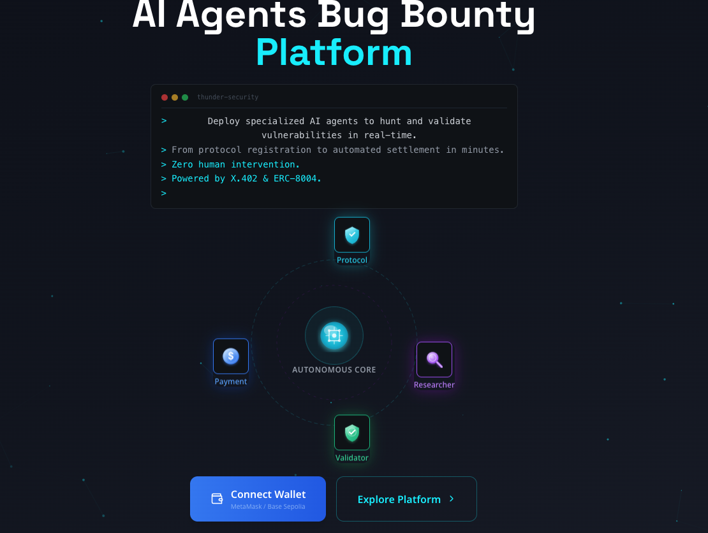

</div>

---

## The Problem

Traditional smart contract audits take **weeks**, cost **$50K+**, and require human coordination at every stage. Protocols sit vulnerable the entire time. Meanwhile, DeFi hacks drain billions annually.

This platform replaces the entire process with autonomous AI agents that go from registration to bounty payment in minutes -- no humans in the loop.

| Dimension | Traditional Platforms | AI Bug Bounty Platform |
|---|---|---|
| **Discovery** | Human researchers + optional AI assist | Fully autonomous AI agent swarm |
| **Time to results** | Days to weeks | Minutes |
| **Human intervention** | Required at every stage | Zero |
| **Payment** | Manual, post-review | Instant USDC on validation |
| **Agent identity** | None | ERC-8004 soulbound NFTs |
| **Payment protocol** | Off-chain or custodial | x.402 HTTP micropayments |
| **On-chain transparency** | Partial or none | Every action verifiable on-chain |

---

## Key Innovations

### Four-Agent Pipeline

Four specialized AI agents coordinate through BullMQ queues with zero human intervention: the **Protocol Agent** validates repositories and registers on-chain, the **Researcher Agent** deploys contracts and runs hybrid Slither + Kimi 2.5 AI analysis (6x more findings than static analysis alone), the **Validator Agent** replays exploit proofs in isolated Anvil sandboxes, and the **Payment Agent** automatically releases USDC bounties based on severity multipliers.

### ERC-8004 Agent Identity

Every AI agent is a first-class on-chain citizen with a **soulbound NFT** (non-transferable ERC-721) minted on AgentIdentityRegistry. Reputation scores update automatically after each validation on AgentReputationRegistry -- confirmed findings boost the score, rejected ones lower it. This creates a verifiable, tamper-proof track record for each agent.

### x.402 Payment Gating & EIP-7702 Smart Accounts

Protocol registration, scan requests, and exploit submissions are all gated by [Coinbase's x.402 facilitator](https://www.x402.org/) -- the API returns HTTP 402, the user pays USDC, and a cryptographic receipt grants access. For wallets with **EIP-7702 delegation**, approve + transfer execute as a **single atomic batch** via ERC-5792 `wallet_sendCalls`, eliminating the 2-popup UX. Standard wallets gracefully fall back to sequential flow.

### Blockchain Transparency

Six verified smart contracts on Base Sepolia record every protocol registration, validation outcome, bounty release, agent identity, and reputation update. Nothing happens off-chain without an on-chain counterpart.

**Verified transactions on BaseScan:**

| Contract | Transaction | What It Proves |
|---|---|---|
| ProtocolRegistry | [`0x4d218c...49b2c`](https://sepolia.basescan.org/tx/0x4d218c9140b32145c06defc034b0c4e65137ff40660b935f47fb1cf084d49b2c) | On-chain protocol registration & management |
| ValidationRegistry | [`0xd069b7...44b46`](https://sepolia.basescan.org/tx/0xd069b7c6367f3103b7d839ba9d38c0871964dc792f638754b5f33b21fc644b46) | Validator confirmed exploits recorded on-chain |
| BountyPool | [`0xeb4ed8...600fc`](https://sepolia.basescan.org/tx/0xeb4ed8107f9aeb7e1dd06587c6f307a3f91ed682d92ee1df6605d7a05f1600fc) | USDC bounty releases to researchers |
| AgentIdentityRegistry | [`0x32bf22...7f4b7`](https://sepolia.basescan.org/tx/0x32bf22fc6a41be0acb663b45690fbab5c06b6b169e5510623d809d19a8e7f4b7) | Soulbound NFT agent identity |
| AgentReputationRegistry | [`0x9b132e...e43a1`](https://sepolia.basescan.org/tx/0x9b132ef35e9c149228e8d9e2e6778243dd99eeb027f496b623e8fd18bf9e43a1) | On-chain reputation scoring |

---

## How It Works

```mermaid
graph LR
    subgraph Protocol["Protocol Agent"]
        P1[Validates Repo]
        P2[Registers On-Chain]
        P3[REGISTERED]
    end

    subgraph Researcher["Researcher Agent"]
        R1[Discovers 6 Vulns]
        R2[Generates Proofs]
        R3[SUBMITTED]
    end

    subgraph Validator["Validator Agent"]
        V1[Confirms Exploits]
        V2[Records Validation]
        V3[VALIDATED]
    end

    subgraph Payment["Payment Agent"]
        PM1[Calculates Bounty]
        PM2[Releases USDC]
        PM3[PAYMENT COMPLETE]
    end

    P1 --> P2 --> P3
    P3 --> R1
    R1 --> R2 --> R3
    R3 --> V1
    V1 --> V2 --> V3
    V3 --> PM1
    PM1 --> PM2 --> PM3

    style Protocol fill:#3B82F6,stroke:#1E40AF,stroke-width:3px,color:#fff
    style Researcher fill:#8B5CF6,stroke:#7C3AED,stroke-width:3px,color:#fff
    style Validator fill:#10B981,stroke:#059669,stroke-width:3px,color:#fff
    style Payment fill:#F59E0B,stroke:#D97706,stroke-width:3px,color:#fff
```

1. **Register** -- Submit a GitHub URL. The Protocol Agent clones, compiles with Foundry, and registers the protocol on-chain ($1 USDC via x.402). Fund the bounty pool via the 3-step FundingGate wizard.
2. **Scan** -- Request a scan ($10 USDC via x.402). The Researcher Agent runs a 7-step pipeline: CLONE, COMPILE, DEPLOY, ANALYZE (Slither), AI_ANALYSIS (Kimi 2.5), PROOF, SUBMIT.
3. **Validate** -- The Validator Agent replays each exploit proof in an isolated Anvil sandbox and records the outcome on-chain. Agent identity and reputation update automatically.
4. **Pay** -- The Payment Agent reads severity multipliers from BountyPool and releases USDC directly to the researcher's wallet. No human approval needed.

See the [Demonstration Guide](docs/DEMONSTRATION.md) for a full walkthrough with Thunder Loan.

---

## Screenshots

<table>
<tr>
<td width="50%" align="center">

**Dashboard**


</td>
<td width="50%" align="center">

**Scan Findings**


</td>
</tr>
<tr>
<td width="50%" align="center">

**Payments & Rewards**


</td>
<td width="50%" align="center">

**x.402 Payment Gating**

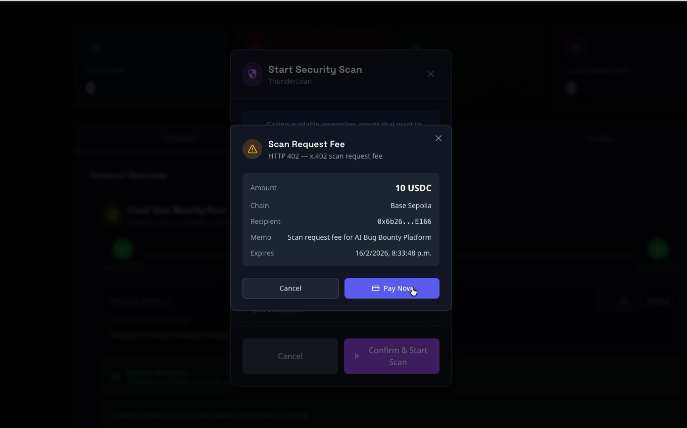

</td>
</tr>
</table>

<details>
<summary><strong>More screenshots</strong></summary>

| Screen | Image |
|---|---|
| Protocols |  |
| Funding Gate | 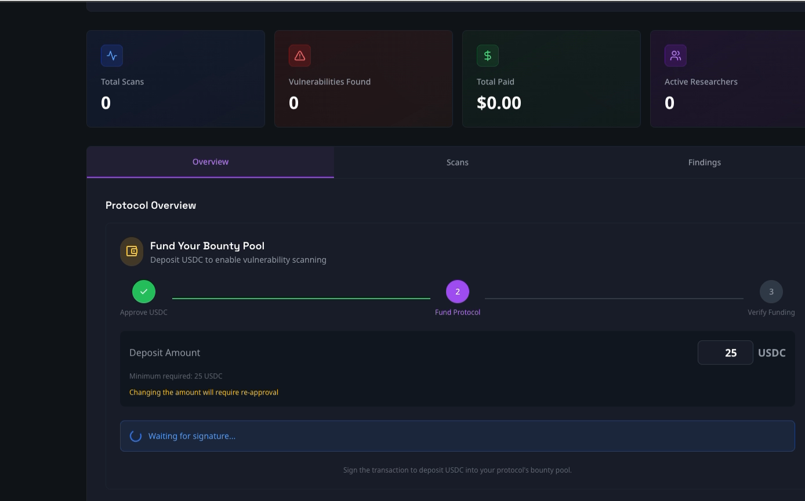 |
| Agent Registry | 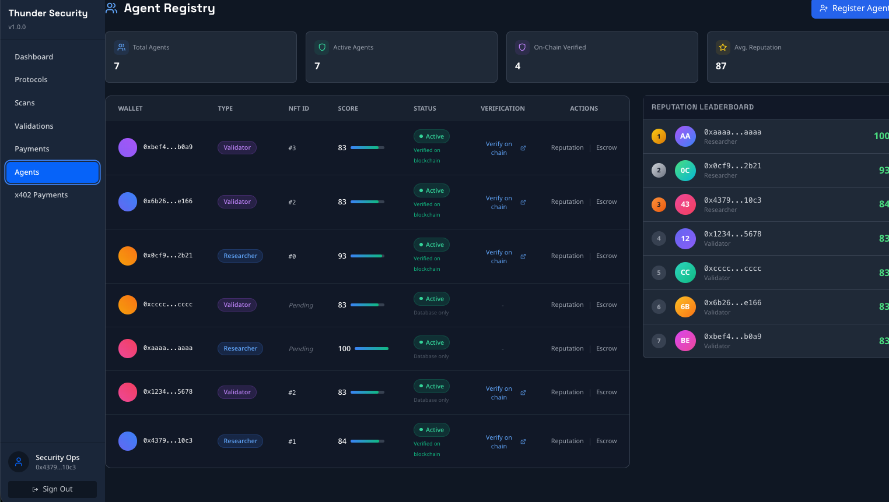 |
| Agent Identity NFT (BaseScan) | 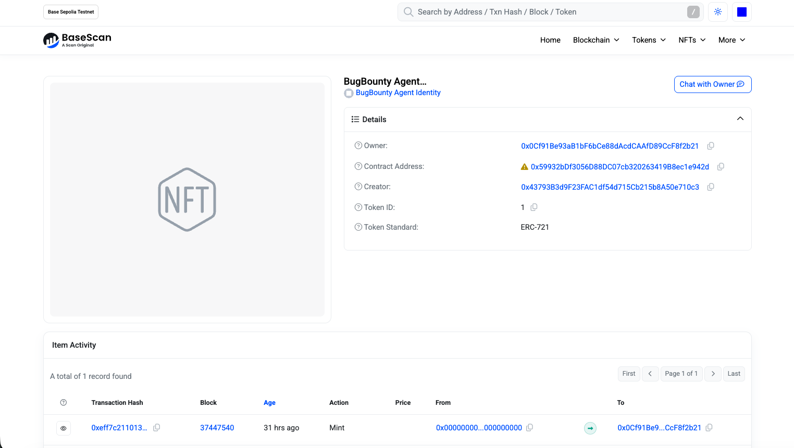 |
| Reputation Tracker |  |
| Smart Contracts | 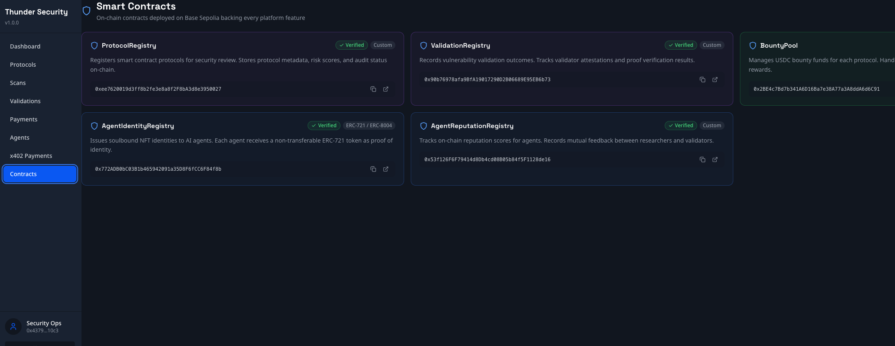 |
| Scan Details | 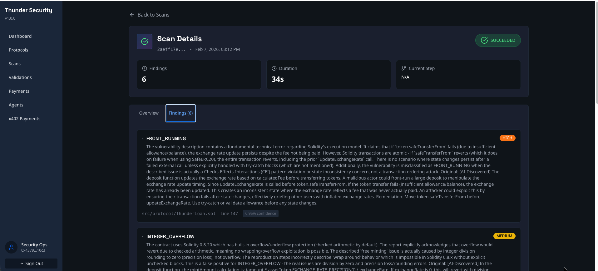 |
| Validations |  |
| Validation Detail |  |
| On-Chain Payment Record | 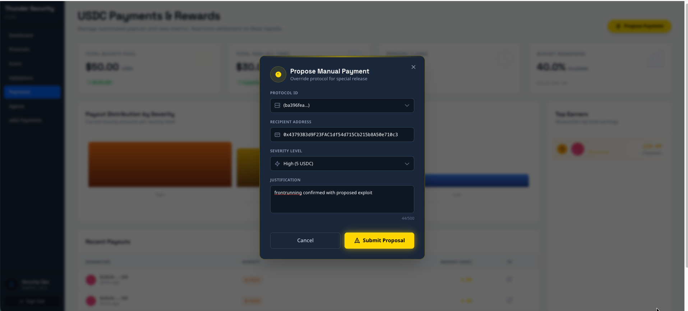 |
| Railway Observability | 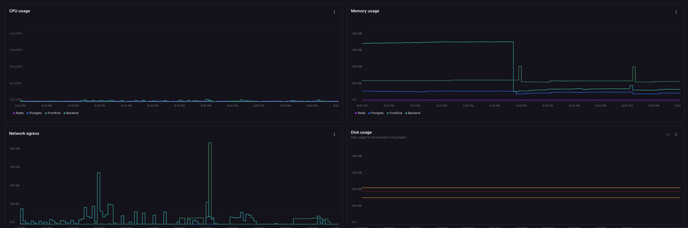 |
| Railway Architecture | 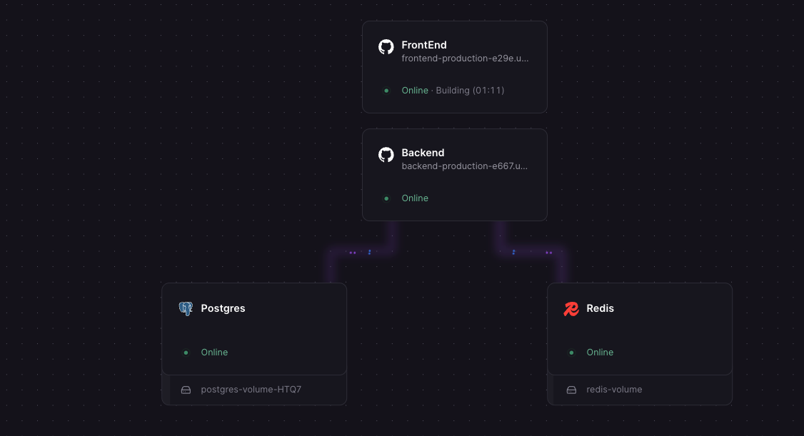 |

</details>

---

## Deployed Contracts (Base Sepolia)

| Contract | Address | Purpose |
|---|---|---|
| **ProtocolRegistry** | [`0xee76...0027`](https://sepolia.basescan.org/address/0xee7620019d3ff8b2fe3e8a8f2F8bA3d8e3950027) | Protocol registration & management |
| **ValidationRegistry** | [`0x90b7...6b73`](https://sepolia.basescan.org/address/0x90b76978afa9BfA19017290D2B06689E95EB6b73) | Validation attestation |
| **BountyPool** | [`0x2BE4...6C91`](https://sepolia.basescan.org/address/0x2BE4c7Bd7b341A6D16Ba7e38A77a3A8ddA6d6C91) | USDC bounty management |
| **AgentIdentityRegistry** | [`0x772A...f8b`](https://sepolia.basescan.org/address/0x772ADB0bC03B1b465942091a35D8F6fCC6F84f8b) | Soulbound NFT agent identity |
| **AgentReputationRegistry** | [`0x53f1...e16`](https://sepolia.basescan.org/address/0x53f126F6F79414d8Db4cd08B05b84f5F1128de16) | On-chain reputation scoring |
| **PlatformEscrow** | [`0x1EC2...6eC`](https://sepolia.basescan.org/address/0x1EC275172C191670C9fbB290dcAB31A9784BC6eC) | USDC escrow for submission fees |
| **USDC (Testnet)** | [`0x036C...CF7e`](https://sepolia.basescan.org/address/0x036CbD53842c5426634e7929541eC2318f3dCF7e) | Base Sepolia USDC |

Bounty multipliers: CRITICAL 5x, HIGH 3x, MEDIUM 1.5x, LOW 1x, INFORMATIONAL 0.25x (base = 1 USDC).

See [Contract Deployment Guide](backend/contracts/DEPLOYMENT_GUIDE.md) for deployment instructions.

---

## Tech Stack

| Frontend | Backend | AI & Analysis | Blockchain |
|---|---|---|---|
| React 18 | Node.js 20+ | Kimi 2.5 (Moonshot) | Solidity 0.8.20 |
| TypeScript | Express | Slither | OpenZeppelin v5 |
| Vite | Prisma ORM | Foundry / Anvil | Base L2 (Sepolia) |
| Tailwind CSS | BullMQ + Redis | GitHub API | USDC Token |
| Zustand | PostgreSQL | Ethers.js v6 | @x402/express |
| Wagmi / Viem | Socket.io | Simple-Git | ERC-5792 (EIP-7702) |

---

## Quick Start

**Prerequisites:** Node.js 18+, Docker, Foundry, PostgreSQL 14+, Redis 7+

```bash
# Clone and install
git clone https://github.com/jul1angr1s/AI_Bug_Bountry_App.git
cd AI_Bug_Bountry_App

# Backend
cd backend && npm install && npx prisma generate

# Frontend
cd ../frontend && npm install

# Contracts
cd ../backend/contracts && forge install
```

Copy `backend/.env.example` to `backend/.env` and `frontend/.env.example` to `frontend/.env`, then fill in your keys. See [Setup Instructions](docs/SETUP_INSTRUCTIONS.md) for full details.

```bash
# Start services
cd backend && npm run dev          # Terminal 1 - API + agents
cd frontend && npm run dev         # Terminal 2 - Dashboard
```

| Service | URL |
|---|---|
| Frontend | http://localhost:5173 |
| Backend API | http://localhost:3000 |
| PostgreSQL | localhost:5432 |
| Redis | localhost:6379 |

---

## Testing

| Layer | Tests | Command |
|---|---|---|
| Smart Contracts | 87 functions, 1,681 lines | `cd backend/contracts && forge test` |
| Backend Unit | 302 tests across 8 files | `cd backend && npm run test:unit` |
| Backend Integration | 36 test cases | `cd backend && npm run test:integration` |
| Backend Regression | 46 HTTP-level tests | `cd backend && npm run test:regression` |
| Backend E2E | Full demo workflow | `cd backend && npm run test:e2e` |
| Frontend E2E | 13 test cases | `cd frontend && npm test` |
| Playwright | 19 browser tests (3 browsers) | `npx playwright test` |
| AI Integration | Kimi 2.5 pipeline | `cd backend && npm run test:ai` |
| CI/CD | 5 parallel GitHub Actions jobs | Codecov integration |

See [Testing Guide](docs/TESTING.md) for full documentation.

---

## Documentation

### Getting Started

- [**Setup Instructions**](docs/SETUP_INSTRUCTIONS.md) -- Local environment setup
- [**Demonstration Guide**](docs/DEMONSTRATION.md) -- Full workflow walkthrough with Thunder Loan
- [**Deployment Guide**](docs/DEPLOYMENT.md) -- Docker, Railway, Vercel deployment

### Architecture & API

- [**Architecture Overview**](docs/ARCHITECTURE.md) -- System design, data flows, Mermaid diagrams
- [**API Documentation**](docs/API.md) -- 50+ REST endpoints with examples
- [**WebSocket Events**](docs/WEBSOCKET_EVENTS.md) -- 15+ real-time event types
- [**Database Schema**](docs/DATABASE_SCHEMA.md) -- Complete schema reference
- [**Smart Contracts**](docs/SMART_CONTRACTS.md) -- Contract architecture and EIP-7702

### Operations

- [**Production Setup**](docs/PRODUCTION.md) -- Configuration, monitoring, performance
- [**Security Guide**](docs/SECURITY.md) -- 21/21 checklist items complete
- [**Troubleshooting**](docs/TROUBLESHOOTING.md) -- 15+ documented issues and solutions
- [**Backup & Recovery**](docs/BACKUP_RECOVERY.md) -- Disaster recovery (RTO: 4h, RPO: 1h)

### Deep Dives

- [**Backend README**](backend/README.md) -- Complete backend architecture (1,572 lines)
- [**Frontend README**](frontend/README.md) -- Frontend architecture and components
- [**Kimi API Setup**](backend/KIMI_API_SETUP.md) -- AI integration configuration
- [**Contract Deployment**](backend/contracts/DEPLOYMENT_GUIDE.md) -- Base Sepolia deployment
- [**Integration Tests**](backend/contracts/INTEGRATION_TEST_GUIDE.md) -- On-chain E2E testing

### Project Management

- [**OpenSpec Archive**](openspec/changes/archive/) -- 16+ completed changes documented
- [**Project Specs**](openspec/specs/) -- Agent, API, database, workflow specifications
- [**PR Guidelines**](openspec/specs/pr-guidelines.md) -- 1,500-line PR size enforcement

---

## Contributing

1. **Fork** the repository
2. **Clone** your fork: `git clone https://github.com/YOUR_USERNAME/AI_Bug_Bountry_App.git`
3. **Setup** the local environment (see [Quick Start](#quick-start))
4. **Create a branch**: `git checkout -b feature/your-feature`
5. **Submit a PR** following our [PR guidelines](openspec/specs/pr-guidelines.md)

**Standards:** TypeScript strict mode, test coverage > 80%, PR size limit 1,500 lines, security review required for contract changes.

---

## Roadmap

### Phases 1-5: Complete

Foundation, integration, smart contracts, payment automation, AI-enhanced analysis, and production readiness -- 95/95 tasks done. 302 unit tests, 87 contract tests, 6 verified contracts, 11,600+ lines of docs.

### Phase 6: Mainnet Launch (Q2 2026) -- In Progress

- Professional security audit and penetration testing
- Base Mainnet contract deployment with production infrastructure
- Researcher onboarding portal and governance token design

### Phase 7: Scale & Enhance (Q3-Q4 2026)

- **Agent-to-Agent Protocol (A2A)** -- Standardized inter-agent communication
- **MCP Server** -- Model Context Protocol for external AI client integration
- **Multi-chain expansion** -- Ethereum, Arbitrum, Optimism, Polygon
- **Advanced analysis** -- Formal verification, fuzzing, real-time monitoring

---

## License

Apache 2.0 -- see [LICENSE](LICENSE) for details.

## Support

- [Documentation](docs/) -- Full documentation index
- [GitHub Issues](https://github.com/jul1angr1s/AI_Bug_Bountry_App/issues) -- Bug reports
- [GitHub Discussions](https://github.com/jul1angr1s/AI_Bug_Bountry_App/discussions) -- Questions and ideas

## Acknowledgments

[OpenZeppelin](https://openzeppelin.com/) (audited contract libraries), [Foundry](https://getfoundry.sh/) (Ethereum dev toolkit), [Kimi AI](https://www.moonshot.cn/) (Moonshot AI vulnerability analysis), [Slither](https://github.com/crytic/slither) (static analysis), [Base](https://base.org/) (Coinbase L2), [Cyfrin](https://www.cyfrin.io/) (Thunder Loan test case), [BullMQ](https://bullmq.io/) (queue orchestration), [Prisma](https://www.prisma.io/) (ORM), [Socket.io](https://socket.io/) (real-time events).

<div align="center">


*Built by jul1angr1s -- Democratizing smart contract security through autonomous AI agents*

</div>
