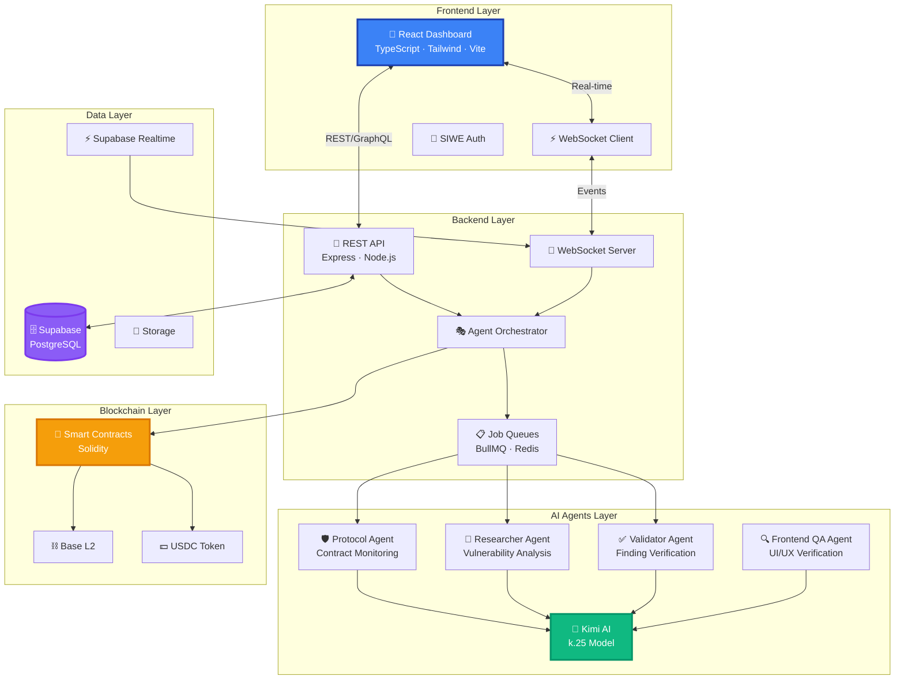
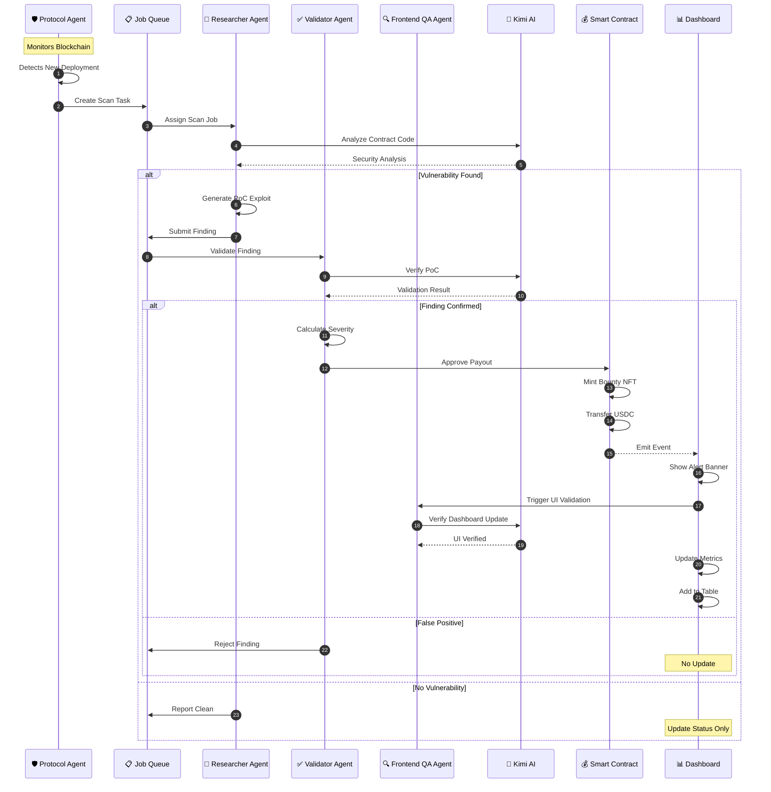
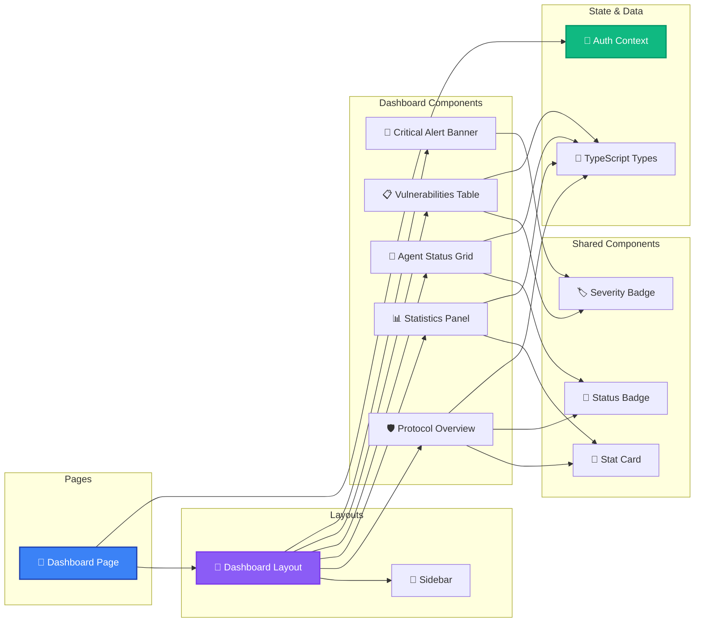
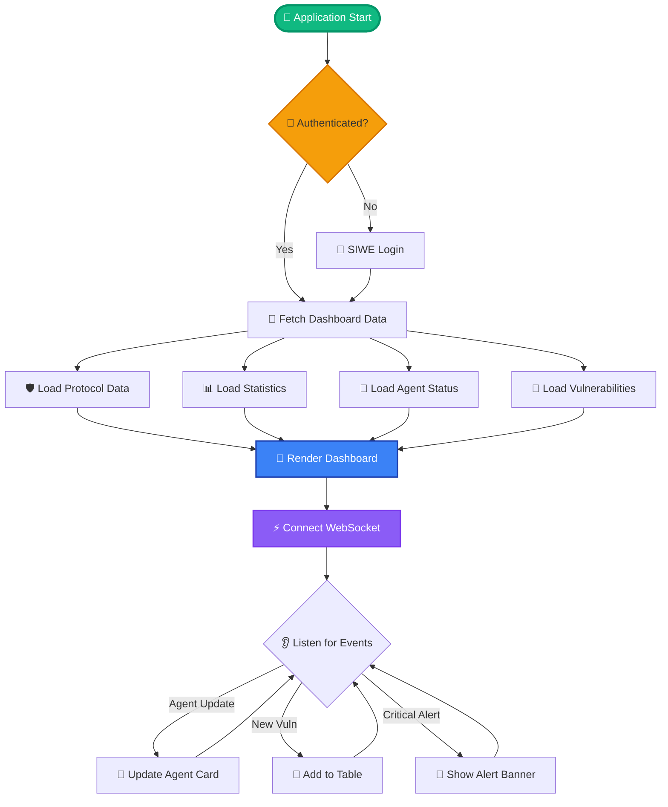

# ⚡ Thunder Security - Autonomous Bug Bounty Platform

<div align="center">


### 🤖 AI-Powered Security Intelligence • ⛓️ Blockchain-Native Payments • 🔒 Continuous Protocol Protection

*The future of Web3 security is autonomous, intelligent, and unstoppable.*

[🚀 Quick Start](#-quick-start) • [📖 Documentation](#-documentation) • [🎯 Features](#-features) • [🏗️ Architecture](#️-architecture) • [🤝 Contributing](#-contributing)

</div>

---

## 🌟 What Makes This Special?

Imagine a security platform where **AI agents never sleep**, constantly scanning smart contracts for vulnerabilities, validating findings with precision, and automatically distributing bounties on-chain. That's Thunder Security.

### 💡 The Problem

Traditional bug bounty programs are:
- ⏰ **Slow**: Manual reviews take days or weeks
- 💰 **Expensive**: High overhead for managing programs
- 🎯 **Inconsistent**: Quality varies wildly between researchers
- 🔄 **Limited Coverage**: Can't monitor protocols 24/7

### ⚡ Our Solution

An **autonomous orchestrator** powered by local AI that:
- 🔍 **Scans continuously** - Monitors your protocols around the clock
- 🤖 **4 Specialized AI Agents** - Protocol, Researcher, Validator, and Frontend QA working in harmony
- ⚓ **On-chain payments** - Instant, transparent USDC bounties via Base L2
- 📊 **Real-time dashboard** - Watch your security posture in real-time
- 🧠 **Cloud-Native AI** - Powered by Kimi AI (Moonshot) - high-performance inference at scale

---

## 🎯 Features

### 🤖 Autonomous AI Agents

<table>
<tr>
<td width="25%" align="center">

**🛡️ Protocol Agent**

Monitors smart contracts
Detects anomalies
Triggers scans on changes

</td>
<td width="25%" align="center">

**🔬 Researcher Agent**

Analyzes contract code
Discovers vulnerabilities
Generates PoC exploits

</td>
<td width="25%" align="center">

**✅ Validator Agent**

Verifies findings
Prevents false positives
Calculates severity scores

</td>
<td width="25%" align="center">

**🔍 Frontend QA Agent**

Inspects Chrome DevTools
Monitors console errors
Verifies UI/UX state

</td>
</tr>
</table>

### 🎨 Beautiful Dashboard

- **📈 Real-time Metrics** - Bounty pool, vulnerabilities found, total paid
- **🚨 Critical Alerts** - Instant notifications for severe findings
- **👁️ Agent Status** - Monitor all agents at a glance
- **📊 Vulnerability Table** - Sortable, filterable findings with severity badges
- **⚡ Live Updates** - WebSocket-powered real-time data (coming in Phase 3)

### ⛓️ Blockchain + AI: The Perfect Synergy

**When AI meets Blockchain, magic happens.** Our platform leverages cutting-edge protocols to create a trustless, autonomous security ecosystem.

#### 🔮 Industry-Leading Standards

- **💳 x402 Protocol** - Autonomous agent-to-agent payments for microtransactions
  - Pay AI agents instantly for vulnerability discoveries
  - Sub-cent precision for granular bounty distribution
  - No human intervention required

- **🛡️ ERC-8004 Standard** - On-chain agent trust & reputation
  - Immutable agent performance history
  - Verifiable track record of discoveries
  - Trust scoring for validator agents
  - Community-driven reputation metrics

- **🤝 Agent-to-Agent Protocol** - Autonomous collaboration at scale
  - Agents negotiate bounties programmatically
  - Cross-platform agent communication
  - Standardized finding verification
  - Decentralized consensus without human bottlenecks

#### ⚡ Why Blockchain + AI Changes Everything

**Traditional Bug Bounties**: Human → Find Bug → Submit → Wait → Review → Get Paid (weeks)

**Thunder Security**: AI Agent → Detect → Verify → Smart Contract → Instant Payment (seconds)

**The Result**:
- 🚀 **1000x Faster** - No waiting for manual reviews
- 💰 **Lower Costs** - Automated processes, no overhead
- 🔒 **Trustless** - Smart contracts guarantee payment
- 📊 **Transparent** - All transactions on-chain
- 🤖 **Scalable** - AI agents work 24/7 across thousands of protocols

#### 💎 Blockchain Features

- **💎 Base L2** - Fast, cheap transactions (< $0.01 per bounty)
- **💵 USDC Payments** - Stable, reliable bounties
- **📝 Smart Contracts** - Transparent, auditable payouts
- **🔐 SIWE Auth** - Sign-In with Ethereum for researchers
- **🏆 NFT Bounties** - Collectible vulnerability discovery tokens
- **⚖️ On-chain Governance** - Community-driven protocol upgrades

### 🧪 Built with Excellence

- **✅ 100% Test Coverage** - TDD methodology throughout
- **📏 TypeScript** - End-to-end type safety
- **🎨 Modern UI** - React 18 + Tailwind CSS
- **⚡ Lightning Fast** - Vite build, optimized bundles
- **📖 OpenSpec** - Structured development methodology
- **🏆 Industry Standards** - x402, ERC-8004, Agent-to-Agent Protocol

---

## 🏗️ Architecture

### 🎯 System Architecture



### 🔄 Agent Workflow



### 🎨 Component Architecture



### 💾 Data Flow



---

## 🚀 Quick Start

### Prerequisites

- **Node.js** 20.x LTS
- **npm** 10.x or **yarn** 1.22+
- **Kimi AI API Key** (Moonshot AI)
- **Supabase** account
- **Git**

### 1️⃣ Clone the Repository

```bash
git clone https://github.com/jul1angr1s/AI_Bug_Bountry_App.git
cd AI_Bug_Bountry_App
```

### 2️⃣ Get Kimi AI API Key

1. Sign up at [Moonshot AI Platform](https://platform.moonshot.cn/)
2. Create an API Key
3. Ensure you have access to the `kimi-k.25` model

### 3️⃣ Setup Frontend

```bash
cd frontend
npm install

# Copy environment variables
cp .env.example .env

# Edit .env with your Supabase credentials
# VITE_SUPABASE_URL=https://your-project.supabase.co
# VITE_SUPABASE_ANON_KEY=your-anon-key

# Start development server
npm run dev
```

🎉 **Frontend running at** http://localhost:5173

### 4️⃣ Setup Backend (Coming Soon)

```bash
cd backend
npm install
cp .env.example .env
npm run dev
```

### 5️⃣ Deploy Smart Contracts (Coming Soon)

```bash
cd contracts
npm install
forge build
forge create <contract-path>:<contract-name> --rpc-url $BASE_SEPOLIA_RPC --private-key $PRIVATE_KEY --chain 84532 --verify
```

---

## 🚀 Deployment

### Local Docker Development

Run the full stack locally with Docker Compose:

```bash
cd backend

# Build and start all services (backend + PostgreSQL + Redis)
npm run docker:up

# View logs
npm run docker:logs

# Stop services
npm run docker:down
```

**Services:**
- **Backend API**: http://localhost:3000
- **PostgreSQL**: localhost:5432
- **Redis**: localhost:6379

[📖 Full Local Docker Guide](./docs/deployment/local-docker.md)

### Production Deployment (Railway)

Deploy to Railway for production hosting:

```bash
# Push to main branch triggers deployment
git checkout main
git merge feature/backend-deployment-infrastructure
git push origin main
```

**Railway Configuration:**
- **Build**: Nixpacks with Node 20
- **Database**: Railway PostgreSQL or Supabase
- **Cache**: Railway Redis
- **Health Checks**: `/api/v1/health`
- **Auto-deploy**: On push to main

[📖 Full Railway Deployment Guide](./docs/deployment/railway.md)

---

## 📖 Documentation

### 📚 Project Structure

```
AI_Bug_Bountry_App/
├── 📱 frontend/              # React + TypeScript UI
│   ├── src/
│   │   ├── components/       # React components
│   │   │   ├── Dashboard/    # Dashboard-specific
│   │   │   ├── Sidebar/      # Navigation
│   │   │   └── shared/       # Reusable components
│   │   ├── pages/            # Page components
│   │   ├── layouts/          # Layout components
│   │   ├── lib/              # Utilities & auth
│   │   ├── types/            # TypeScript types
│   │   └── __tests__/        # Test suites
│   └── package.json
│
├── 🤖 backend/               # Node.js API (planned)
│   ├── src/
│   │   ├── api/              # REST endpoints
│   │   ├── services/         # Business logic
│   │   │   ├── AgentOrchestrator.ts
│   │   │   └── KimiService.ts
│   │   ├── lib/              # Utilities
│   │   └── prisma/           # Database schema
│   └── package.json
│
├── ⛓️ contracts/             # Smart contracts (planned)
│   ├── src/
│   │   ├── BountyPool.sol
│   │   ├── BountyNFT.sol
│   │   └── Governance.sol
│   └── hardhat.config.ts
│
├── 📋 openspec/              # OpenSpec methodology
│   ├── changes/              # Feature changes
│   │   └── dashboard-ui/     # Dashboard implementation
│   └── project/              # Project specs
│       ├── Architecture.md
│       ├── Stack.md
│       └── Testing.md
│
└── 📄 docs/                  # Documentation
```

### 🧪 Testing

We take testing seriously. **>90% coverage** on all components. Because we use TDD methodology

```bash
cd frontend

# Run tests
npm test

# Run tests with coverage
npm run test:coverage

# Run tests in watch mode
npm test -- --watch

# Run tests with UI
npm run test:ui
```

**Test Stack:**
- ✅ Vitest - Fast unit test runner
- ✅ React Testing Library - Component testing
- ✅ @testing-library/user-event - User interaction testing


## 🛠️ Tech Stack

### Frontend


- **React 18** - UI framework with concurrent features
- **TypeScript 5** - Type safety and DX
- **Vite** - Lightning-fast build tool
- **Tailwind CSS** - Utility-first styling
- **React Router v6** - Client-side routing
- **Supabase Client** - Auth & real-time DB
- **Lucide React** - Beautiful icons
- **Vitest** - Fast unit testing

### Backend (Planned)


- **Node.js 20 LTS** - Runtime
- **Express** - Web framework
- **Prisma** - Type-safe ORM
- **Supabase Postgres** - Database
- **BullMQ + Redis** - Job queues
- **WebSocket** - Real-time updates

### AI & Blockchain


#### AI Layer
- **Kimi AI (Moonshot)** - High-performance LLM inference engine
- **kimi-k.25** - Advanced model for code analysis and reasoning
- **MCP SDK** - Model Context Protocol for agent communication
- **Chrome DevTools MCP** - Direct browser interaction for QA agents

#### Blockchain Layer
- **Solidity 0.8.20** - Smart contract language
- **Foundry** - Advanced contract development toolkit
- **Viem** - TypeScript Ethereum library
- **Base L2** - Fast, low-cost scaling solution
- **USDC** - Stable payment token

#### Autonomous Agent Standards
- **x402 Protocol** - Micropayment standard for agent-to-agent transactions
- **ERC-8004** - On-chain agent trust and reputation system
- **Agent-to-Agent Protocol** - Standardized autonomous agent communication
- **MCP Tools** - Model Context Protocol for tool integration

---

## 📊 Current Status

### ✅ Completed (Phase 1 & 2)

- [x] Frontend environment setup with Vite + React
- [x] Dashboard layout with fixed sidebar
- [x] Thunder Security branding & navigation
- [x] Auth context with SIWE preparation
- [x] Protected routes structure
- [x] StatCard component with progress bars
- [x] Severity & status badge system
- [x] Protocol overview card
- [x] Statistics panel (3 metrics)
- [x] Agent status grid
- [x] Vulnerabilities table with sorting
- [x] Critical alert banner
- [x] Complete Dashboard page integration
- [x] 100% test coverage (73 tests)
- [x] OpenSpec documentation

### 🚧 In Progress (Phase 3)

- [ ] WebSocket connection manager
- [ ] Real-time agent status updates
- [ ] Toast notification system
- [ ] Optimistic UI updates

### 📋 Planned (Phase 4-5)

- [ ] API integration with TanStack Query
- [ ] Zustand state management
- [ ] Backend API implementation
- [ ] Kimi AI agent services
- [ ] Smart contract deployment
- [ ] SIWE authentication flow
- [ ] Keyboard navigation
- [ ] ARIA accessibility
- [ ] Mobile optimization

### 🎯 Roadmap

**Q1 2026** - Phase 3-5 (Real-time, API, Polish)
**Q2 2026** - Backend + AI Agents
**Q3 2026** - Smart Contracts + Blockchain
**Q4 2026** - Beta Launch 🚀

---

## 🤝 Contributing

We ❤️ contributions! Whether you're fixing bugs, adding features, or improving docs.

### 🌟 How to Contribute

1. **Fork** the repository
2. **Create** a feature branch (`git checkout -b feature/amazing-feature`)
3. **Write tests** first (TDD methodology)
4. **Implement** your feature
5. **Ensure** all tests pass (`npm test`)
6. **Commit** with conventional commits (`feat: add amazing feature`)
7. **Push** to your branch (`git push origin feature/amazing-feature`)
8. **Open** a Pull Request

### 📝 Commit Convention

We use [Conventional Commits](https://www.conventionalcommits.org/):

```
feat: add new feature
fix: bug fix
docs: documentation changes
style: formatting, missing semicolons, etc.
refactor: code restructuring
test: adding tests
chore: maintenance tasks
```

### ✨ Code Style

- **TypeScript** - Strict mode enabled
- **ESLint** - Airbnb config with custom rules
- **Prettier** - Code formatting
- **100% Test Coverage** - No exceptions

### 🧪 Testing Requirements

All PRs must:
- ✅ Include tests for new features
- ✅ Maintain 100% coverage
- ✅ Pass all existing tests
- ✅ Follow TDD methodology

---

## 📜 License

This project is licensed under the **Apache License 2.0** - see the [LICENSE](LICENSE) file for details.

---

## 🙏 Acknowledgments

### 🏆 Protocol Standards
- **x402 Protocol** - Pioneering agent micropayment infrastructure
- **ERC-8004** - On-chain agent trust and reputation standard
- **Agent-to-Agent Protocol** - Autonomous agent communication framework

### 🤖 AI & Technology
- **OpenAI** - Inspiration for autonomous agents
- **Anthropic** - Claude for development assistance
- **Moonshot AI** - Providing Kimi k.25 for advanced intelligence and autonomous reasoning
- **Anthropic** - Claude for development assistance and agentic orchestration

### ⛓️ Blockchain Infrastructure
- **Base** - L2 scaling solution
- **OpenZeppelin** - Smart contract security standards
- **Coinbase** - USDC stable payment infrastructure
- **Ethereum Foundation** - Core blockchain technology

### 🛠️ Development Tools
- **Supabase** - Backend platform and real-time database
- **Vite** - Lightning-fast build tooling
- **Vitest** - Modern testing framework
- **The Open Source Community** - For making innovation possible

---

## 📞 Contact & Support

<div align="center">

### 💬 Join Our Community

[](https://discord.gg/your-server)
[](https://twitter.com/your-handle)
[](https://github.com/jul1angr1s/AI_Bug_Bountry_App)

### 🐛 Found a Bug?

[Open an Issue](https://github.com/jul1angr1s/AI_Bug_Bountry_App/issues/new)

### 💡 Have an Idea?

[Start a Discussion](https://github.com/jul1angr1s/AI_Bug_Bountry_App/discussions/new)

</div>

---

## 🌟 Star History

<div align="center">

[](https://star-history.com/#jul1angr1s/AI_Bug_Bountry_App&Date)

### ⭐ If you find this project interesting, give it a star!

**Built with ❤️ by developers, for developers**

*Making Web3 security autonomous, one vulnerability at a time.*

</div>

---

<div align="center">

**[⬆ Back to Top](#-thunder-security---autonomous-bug-bounty-platform)**

</div>
