# 🛡️ AI Bug Bounty: The Autonomous Defense Protocol

> *Democratizing security with Swarms of Autonomous AI Agents.*

  

## 🌌 Overview

The **AI Bug Bounty Platform** is a cutting-edge security orchestration system that connects decentralized protocols with autonomous researcher agents. Instead of waiting weeks for a human audit, our agents clone, compile, and mathematically verify vulnerabilities in **real-time**.

We leverage **MCP (Model Context Protocol)** to give Large Language Models (LLMs) direct access to blockchain tools, allowing them to perform actual security work, not just chat about it.

---

## 🏗️ System Architecture

Our architecture is a modular monolith composed of a high-speed React frontend and a robust Node.js agent orchestration layer.

```mermaid
graph LR
    subgraph User Experience
        FE[🖥️ Frontend Dashboard]
    end

    subgraph "The Core (Backend)"
        API[🚀 API Gateway]
        ORCH[🧠 Orchestrator]
        DB[(💽 Database)]
    end

    subgraph "Agent Swarm (MCP)"
        RES[🕵️ Researcher]
        VAL[🛡️ Validator]
    end

    User --> FE
    FE <-->|Realtime| API
    API --> ORCH
    ORCH <-->|Task| RES
    RES -->|Finding| VAL
    VAL -->|Verified| DB
```



## 📂 Project Structure

This repository is organized into two main powerhouses:

| Module | Deployment | Description |
|--------|------------|-------------|
| **[🖥️ Frontend](frontend/README.md)** | React + Vite | The command center. Real-time dashboards, wallet analysis, and live agent feeds. |
| **[🧠 Backend](backend/README.md)** | Node.js + Express | The brain. Manages job queues, orchestrates Kimi AI agents, and handles on-chain verification. |

> 👉 **Click on the links above to view detailed setup instructions for each module.**

## 🚀 Quick Start

To get the entire system running locally, you will need to start both services.

### 1. Clone & Install
```bash
git clone https://github.com/jul1angr1s/AI_Bug_Bountry_App.git
cd AI_Bug_Bountry_App

# Install root scripts (if any) or navigate to subfolders
```

### 2. Ignite the Backend
See [backend/README.md](backend/README.md) for full details.
```bash
cd backend
npm install
npm run dev
```

### 3. Launch the Frontend
See [frontend/README.md](frontend/README.md) for full details.
```bash
cd frontend
npm install
npm run dev
```

## 📚 Documentation
- [**Architecture Specs**](openspec/specs/architecture.md): Deep dive into the system design.
- [**Agent Protocols**](openspec/specs/agents.md): How our AI researchers think and act.
- [**Stack Overview**](project/Stack.md): The full list of technologies used.

## 🤝 Contributing
We welcome security researchers and developers! Please read our [CONTRIBUTING.md](CONTRIBUTING.md) (coming soon) before submitting code.

## 📄 License
MIT © 2024 AI Bug Bounty Team
