# 🧠 Autonomous Bug Bounty Core

> *The neural network orchestrating thousands of security agents.*

Welcome to the **Backend Core** of the Autonomous Bug Bounty platform. This is a battle-hardened **Node.js/Express** microservice architecture that coordinates AI agents, manages blockchain transactions, and ensures your protocols stay secure 24/7.

## ⚡ System Architecture

```mermaid
graph TD
    API[🚀 Express API] -->|Dispatch| QUEUE[🐂 BullMQ / Redis]
    
    subgraph Agent Swarm
        QUEUE -->|Job| RES[🕵️ Researcher Agent]
        QUEUE -->|Job| VAL[🛡️ Validator Agent]
        QUEUE -->|Job| PROTO[🤝 Protocol Agent]
    end

    subgraph Infrastructure
        RES <-->|AI Inference| KIMI[🤖 Kimi AI k.25]
        RES -->|Clone| GIT[🐙 GitHub]
        VAL -->|Verify| SANDBOX[📦 Anvil Sandbox]
    end

    subgraph Persistence & State
        AGENTS -->|Store| DB[(🐘 Postgres / Prisma)]
        AGENTS -->|Payment| CHAIN[⛓️ Base Sepolia]
        API <-->|Sync| SUPA[🔥 Supabase Auth]
    end

    API -->|Push Updates| WS[🔌 Socket.io Server]
```



## 🛠️ Technology Stack

Built for scale, reliability, and asynchronous processing:

- **Runtime**: Node.js 20+ (LTS), TypeScript
- **Framework**: Express, Zod (Validation)
- **Queueing**: BullMQ (Redis)
- **Database**: PostgreSQL (via Prisma ORM), Supabase
- **AI Integration**: Custom MCP Agents, Kimi AI (Moonshot)
- **Blockchain**: Ethers.js v6, Simple-Git
- **Testing**: Vitest, Docker

## 🚀 Core Services

- **Agent Orchestrator**: Manages the lifecycle of AI agents (spawning, monitoring, retiring).
- **Scan Scheduler**: Automated dispatch of security scans based on protocol updates.
- **Verification Engine**: Deterministic sandbox for validating exploits before payout.
- **Real-time Gateway**: Pushes findings to the frontend in milliseconds.

## 🏁 Getting Started

### 1. Prerequisites
- Docker & Docker Compose
- Node.js 20+
- Redis (local or remote)

### 2. Installation

```bash
cd backend
npm install
```

### 3. Environment Setup
Create a `.env` file in the backend root:

```env
# Server
PORT=3000
NODE_ENV=development

# Database
DATABASE_URL="postgresql://..."
DIRECT_URL="postgresql://..."

# Auth
SUPABASE_URL="https://..."
SUPABASE_SERVICE_ROLE_KEY="ey..."

# AI
MOONSHOT_API_KEY="sk-..."

# Redis
REDIS_HOST=localhost
REDIS_PORT=6379
```

### 4. Ignite the Core 🔥

You can run the full stack with Docker or locally.

**Local Development:**
```bash
# Start Redis first
docker-compose up -d redis

# Run the API server
npm run dev

# Run the Researcher Worker (in a separate terminal)
npm run researcher:worker
```

**Production Build:**
```bash
npm run build
npm start
```

## 🧪 Testing

We take reliability seriously.

```bash
# Run unit & integration tests
npm run test

# Run e2e tests
npm run test:e2e
```
