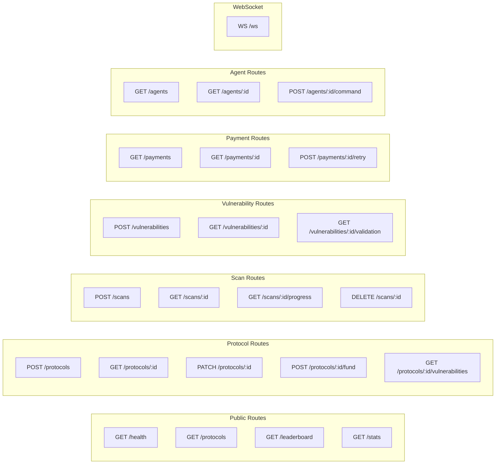

# API Routes: Autonomous Bug Bounty Orchestrator

## Overview

RESTful API with WebSocket support for real-time updates. All endpoints return JSON.

## Base Configuration

```
Base URL: /api/v1
Content-Type: application/json
Authentication: Bearer JWT or Wallet Signature
```

### Authentication and Session Transport

- `POST /api/v1/auth/siwe`
  - Verifies signature ownership and SIWE semantics server-side (allowed domain, chain ID, nonce freshness, issued-at window, optional expiration).
  - Returns short-lived access token + refresh token payload for authenticated session bootstrap.
- `POST /api/v1/auth/session-cookie`
  - Accepts `Authorization: Bearer <token>` and sets backend-domain `auth_token` HttpOnly cookie for SSE/EventSource transport.
  - Returns `401 {"error":"Missing bearer token"}` when Authorization header is absent.
- `DELETE /api/v1/auth/session-cookie`
  - Clears backend-domain `auth_token` cookie.
  - Returns `204 No Content` on success.
- `GET /api/v1/auth/session-cookie`
  - Not implemented (returns `404` in deployed production).

### CSRF Rules

- `GET /api/v1/csrf-token` issues/returns CSRF token for browser clients.
- All mutation routes (`POST`, `PUT`, `PATCH`, `DELETE`) under protected API scopes require matching CSRF cookie + `x-csrf-token` header.
- Missing or mismatched CSRF proof fails closed with HTTP `403`.

---

## Route Map



---

## Public Routes

### SIWE Authentication

```http
POST /api/v1/auth/siwe
```

**Request Body**
```json
{
  "message": "EIP-4361 formatted SIWE message",
  "signature": "0x...",
  "walletAddress": "0x..."
}
```

**Security Validation Rules**
- The backend validates SIWE message semantics before token issuance:
  - allowed `domain` must match configured frontend host(s)
  - `chainId` must be in allowed chain list (default includes Base Sepolia)
  - `nonce` is single-use (replay-protected)
  - `issuedAt` must be fresh (bounded max age)
  - optional `expirationTime` must not be expired
- Requests that fail SIWE semantic validation return:
  - `401 {"error":"Invalid SIWE message"}`
- Invalid/missing request fields return:
  - `400 {"error":"Invalid request body","details":[...]}`

**Production validation snapshot (February 18, 2026)**
- `POST /api/v1/auth/siwe` with malformed semantic payload returned `401 {"error":"Invalid SIWE message"}`.
- `POST /api/v1/auth/session-cookie` without bearer token returned `401 {"error":"Missing bearer token"}`.

### Session Cookie

```http
POST /api/v1/auth/session-cookie
Authorization: Bearer {jwt}
```

Sets `auth_token` HttpOnly cookie used by SSE/EventSource and browser credential flows.

### Health Check

```http
GET /api/v1/health
```

**Response**
```json
{
  "status": "ok",
  "timestamp": "2026-02-18T01:59:55.521Z",
  "services": {
    "database": "ok",
    "redis": "ok",
    "eventListener": "ok"
  }
}
```

### Dashboard Statistics

```http
GET /api/v1/stats
Authorization: Bearer {jwt}
```

**Response**
```json
{
  "protocols": {
    "total": 150,
    "active": 120,
    "totalBountyPool": "500000.00"
  },
  "vulnerabilities": {
    "total": 450,
    "confirmed": 380,
    "pending": 70,
    "bySeverity": {
      "critical": 45,
      "high": 120,
      "medium": 180,
      "low": 105
    }
  },
  "payments": {
    "totalPaid": "125000.00",
    "last24h": "5000.00",
    "avgPerVuln": "328.95"
  },
  "scans": {
    "totalCompleted": 12500,
    "last24h": 450,
    "avgDuration": 45
  }
}
```

### Leaderboard

```http
GET /api/v1/leaderboard?limit=10&period=all
```

**Query Parameters**
| Param | Type | Default | Description |
|-------|------|---------|-------------|
| limit | int | 10 | Number of researchers |
| period | string | all | all, month, week |

**Response**
```json
{
  "researchers": [
    {
      "rank": 1,
      "walletAddress": "0x1234...5678",
      "name": "SecurityPro",
      "reputation": 9500,
      "totalFindings": 85,
      "totalEarned": "45000.00",
      "criticalFindings": 12
    }
  ],
  "period": "all",
  "updatedAt": "2024-01-28T10:00:00Z"
}
```

---

## Protocol Routes

### List Protocols

```http
GET /api/v1/protocols
Authorization: Bearer {jwt}
```

**Query Parameters**
| Param | Type | Default | Description |
|-------|------|---------|-------------|
| status | string | active | active, paused, all |
| chainId | int | - | Filter by chain |
| limit | int | 20 | Page size |
| offset | int | 0 | Pagination offset |
| sort | string | createdAt | createdAt, bountyPool, vulnCount |

**Response**
```json
{
  "protocols": [
    {
      "id": "uuid",
      "contractAddress": "0xabc...def",
      "chainId": 8453,
      "name": "DeFi Protocol",
      "status": "ACTIVE",
      "bountyPool": "10000.00",
      "vulnCount": 5,
      "lastScan": "2024-01-28T09:00:00Z"
    }
  ],
  "total": 150,
  "limit": 20,
  "offset": 0
}
```

### Register Protocol

```http
POST /api/v1/protocols
Authorization: Bearer {jwt}
```

**Request Body**
```json
{
  "githubUrl": "https://github.com/org/defi-protocol",
  "branch": "main",
  "commitHash": null,
  "contractPath": "src/core/Vault.sol",
  "contractName": "Vault",
  "constructorArgs": ["0xTokenAddress", 1000000],
  "name": "My DeFi Protocol",
  "description": "Decentralized lending protocol",
  "bountyTerms": {
    "baseReward": "100.00",
    "multipliers": {
      "critical": 10.0,
      "high": 5.0,
      "medium": 2.0,
      "low": 1.0
    },
    "maxPayout": "50000.00"
  }
}
```

| Field | Required | Description |
|-------|----------|-------------|
| githubUrl | Yes | Public GitHub repo URL |
| branch | No | Branch name (default: "main") |
| commitHash | No | Specific commit (null = latest) |
| contractPath | Yes | Path to main contract in repo |
| contractName | Yes | Contract name to deploy |
| constructorArgs | No | Constructor arguments for deployment |

**Response** `201 Created`
```json
{
  "id": "uuid",
  "githubUrl": "https://github.com/org/defi-protocol",
  "branch": "main",
  "contractPath": "src/core/Vault.sol",
  "contractName": "Vault",
  "name": "My DeFi Protocol",
  "status": "PENDING",
  "riskScore": null,
  "createdAt": "2024-01-28T10:00:00Z",
  "nextStep": "Fund the bounty pool to activate"
}
```

### Get Protocol Details

```http
GET /api/v1/protocols/:id
Authorization: Bearer {jwt}
```

**Response**
```json
{
  "id": "uuid",
  "contractAddress": "0xabc...def",
  "chainId": 8453,
  "name": "My DeFi Protocol",
  "description": "Decentralized lending protocol",
  "status": "ACTIVE",
  "riskScore": 75,
  "verified": true,
  "bountyTerms": {
    "baseReward": "100.00",
    "multipliers": { "critical": 10.0, "high": 5.0, "medium": 2.0, "low": 1.0 },
    "maxPayout": "50000.00"
  },
  "bounty": {
    "totalFunded": "10000.00",
    "availableBalance": "8500.00",
    "paidOut": "1500.00"
  },
  "stats": {
    "totalScans": 50,
    "vulnerabilitiesFound": 8,
    "lastScanAt": "2024-01-28T09:00:00Z"
  },
  "createdAt": "2024-01-20T10:00:00Z"
}
```

### Fund Bounty Pool

```http
POST /api/v1/protocols/:id/fund
Authorization: Bearer {jwt}
```

**Request Body**
```json
{
  "amount": "5000.00",
  "txHash": "0x123...abc"
}
```

**Response**
```json
{
  "protocolId": "uuid",
  "depositAmount": "5000.00",
  "newBalance": "15000.00",
  "status": "ACTIVE",
  "txHash": "0x123...abc",
  "confirmedAt": "2024-01-28T10:01:00Z"
}
```

### Get Protocol Vulnerabilities

```http
GET /api/v1/protocols/:id/vulnerabilities
```

**Query Parameters**
| Param | Type | Description |
|-------|------|-------------|
| status | string | pending, confirmed, rejected, all |
| severity | string | critical, high, medium, low |

**Response**
```json
{
  "vulnerabilities": [
    {
      "id": "uuid",
      "title": "Reentrancy in withdraw()",
      "severity": "CRITICAL",
      "status": "CONFIRMED",
      "discoveredAt": "2024-01-25T10:00:00Z",
      "researcher": {
        "walletAddress": "0x789...012",
        "name": "SecurityPro"
      },
      "payment": {
        "amount": "1000.00",
        "status": "CONFIRMED"
      }
    }
  ],
  "total": 8
}
```

---

## Scan Routes

### Create Scan

```http
POST /api/v1/scans
Authorization: Bearer {jwt}
```

**Request Body**
```json
{
  "protocolId": "uuid",
  "scanType": "FULL",
  "priority": 1
}
```

**Response** `202 Accepted`
```json
{
  "id": "uuid",
  "protocolId": "uuid",
  "scanType": "FULL",
  "status": "QUEUED",
  "position": 3,
  "createdAt": "2024-01-28T10:00:00Z"
}
```

**Security gate behavior (February 18, 2026)**
- `POST /api/v1/scans` without CSRF token returned `403 {"error":{"code":"CSRF_MISSING","message":"CSRF token required"}}`.
- `GET /api/v1/scans` without auth returned `401 {"error":{"code":"UnauthorizedError","message":"Authentication required. Please log in and try again."}}`.

### Get Scan Status

```http
GET /api/v1/scans/:id
Authorization: Bearer {jwt}
```

**Response**
```json
{
  "id": "uuid",
  "protocolId": "uuid",
  "scanType": "FULL",
  "status": "RUNNING",
  "progress": 65,
  "findings": {
    "potential": 3,
    "confirmed": 0
  },
  "startedAt": "2024-01-28T10:00:00Z",
  "estimatedCompletion": null
}
```

### Get Scan Progress (SSE)

```http
GET /api/v1/scans/:id/progress
Accept: text/event-stream
Cookie: auth_token={session_jwt}
```

**Response** (Server-Sent Events)
```
event: progress
data: {"progress": 66, "currentStep": "Analyzing reentrancy patterns"}

event: progress
data: {"progress": 67, "currentStep": "Checking access controls"}

event: finding
data: {"type": "potential", "severity": "HIGH", "pattern": "reentrancy"}

event: complete
data: {"status": "COMPLETED", "totalFindings": 3}
```

### Cancel Scan

```http
DELETE /api/v1/scans/:id
Authorization: Bearer {jwt}
```

**Response** `200 OK`
```json
{
  "id": "uuid",
  "status": "CANCELLED",
  "cancelledAt": "2024-01-28T10:05:00Z"
}
```

---

## Vulnerability Routes

### Submit Vulnerability

```http
POST /api/v1/vulnerabilities
Authorization: Bearer {jwt}
```

**Request Body**
```json
{
  "protocolId": "uuid",
  "title": "Reentrancy vulnerability in withdraw function",
  "description": "The withdraw function updates state after external call...",
  "severity": "CRITICAL",
  "exploitSteps": [
    {
      "step": 1,
      "action": "Deploy attacker contract",
      "code": "contract Attacker { ... }"
    },
    {
      "step": 2,
      "action": "Call withdraw with fallback",
      "code": "target.withdraw(amount)"
    }
  ],
  "proofHash": "0xkeccak256...",
  "encryptedProof": "encrypted_base64_data"
}
```

**Response** `201 Created`
```json
{
  "id": "uuid",
  "proofHash": "0xkeccak256...",
  "status": "PENDING_VALIDATION",
  "createdAt": "2024-01-28T10:00:00Z",
  "message": "Vulnerability submitted. Validation will begin shortly."
}
```

### Get Vulnerability Details

```http
GET /api/v1/vulnerabilities/:id
Authorization: Bearer {jwt}
```

**Response**
```json
{
  "id": "uuid",
  "protocol": {
    "id": "uuid",
    "name": "DeFi Protocol",
    "contractAddress": "0xabc...def"
  },
  "title": "Reentrancy vulnerability in withdraw function",
  "description": "The withdraw function updates state after external call...",
  "severity": "CRITICAL",
  "status": "CONFIRMED",
  "exploitSteps": [...],
  "proofHash": "0xkeccak256...",
  "ipfsCid": "Qm...",
  "discoveredAt": "2024-01-28T10:00:00Z",
  "validation": {
    "result": "TRUE",
    "txHash": "0xvalidation...",
    "validatedAt": "2024-01-28T10:05:00Z"
  },
  "payment": {
    "amount": "1000.00",
    "status": "CONFIRMED",
    "txHash": "0xpayment..."
  }
}
```

### Get Validation Status

```http
GET /api/v1/vulnerabilities/:id/validation
```

**Response**
```json
{
  "vulnerabilityId": "uuid",
  "proofHash": "0xkeccak256...",
  "status": "VALIDATING",
  "sandboxId": "sandbox-123",
  "progress": {
    "step": "EXECUTING_EXPLOIT",
    "message": "Running exploit in Foundry sandbox"
  },
  "startedAt": "2024-01-28T10:03:00Z"
}
```

---

## Payment Routes

### List Payments

```http
GET /api/v1/payments
Authorization: Bearer {jwt}
```

**Query Parameters**
| Param | Type | Description |
|-------|------|-------------|
| status | string | pending, confirmed, failed |
| researcherId | uuid | Filter by researcher |
| limit | int | Page size |
| offset | int | Pagination |

**Response**
```json
{
  "payments": [
    {
      "id": "uuid",
      "vulnerability": {
        "id": "uuid",
        "title": "Reentrancy in withdraw()",
        "severity": "CRITICAL"
      },
      "amount": "1000.00",
      "token": "USDC",
      "status": "CONFIRMED",
      "txHash": "0xpayment...",
      "confirmedAt": "2024-01-28T10:10:00Z"
    }
  ],
  "total": 50,
  "totalAmount": "45000.00"
}
```

**Auth gate behavior (February 18, 2026)**
- `GET /api/v1/payments` without auth returned `401 {"error":{"code":"UnauthorizedError","message":"Authentication required. Please log in and try again."}}`.

### Get Payment Details

```http
GET /api/v1/payments/:id
Authorization: Bearer {jwt}
```

**Response**
```json
{
  "id": "uuid",
  "vulnerabilityId": "uuid",
  "researcherId": "uuid",
  "amount": "1000.00",
  "tokenAddress": "0x833589fCD6eDb6E08f4c7C32D4f71b54bdA02913",
  "tokenSymbol": "USDC",
  "status": "CONFIRMED",
  "txHash": "0xpayment...",
  "blockNumber": 12345678,
  "createdAt": "2024-01-28T10:08:00Z",
  "confirmedAt": "2024-01-28T10:10:00Z"
}
```

### Retry Failed Payment

```http
POST /api/v1/payments/:id/retry
Authorization: Bearer {jwt} (Admin only)
```

**Response**
```json
{
  "id": "uuid",
  "status": "PROCESSING",
  "retryCount": 2,
  "message": "Payment retry initiated"
}
```

---

## Agent Routes

### List Agents

```http
GET /api/v1/agents
Authorization: Bearer {jwt} (Admin only)
```

**Response**
```json
{
  "agents": [
    {
      "id": "uuid",
      "name": "Protocol Agent 1",
      "type": "PROTOCOL",
      "status": "ONLINE",
      "lastHeartbeat": "2024-01-28T10:00:00Z",
      "currentTask": null
    },
    {
      "id": "uuid",
      "name": "Researcher Agent 1",
      "type": "RESEARCHER",
      "status": "BUSY",
      "lastHeartbeat": "2024-01-28T10:00:00Z",
      "currentTask": {
        "type": "SCAN",
        "protocolId": "uuid",
        "progress": 45
      }
    }
  ]
}
```

### Get Agent Details

```http
GET /api/v1/agents/:id
Authorization: Bearer {jwt} (Admin only)
```

**Response**
```json
{
  "id": "uuid",
  "name": "Researcher Agent 1",
  "type": "RESEARCHER",
  "status": "BUSY",
  "config": {
    "scanPatterns": ["reentrancy", "overflow", "access-control"],
    "maxConcurrentScans": 3
  },
  "stats": {
    "totalScans": 500,
    "vulnerabilitiesFound": 45,
    "uptime": "99.9%"
  },
  "recentLogs": [
    {
      "level": "INFO",
      "message": "Started scan for protocol xyz",
      "timestamp": "2024-01-28T09:55:00Z"
    }
  ]
}
```

### Send Agent Command

```http
POST /api/v1/agents/:id/command
Authorization: Bearer {jwt} (Admin only)
```

**Request Body**
```json
{
  "command": "PAUSE",
  "reason": "Maintenance window"
}
```

**Response**
```json
{
  "agentId": "uuid",
  "command": "PAUSE",
  "status": "ACKNOWLEDGED",
  "timestamp": "2024-01-28T10:00:00Z"
}
```

---

## WebSocket API

### Connection

```javascript
const socket = io('wss://api.example.com', {
  auth: { token: 'jwt_token' }
});
```

### Rooms & Events

| Room | Events | Description |
|------|--------|-------------|
| `protocols` | protocol_registered, protocol_updated, pool_funded | Protocol updates |
| `scans` | scan_started, scan_progress, scan_completed | Scan lifecycle |
| `vulnerabilities` | vuln_found, validation_started, validation_complete | Vulnerability flow |
| `payments` | payment_pending, payment_released, payment_failed | Payment status |
| `agents` | agent_online, agent_offline, agent_status | Agent monitoring |

### Event Payloads

```typescript
// Join room
socket.emit('join', { room: 'vulnerabilities' });

// Vulnerability found event
socket.on('vuln_found', (data: {
  id: string;
  protocolId: string;
  severity: 'CRITICAL' | 'HIGH' | 'MEDIUM' | 'LOW';
  title: string;
  discoveredAt: string;
}) => {
  // Handle new vulnerability
});

// Payment released event
socket.on('payment_released', (data: {
  id: string;
  vulnerabilityId: string;
  amount: string;
  researcherAddress: string;
  txHash: string;
}) => {
  // Handle payment notification
});
```

---

## Railway Production Validation Snapshot (2026-02-18)

Validated against `https://backend-production-e667.up.railway.app`:

- `GET /api/v1/health` -> `200`
  ```json
  {"status":"ok","timestamp":"2026-02-18T03:29:50.292Z","services":{"database":"ok","redis":"ok","eventListener":"ok"}}
  ```
- `GET /api/v1/protocols` (no auth) -> `401`
  ```json
  {"error":{"code":"UnauthorizedError","message":"Authentication required. Please log in and try again.","requestId":"..."}}
  ```
- `GET /api/v1/scans` (no auth) -> `401`
  ```json
  {"error":{"code":"UnauthorizedError","message":"Authentication required. Please log in and try again.","requestId":"..."}}
  ```
- `GET /api/v1/payments` (no auth) -> `401`
  ```json
  {"error":{"code":"UnauthorizedError","message":"Authentication required. Please log in and try again.","requestId":"..."}}
  ```
- `POST /api/v1/auth/session-cookie` (no bearer token) -> `401`
  ```json
  {"error":"Missing bearer token"}
  ```
- `GET /api/v1/auth/session-cookie` -> `404`
  ```json
  {"error":{"code":"NotFoundError","message":"The requested resource was not found.","requestId":"..."}}
  ```

---

## Error Responses

### Standard Error Format

```json
{
  "error": {
    "code": "VALIDATION_ERROR",
    "message": "Invalid contract address format",
    "details": [
      {
        "field": "contractAddress",
        "message": "Must be a valid Ethereum address"
      }
    ]
  },
  "requestId": "req-uuid"
}
```

### HTTP Status Codes

| Code | Description |
|------|-------------|
| 200 | Success |
| 201 | Created |
| 202 | Accepted (async processing) |
| 400 | Bad Request / Validation Error |
| 401 | Unauthorized |
| 403 | Forbidden |
| 404 | Not Found |
| 409 | Conflict (duplicate) |
| 429 | Rate Limited |
| 500 | Internal Server Error |
| 503 | Service Unavailable |

### Error Codes

| Code | Description |
|------|-------------|
| VALIDATION_ERROR | Request validation failed |
| UNAUTHORIZED | Missing or invalid auth |
| FORBIDDEN | Insufficient permissions |
| NOT_FOUND | Resource not found |
| DUPLICATE | Resource already exists |
| RATE_LIMITED | Too many requests |
| BLOCKCHAIN_ERROR | On-chain operation failed |
| AGENT_ERROR | Agent communication failed |
| INSUFFICIENT_FUNDS | Bounty pool empty |

---

## Rate Limits

| Endpoint Category | Limit | Window |
|------------------|-------|--------|
| Public (GET) | 100 | 1 minute |
| Authenticated (GET) | 300 | 1 minute |
| Mutations (POST/PATCH) | 30 | 1 minute |
| Scan Creation | 5 | 1 hour |
| Vulnerability Submission | 10 | 1 hour |

**Rate Limit Headers**
```
X-RateLimit-Limit: 100
X-RateLimit-Remaining: 95
X-RateLimit-Reset: 1706436060
```
