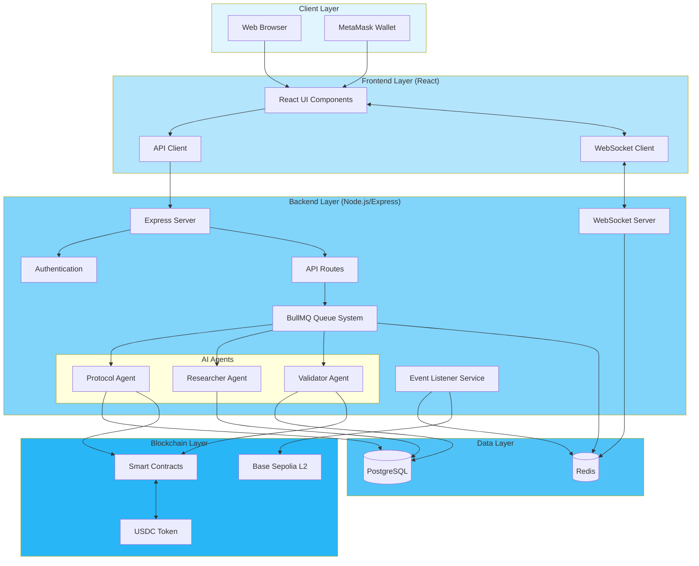
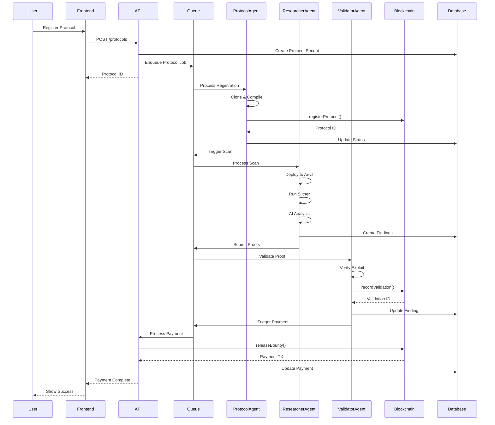
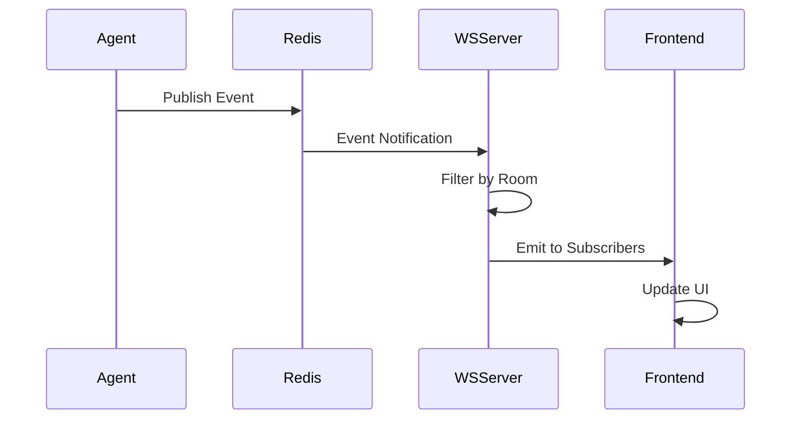
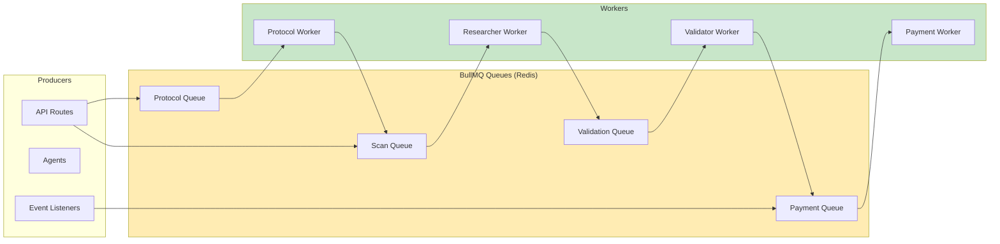
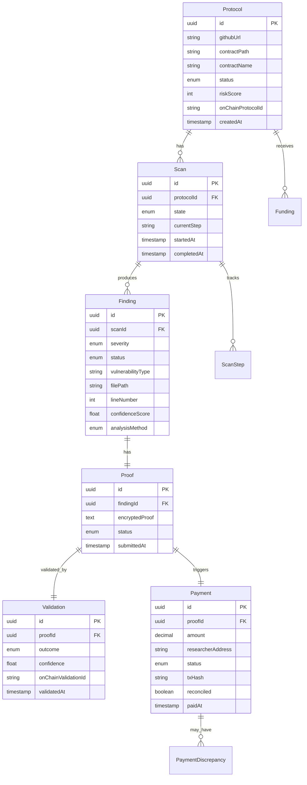
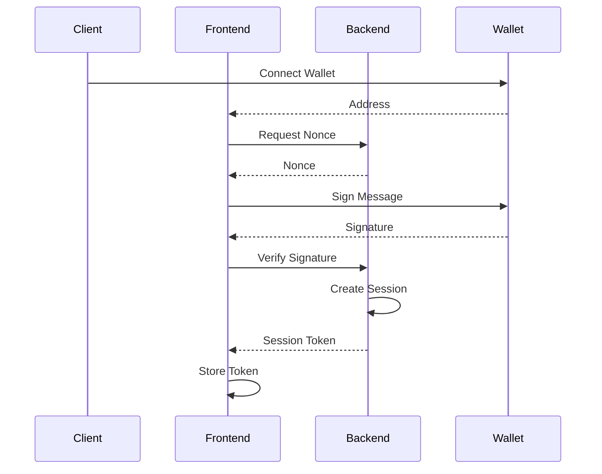
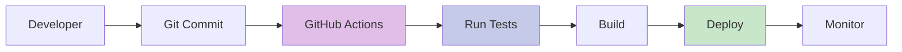

# System Architecture

Complete architectural overview of the AI Bug Bounty Platform, including component diagrams, data flows, and technology stack.

## Table of Contents

- [High-Level Overview](#high-level-overview)
- [System Components](#system-components)
- [Data Flow](#data-flow)
- [Queue Architecture](#queue-architecture)
- [WebSocket Event Flow](#websocket-event-flow)
- [Database Schema](#database-schema)
- [Technology Stack](#technology-stack)
- [Security Architecture](#security-architecture)

---

## High-Level Overview

The AI Bug Bounty Platform is a distributed system that automates vulnerability discovery and rewards using AI agents and blockchain integration.



---

## System Components

### Frontend Components

**Technology**: React 18 + TypeScript + Vite

```
frontend/src/
├── components/          # Reusable UI components
│   ├── dashboard/       # Dashboard widgets
│   ├── protocols/       # Protocol management
│   ├── scans/          # Scan monitoring
│   ├── payments/       # Payment views
│   └── ui/             # Base UI components
├── pages/              # Route pages
│   ├── Dashboard.tsx
│   ├── ProtocolList.tsx
│   ├── ScanDetail.tsx
│   └── PaymentHistory.tsx
├── lib/                # Utilities
│   ├── api.ts          # API client
│   └── websocket.ts    # WebSocket client
└── stores/             # Zustand state management
    ├── auth.ts
    └── protocol.ts
```

### Backend Components

**Technology**: Node.js 20 + Express + TypeScript

```
backend/src/
├── server.ts           # Express server entry point
├── routes/             # API route handlers
│   ├── protocol.routes.ts
│   ├── scans.ts
│   ├── payment.routes.ts
│   └── health.ts
├── agents/             # AI agent workers
│   ├── protocol/       # Protocol Agent
│   ├── researcher/     # Researcher Agent
│   └── validator/      # Validator Agent
├── queues/             # BullMQ queue definitions
│   ├── protocol.queue.ts
│   ├── researcher.queue.ts
│   └── payment.queue.ts
├── services/           # Business logic
│   ├── protocol.service.ts
│   ├── payment.service.ts
│   └── reconciliation.service.ts
├── blockchain/         # Smart contract clients
│   ├── ProtocolRegistryClient.ts
│   ├── ValidationRegistryClient.ts
│   └── BountyPoolClient.ts
├── websocket/          # WebSocket server
│   ├── index.ts
│   └── rooms.ts
├── middleware/         # Express middleware
│   ├── auth.ts
│   ├── validation.ts
│   └── rate-limit.ts
└── lib/                # Utilities
    ├── prisma.ts
    └── redis.ts
```

---

## Data Flow

### End-to-End Vulnerability Discovery Flow



### Real-Time Update Flow



---

## Queue Architecture

### BullMQ Queue System

The platform uses Redis-backed queues for asynchronous job processing.



### Queue Configuration

```typescript
// Protocol Queue
{
  name: 'protocol-registration',
  concurrency: 3,
  retries: 3,
  backoff: {
    type: 'exponential',
    delay: 5000
  }
}

// Scan Queue
{
  name: 'vulnerability-scan',
  concurrency: 2,
  retries: 2,
  timeout: 600000  // 10 minutes
}

// Payment Queue
{
  name: 'bounty-payment',
  concurrency: 1,
  retries: 5,
  backoff: {
    type: 'exponential',
    delay: 10000
  }
}
```

### Job Lifecycle

```
QUEUED → WAITING → ACTIVE → COMPLETED
                    ↓
                  FAILED → RETRY (max 3x)
                    ↓
                  CANCELED
```

---

## WebSocket Event Flow

### Room Structure

```typescript
// Room naming convention
protocol:{protocolId}     // Protocol-specific events
scan:{scanId}            // Scan progress updates
global                   // System-wide events
```

### Event Types

```mermaid
graph TB
    subgraph Backend["Backend Events"]
        PE[Protocol Events]
        SE[Scan Events]
        FE[Finding Events]
        PayE[Payment Events]
    end

    subgraph Channels["Redis Pub/Sub"]
        PC[protocol:*]
        SC[scan:*]
        FC[finding:*]
        PayC[payment:*]
    end

    subgraph Rooms["WebSocket Rooms"]
        PR[protocol:{id}]
        SR[scan:{id}]
        GR[global]
    end

    PE --> PC
    SE --> SC
    FE --> FC
    PayE --> PayC

    PC --> PR
    SC --> SR
    FC --> GR
    PayC --> GR

    PR --> Client1[Client 1]
    SR --> Client2[Client 2]
    GR --> Client3[Client 3]

    style Channels fill:#fff9c4
    style Rooms fill:#c5e1a5
```

### Heartbeat Mechanism

```typescript
// Client sends heartbeat every 30s
socket.emit('heartbeat');

// Server acknowledges
socket.on('heartbeat:ack');

// Timeout after 60s of inactivity
if (Date.now() - lastSeen > 60000) {
  socket.disconnect();
}
```

---

## Database Schema

### Entity Relationship Diagram



### Core Tables

**Protocol**: Protocol registration and metadata
- Stores GitHub repository information
- Tracks compilation and risk assessment
- Links to on-chain protocol registry

**Scan**: Vulnerability scan jobs
- Tracks scan state and progress
- Stores error information for debugging
- Links to findings discovered

**Finding**: Individual vulnerabilities
- Severity classification (CRITICAL → INFO)
- Analysis method (AI, STATIC, HYBRID)
- Validation status and confidence

**Payment**: Bounty payments
- USDC amounts and transaction hashes
- Reconciliation status
- Links to on-chain bounty IDs

### Indexes

```sql
-- Performance-critical indexes
CREATE INDEX idx_protocol_status ON Protocol(status);
CREATE INDEX idx_scan_state ON Scan(state);
CREATE INDEX idx_finding_severity ON Finding(severity);
CREATE INDEX idx_payment_status ON Payment(status);
CREATE INDEX idx_payment_researcher ON Payment(researcherAddress);
```

---

## Technology Stack

### Frontend

| Component | Technology | Version |
|-----------|-----------|---------|
| Framework | React | 18.2 |
| Language | TypeScript | 5.3 |
| Build Tool | Vite | 5.0 |
| State Management | Zustand | 5.0 |
| API Client | TanStack Query | 5.90 |
| Styling | TailwindCSS | 3.3 |
| Web3 | Wagmi + Viem | 3.4 / 2.45 |
| Wallet | SIWE | 3.0 |

### Backend

| Component | Technology | Version |
|-----------|-----------|---------|
| Runtime | Node.js | 20+ |
| Framework | Express | 4.18 |
| Language | TypeScript | 5.3 |
| Database ORM | Prisma | 5.0 |
| Queue System | BullMQ | 5.67 |
| WebSocket | Socket.io | 4.6 |
| Validation | Zod | 3.22 |
| Blockchain | Ethers.js | 6.16 |

### Infrastructure

| Component | Technology | Purpose |
|-----------|-----------|---------|
| Database | PostgreSQL | 14+ | Relational data storage |
| Cache/Queue | Redis | 7+ | Caching and job queues |
| Blockchain | Base Sepolia | L2 testnet |
| Static Analysis | Slither | Solidity analysis |
| AI Model | Claude Sonnet 4.5 | Vulnerability analysis |
| Container | Docker | Development environment |

### Smart Contracts

| Component | Technology | Version |
|-----------|-----------|---------|
| Framework | Foundry | Latest |
| Language | Solidity | 0.8.20 |
| Testing | Forge | Latest |
| Libraries | OpenZeppelin | 5.0.0 |

---

## Security Architecture

### Authentication Flow



### Authorization Layers

1. **Public Endpoints**: No authentication required
   - Health checks
   - Public statistics

2. **Authenticated Endpoints**: Session token required
   - Protocol registration
   - Scan creation
   - Payment viewing

3. **Admin Endpoints**: Admin role required
   - Agent control
   - Reconciliation
   - System configuration

### Rate Limiting

```typescript
// Per-endpoint rate limits
const rateLimits = {
  public: 100,      // requests/minute
  authenticated: 500,
  admin: 500
};

// Headers returned
X-RateLimit-Limit: 500
X-RateLimit-Remaining: 450
X-RateLimit-Reset: 1706812800
```

### Data Protection

- **Encryption at Rest**: PostgreSQL encryption
- **Encryption in Transit**: TLS/HTTPS
- **Proof Encryption**: Sensitive exploit details encrypted
- **Private Key Management**: Environment variables, never logged

### Smart Contract Security

- **Access Control**: Role-based permissions (VALIDATOR_ROLE, PAYOUT_ROLE)
- **Reentrancy Protection**: ReentrancyGuard on all state changes
- **Safe Transfers**: SafeERC20 for USDC operations
- **Immutable Records**: Validation data cannot be modified
- **Event Logging**: All critical actions emit events

---

## Deployment Architecture

### Development

```
┌─────────────┐     ┌─────────────┐     ┌─────────────┐
│   Frontend  │────▶│   Backend   │────▶│  PostgreSQL │
│ Vite :5173  │     │ Express:3000│     │   :5432     │
└─────────────┘     └─────────────┘     └─────────────┘
                           │
                           ▼
                    ┌─────────────┐
                    │    Redis    │
                    │    :6379    │
                    └─────────────┘
```

### Production (Railway)

```
┌──────────────────┐
│  CDN (Frontend)  │
└────────┬─────────┘
         │
         ▼
┌──────────────────┐     ┌──────────────────┐
│ Railway Backend  │────▶│ Railway Postgres │
│   (Node.js)      │     │   (Managed)      │
└────────┬─────────┘     └──────────────────┘
         │
         ▼
┌──────────────────┐
│  Railway Redis   │
│   (Managed)      │
└──────────────────┘
```

---

## Performance Considerations

### Caching Strategy

```typescript
// Cache layers
1. Application Cache: Redis (30-60s TTL)
   - Dashboard statistics
   - Leaderboard data
   - Protocol summaries

2. HTTP Cache: Client-side (30s)
   - Static protocol data
   - Historical payments

3. Database Cache: Prisma query cache
   - Frequently accessed records
```

### Scalability

- **Horizontal Scaling**: Stateless API servers
- **Queue Concurrency**: Configurable worker count
- **Database Indexing**: Optimized for common queries
- **Connection Pooling**: Prisma connection pool
- **WebSocket Clustering**: Socket.io Redis adapter

### Monitoring

```typescript
// Metrics collected
- Request rate and latency
- Queue depth and processing time
- Database query performance
- Memory and CPU usage
- Blockchain transaction status
- Error rates by endpoint
```

---

## Development Workflow



### Local Development

```bash
# Terminal 1: Database
docker-compose up postgres redis

# Terminal 2: Backend
cd backend
npm run dev

# Terminal 3: Frontend
cd frontend
npm run dev
```

### Testing Strategy

- **Unit Tests**: Vitest for business logic
- **Integration Tests**: API endpoint testing
- **E2E Tests**: Full workflow validation
- **Contract Tests**: Forge for smart contracts
- **Coverage Target**: 85%+

---

This architecture supports the platform's goals of automated vulnerability discovery, secure payment processing, and real-time monitoring while maintaining scalability and security.
