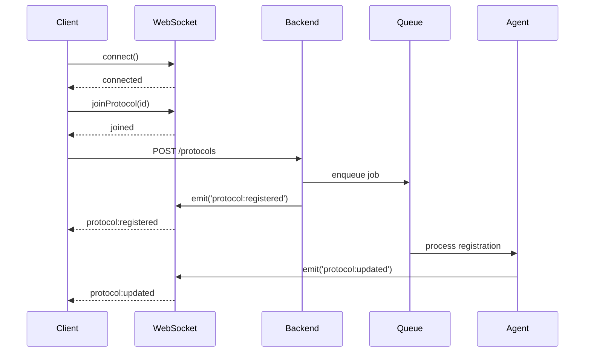
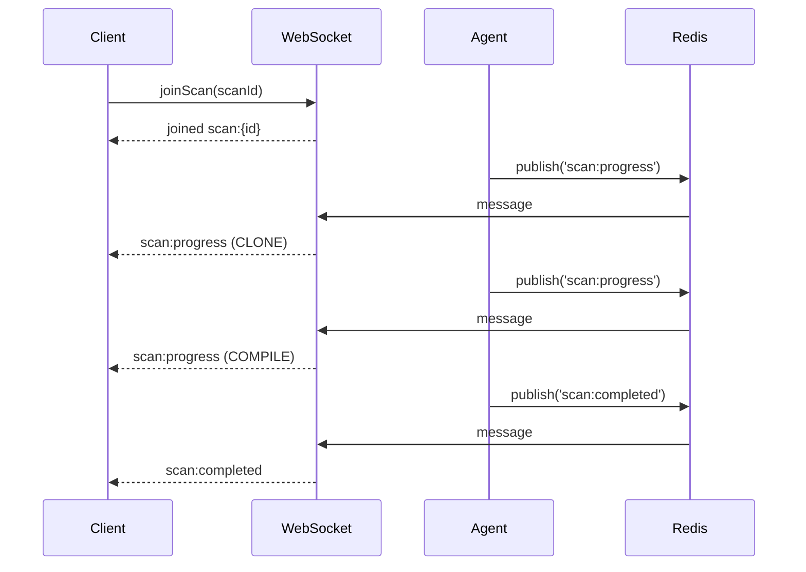

# WebSocket Events Documentation

Real-time event system for the AI Bug Bounty Platform using Socket.io.

## Table of Contents

- [Overview](#overview)
- [Connection](#connection)
- [Room Structure](#room-structure)
- [Event Types](#event-types)
- [Client Examples](#client-examples)
- [Event Flow Diagrams](#event-flow-diagrams)
- [Error Handling](#error-handling)

---

## Overview

The platform uses WebSocket connections to provide real-time updates for:

- Protocol registration status
- Scan progress tracking
- Finding discovery notifications
- Payment processing updates
- System-wide events

**Technology**: Socket.io 4.6+ (WebSocket with fallback to HTTP long-polling)

**Server Endpoint**: `ws://localhost:3000` (development) or `wss://your-api.railway.app` (production)

---

## Connection

### Client Connection

```javascript
import { io } from 'socket.io-client';

// Connect to WebSocket server
const socket = io('ws://localhost:3000', {
  transports: ['websocket', 'polling'],
  auth: {
    token: 'your-auth-token'  // Optional authentication
  }
});

// Connection event handlers
socket.on('connect', () => {
  console.log('Connected:', socket.id);
});

socket.on('disconnect', (reason) => {
  console.log('Disconnected:', reason);
});

socket.on('error', (error) => {
  console.error('Socket error:', error);
});
```

### Authentication

Authentication is optional but recommended for user-specific events:

```javascript
const socket = io('ws://localhost:3000', {
  auth: {
    token: localStorage.getItem('authToken')
  }
});

// Server validates token and sets user context
socket.on('authenticated', (user) => {
  console.log('Authenticated as:', user.address);
});
```

### Heartbeat

Clients must send periodic heartbeats to maintain connection:

```javascript
// Send heartbeat every 30 seconds
setInterval(() => {
  socket.emit('heartbeat');
}, 30000);

// Acknowledge heartbeat
socket.on('heartbeat:ack', () => {
  console.log('Heartbeat acknowledged');
});

// Server disconnects after 60 seconds of inactivity
```

---

## Room Structure

WebSocket rooms organize events by scope.

### Room Types

| Room Pattern | Purpose | Example |
|--------------|---------|---------|
| `protocol:{id}` | Protocol-specific events | `protocol:550e8400-e29b` |
| `scan:{id}` | Scan progress updates | `scan:abc123-def456` |
| `global` | System-wide events | `global` |

### Joining Rooms

```javascript
// Join protocol room
socket.emit('joinProtocol', 'protocol-id-123');

// Join scan room
socket.emit('joinScan', 'scan-id-456');

// Leave all protocol rooms (automatically joins new one)
socket.emit('joinProtocol', 'new-protocol-id');
```

### Room Management

**Server-side**:

```typescript
// Client joins protocol room
socket.on('joinProtocol', (protocolId: string) => {
  // Leave previous protocol rooms
  socket.rooms.forEach(room => {
    if (room.startsWith('protocol:')) {
      socket.leave(room);
    }
  });

  // Join new room
  socket.join(`protocol:${protocolId}`);
});
```

**Client-side**:

```javascript
// Listen for protocol events
socket.on('protocol:updated', (data) => {
  console.log('Protocol updated:', data);
});

// Automatically filtered by room membership
```

---

## Event Types

### Protocol Events

#### protocol:registered

Emitted when a new protocol is registered.

**Room**: `global`

**Payload**:

```json
{
  "protocolId": "550e8400-e29b-41d4-a716-446655440000",
  "githubUrl": "https://github.com/Cyfrin/2023-11-Thunder-Loan",
  "contractName": "ThunderLoan",
  "status": "PENDING",
  "timestamp": "2024-02-01T12:00:00Z"
}
```

**Example**:

```javascript
socket.on('protocol:registered', (data) => {
  showNotification(`New protocol registered: ${data.contractName}`);
  updateProtocolList(data);
});
```

#### protocol:updated

Emitted when protocol status changes.

**Room**: `protocol:{id}`

**Payload**:

```json
{
  "protocolId": "550e8400-e29b-41d4-a716-446655440000",
  "status": "ACTIVE",
  "riskScore": 85,
  "timestamp": "2024-02-01T12:01:30Z"
}
```

#### protocol:funded

Emitted when protocol receives funding.

**Room**: `protocol:{id}`

**Payload**:

```json
{
  "protocolId": "550e8400-e29b-41d4-a716-446655440000",
  "amount": "100.00",
  "currency": "USDC",
  "txHash": "0xabc123...",
  "timestamp": "2024-02-01T12:05:00Z"
}
```

### Scan Events

#### scan:created

Emitted when a new scan is queued.

**Room**: `protocol:{id}`

**Payload**:

```json
{
  "scanId": "scan-550e8400",
  "protocolId": "550e8400-e29b-41d4-a716-446655440000",
  "state": "QUEUED",
  "timestamp": "2024-02-01T12:00:00Z"
}
```

#### scan:progress

Real-time scan progress updates.

**Room**: `scan:{id}`

**Payload**:

```json
{
  "scanId": "scan-550e8400",
  "state": "RUNNING",
  "step": "ANALYZE",
  "progress": 60,
  "message": "Running Slither analysis...",
  "timestamp": "2024-02-01T12:01:30Z"
}
```

**Steps**:

1. `CLONE` - Cloning GitHub repository
2. `COMPILE` - Compiling smart contracts
3. `DEPLOY` - Deploying to local Anvil
4. `ANALYZE` - Running static analysis
5. `AI_ANALYSIS` - AI-powered deep analysis
6. `PROOF_GENERATION` - Generating exploit proofs
7. `SUBMIT` - Submitting to validator

**Example**:

```javascript
socket.on('scan:progress', (data) => {
  updateProgressBar(data.progress);
  showMessage(`Step ${data.step}: ${data.message}`);
});
```

#### scan:completed

Emitted when scan finishes successfully.

**Room**: `scan:{id}`, `protocol:{id}`

**Payload**:

```json
{
  "scanId": "scan-550e8400",
  "protocolId": "550e8400-e29b-41d4-a716-446655440000",
  "state": "SUCCEEDED",
  "findingsCount": 5,
  "duration": 180,
  "timestamp": "2024-02-01T12:03:45Z"
}
```

#### scan:failed

Emitted when scan fails.

**Room**: `scan:{id}`, `protocol:{id}`

**Payload**:

```json
{
  "scanId": "scan-550e8400",
  "state": "FAILED",
  "errorCode": "COMPILATION_ERROR",
  "errorMessage": "Contract compilation failed",
  "retryCount": 1,
  "timestamp": "2024-02-01T12:02:00Z"
}
```

### Finding Events

#### finding:discovered

Emitted when a new vulnerability is discovered.

**Room**: `scan:{id}`, `protocol:{id}`

**Payload**:

```json
{
  "findingId": "finding-123",
  "scanId": "scan-550e8400",
  "vulnerabilityType": "REENTRANCY",
  "severity": "CRITICAL",
  "filePath": "src/protocol/ThunderLoan.sol",
  "lineNumber": 245,
  "description": "Potential reentrancy vulnerability",
  "confidenceScore": 0.95,
  "timestamp": "2024-02-01T12:02:30Z"
}
```

**Example**:

```javascript
socket.on('finding:discovered', (data) => {
  if (data.severity === 'CRITICAL') {
    showAlert(`Critical vulnerability found: ${data.description}`);
  }
  addFindingToList(data);
});
```

#### finding:validated

Emitted when a finding is validated.

**Room**: `protocol:{id}`

**Payload**:

```json
{
  "findingId": "finding-123",
  "status": "VALIDATED",
  "confidence": 92,
  "validationId": "validation-789",
  "timestamp": "2024-02-01T12:05:00Z"
}
```

### Payment Events

#### payment:queued

Emitted when a payment is queued for processing.

**Room**: `protocol:{id}`

**Payload**:

```json
{
  "paymentId": "payment-123",
  "amount": "500.00",
  "currency": "USDC",
  "researcherAddress": "0xResearcher123...",
  "severity": "CRITICAL",
  "status": "PENDING",
  "timestamp": "2024-02-01T12:05:30Z"
}
```

#### payment:processing

Emitted when payment transaction is submitted.

**Room**: `protocol:{id}`

**Payload**:

```json
{
  "paymentId": "payment-123",
  "status": "PROCESSING",
  "txHash": "0xPaymentTx...",
  "timestamp": "2024-02-01T12:05:45Z"
}
```

#### payment:completed

Emitted when payment is confirmed on-chain.

**Room**: `protocol:{id}`, `global`

**Payload**:

```json
{
  "paymentId": "payment-123",
  "amount": "500.00",
  "currency": "USDC",
  "researcherAddress": "0xResearcher123...",
  "status": "COMPLETED",
  "txHash": "0xPaymentTx...",
  "blockNumber": 12345678,
  "timestamp": "2024-02-01T12:06:15Z"
}
```

**Example**:

```javascript
socket.on('payment:completed', (data) => {
  showSuccess(`Payment of ${data.amount} USDC sent to ${data.researcherAddress}`);
  updatePaymentStatus(data.paymentId, 'COMPLETED');
});
```

#### payment:failed

Emitted when payment transaction fails.

**Room**: `protocol:{id}`

**Payload**:

```json
{
  "paymentId": "payment-123",
  "status": "FAILED",
  "errorCode": "INSUFFICIENT_FUNDS",
  "errorMessage": "Insufficient USDC balance in bounty pool",
  "retryCount": 2,
  "timestamp": "2024-02-01T12:06:00Z"
}
```

### System Events

#### system:notification

Global system notifications.

**Room**: `global`

**Payload**:

```json
{
  "type": "INFO",
  "title": "Maintenance Window",
  "message": "System maintenance scheduled for 2024-02-01 23:00 UTC",
  "timestamp": "2024-02-01T12:00:00Z"
}
```

**Types**: `INFO`, `WARNING`, `ERROR`, `SUCCESS`

#### agent:status

Agent status updates (admin only).

**Room**: `global`

**Payload**:

```json
{
  "agentId": "protocol-agent",
  "status": "ACTIVE",
  "queueDepth": 5,
  "timestamp": "2024-02-01T12:00:00Z"
}
```

---

## Client Examples

### React Hook

```typescript
import { useEffect, useState } from 'react';
import { io, Socket } from 'socket.io-client';

export function useWebSocket(url: string) {
  const [socket, setSocket] = useState<Socket | null>(null);
  const [connected, setConnected] = useState(false);

  useEffect(() => {
    const newSocket = io(url, {
      transports: ['websocket', 'polling']
    });

    newSocket.on('connect', () => {
      console.log('WebSocket connected');
      setConnected(true);
    });

    newSocket.on('disconnect', () => {
      console.log('WebSocket disconnected');
      setConnected(false);
    });

    // Heartbeat
    const heartbeat = setInterval(() => {
      newSocket.emit('heartbeat');
    }, 30000);

    setSocket(newSocket);

    return () => {
      clearInterval(heartbeat);
      newSocket.close();
    };
  }, [url]);

  return { socket, connected };
}

// Usage in component
function ScanProgress({ scanId }: { scanId: string }) {
  const { socket } = useWebSocket('ws://localhost:3000');
  const [progress, setProgress] = useState(0);

  useEffect(() => {
    if (!socket) return;

    socket.emit('joinScan', scanId);

    socket.on('scan:progress', (data) => {
      setProgress(data.progress);
    });

    return () => {
      socket.off('scan:progress');
    };
  }, [socket, scanId]);

  return <ProgressBar value={progress} />;
}
```

### Vue Composition API

```typescript
import { ref, onMounted, onUnmounted } from 'vue';
import { io, Socket } from 'socket.io-client';

export function useWebSocket(url: string) {
  const socket = ref<Socket | null>(null);
  const connected = ref(false);

  onMounted(() => {
    socket.value = io(url);

    socket.value.on('connect', () => {
      connected.value = true;
    });

    socket.value.on('disconnect', () => {
      connected.value = false;
    });
  });

  onUnmounted(() => {
    socket.value?.close();
  });

  return { socket, connected };
}
```

### Vanilla JavaScript

```javascript
const socket = io('ws://localhost:3000');

// Protocol updates
socket.emit('joinProtocol', 'protocol-123');

socket.on('protocol:updated', (data) => {
  document.getElementById('status').textContent = data.status;
});

// Scan progress
socket.emit('joinScan', 'scan-456');

socket.on('scan:progress', (data) => {
  const progressBar = document.getElementById('progress');
  progressBar.style.width = `${data.progress}%`;
  progressBar.textContent = data.message;
});

// Payment notifications
socket.on('payment:completed', (data) => {
  showToast(`Payment of ${data.amount} USDC completed!`);
});
```

---

## Event Flow Diagrams

### Protocol Registration Flow



### Scan Progress Flow



---

## Error Handling

### Connection Errors

```javascript
socket.on('connect_error', (error) => {
  console.error('Connection failed:', error.message);
  // Retry logic or fallback to polling
});

socket.on('connect_timeout', () => {
  console.error('Connection timeout');
});
```

### Heartbeat Timeout

```javascript
let heartbeatInterval;
let heartbeatTimeout;

socket.on('connect', () => {
  heartbeatInterval = setInterval(() => {
    socket.emit('heartbeat');

    // Set timeout for acknowledgment
    heartbeatTimeout = setTimeout(() => {
      console.error('Heartbeat timeout - disconnecting');
      socket.disconnect();
    }, 5000);
  }, 30000);
});

socket.on('heartbeat:ack', () => {
  clearTimeout(heartbeatTimeout);
});

socket.on('disconnect', () => {
  clearInterval(heartbeatInterval);
  clearTimeout(heartbeatTimeout);
});
```

### Reconnection

```javascript
socket.io.on('reconnect', (attemptNumber) => {
  console.log('Reconnected after', attemptNumber, 'attempts');

  // Re-join rooms
  if (currentProtocolId) {
    socket.emit('joinProtocol', currentProtocolId);
  }
  if (currentScanId) {
    socket.emit('joinScan', currentScanId);
  }
});

socket.io.on('reconnect_error', (error) => {
  console.error('Reconnection failed:', error);
});

socket.io.on('reconnect_failed', () => {
  console.error('Reconnection failed permanently');
  showError('Unable to connect to server. Please refresh the page.');
});
```

### Rate Limiting

Server enforces connection limits:

- **Max connections per user**: 3
- **Heartbeat timeout**: 60 seconds
- **Auto-disconnect on timeout**: Yes

```javascript
socket.on('error', (error) => {
  if (error === 'Max connections exceeded') {
    showError('Too many active connections. Close other tabs.');
  } else if (error === 'Heartbeat timeout') {
    console.log('Reconnecting due to heartbeat timeout...');
  }
});
```

---

## Best Practices

1. **Always handle disconnections**: Implement reconnection logic
2. **Send heartbeats**: Maintain connection with periodic pings
3. **Clean up listeners**: Remove event listeners on component unmount
4. **Use rooms efficiently**: Join only necessary rooms
5. **Handle errors gracefully**: Provide fallback UI for connection issues
6. **Throttle UI updates**: Avoid re-rendering on every progress event
7. **Secure connections**: Use WSS in production
8. **Validate payloads**: Always validate incoming event data

---

## Testing WebSocket Events

### Manual Testing

```bash
# Install wscat
npm install -g wscat

# Connect to server
wscat -c ws://localhost:3000

# Send heartbeat
> {"type":"heartbeat"}

# Join protocol room
> {"type":"joinProtocol","data":"protocol-123"}
```

### Automated Testing

```typescript
import { io } from 'socket.io-client';

describe('WebSocket Events', () => {
  let socket;

  beforeAll(() => {
    socket = io('http://localhost:3000');
  });

  afterAll(() => {
    socket.close();
  });

  test('should connect and receive heartbeat ack', (done) => {
    socket.on('connect', () => {
      socket.emit('heartbeat');
      socket.on('heartbeat:ack', () => {
        done();
      });
    });
  });

  test('should receive protocol updates', (done) => {
    socket.emit('joinProtocol', 'test-protocol-123');
    socket.on('protocol:updated', (data) => {
      expect(data.protocolId).toBe('test-protocol-123');
      done();
    });
  });
});
```

---

For more information, see:

- [ARCHITECTURE.md](./ARCHITECTURE.md) - System architecture
- [API.md](./API.md) - REST API documentation
- [DEPLOYMENT.md](./DEPLOYMENT.md) - Deployment guide
