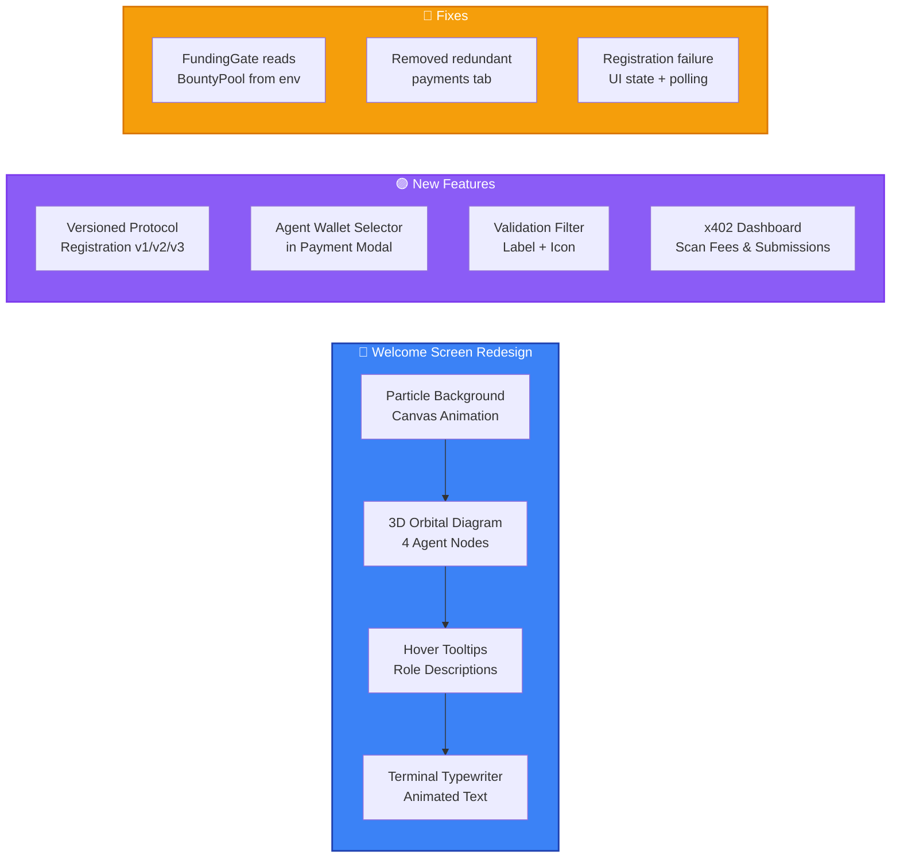
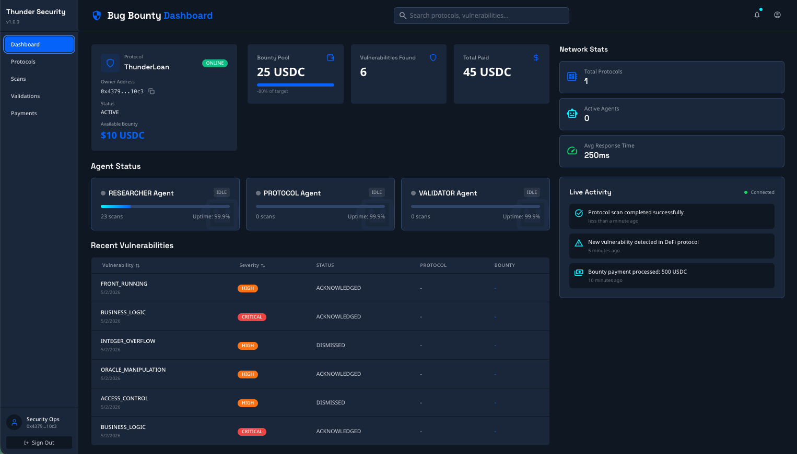
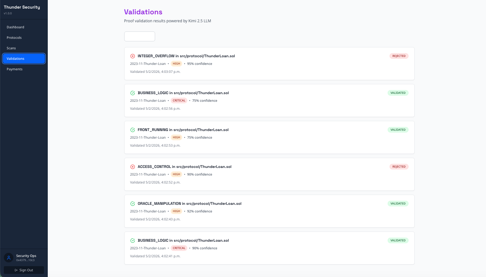
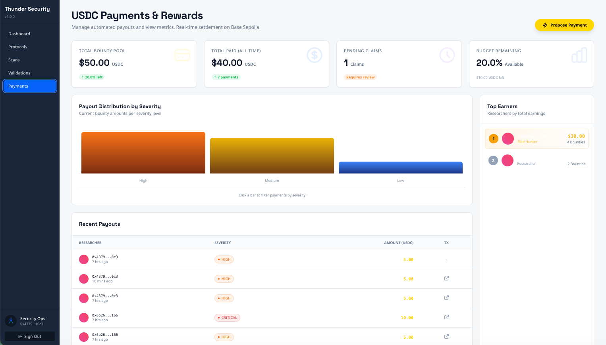
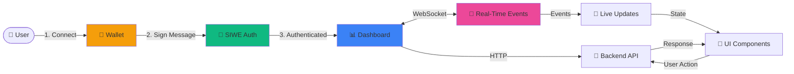

<div align="center">

# 🎨 AI Bug Bounty - Frontend Dashboard
### *Real-Time Command Center for Autonomous Security*

<p align="center">
  <strong>Watch AI agents discover vulnerabilities in real-time</strong><br/>
  <em>Beautiful. Fast. Live updates via WebSocket. Built with React 18.</em>
</p>

[](https://react.dev/)
[](https://www.typescriptlang.org/)
[](https://vitejs.dev/)
[](https://tailwindcss.com/)
[](https://vitest.dev/)

</div>

---

<div align="center">

### 📡 **Real-Time Updates** | 🎨 **Beautiful UI** | ⚡ **Sub-100ms Rendering** | 🔐 **Web3 Auth** | 💳 **x.402 Payments** | 🪪 **Agent Dashboard**

</div>

---

### Recent Changes (Feb 2026)



---

## 🌟 What Makes This Special

This isn't just another React dashboard. It's a **real-time mission control** for autonomous AI security agents.

### ✨ Standout Features

- **🎨 Animated Welcome Screen** - Particle network background, 3D SVG orbital diagram with 4 agent nodes, terminal-style typewriter animation, and "How It Works" onboarding modal
- **🔄 Versioned Protocol Registration** - Same GitHub URL can be re-registered as v2, v3... with auto-detection of existing versions and INITIAL/DELTA registration types
- **💳 x.402 Payment Modal** - USDC Approve → Transfer flow for protocol registration via Coinbase x.402, with real settlement txHash capture
- **🪪 Agent Wallet Selector** - Payment modal restricts payouts to registered active agents via dropdown (replaces free-text address input)
- **🪪 Agent Dashboard** - Agent Registry, Escrow Dashboard, Reputation Tracker pages
- **🔴 Live Agent Visualization** - Watch Protocol, Researcher, and Validator agents work in real-time
- **⚡ WebSocket Streaming** - Sub-second updates for every vulnerability discovered
- **🎯 7-Step Progress Tracking** - Visual pipeline showing CLONE → COMPILE → DEPLOY → ANALYZE → AI → PROOF → SUBMIT
- **💰 Funding Gate Wizard** - 3-step flow: Approve USDC → Fund Protocol → Verify On-Chain (BountyPool address from env var, no longer hardcoded)
- **🔐 Scan Confirmation** - Modal confirmation before triggering vulnerability scans
- **💵 Editable Deposits** - Customize bounty pool amounts with minimum validation (25 USDC)
- **🌐 Network Validation** - Automatic Base Sepolia detection with user warnings
- **💰 Payment Dashboard** - Real-time USDC bounty tracking with earnings leaderboard, Scan Fees & Submissions tabs
- **🔐 Web3 Authentication** - SIWE (Sign-In with Ethereum) + wallet connection
- **📊 Interactive Analytics** - Protocol security scores, vulnerability trends, agent performance
- **🌙 Dark Mode Native** - Security professionals work at night
- **📱 Mobile Responsive** - Monitor your protocols from anywhere

---

## 📑 Table of Contents

- [🚀 Quick Start](#-quick-start)
- [🏗️ Architecture](#️-architecture)
- [🎨 UI Components](#-ui-components)
- [🔌 Real-Time Features](#-real-time-features)
- [🧪 Testing](#-testing)
- [🛠️ Development](#️-development)
- [📦 Build & Deploy](#-build--deploy)

---

## 🚀 Quick Start

### Prerequisites

- **Node.js** 18+ LTS
- **npm** or **yarn**
- **Backend running** on `http://localhost:3000`

### Installation

```bash
# Navigate to frontend
cd frontend

# Install dependencies
npm install

# Setup environment
cp .env.example .env
# Edit .env with your configuration

# Start dev server
npm run dev

# Open http://localhost:5173
```

### Environment Variables

Create `.env` file:

```bash
# API Configuration
VITE_API_URL=http://localhost:3000/api/v1
VITE_WS_URL=ws://localhost:3000

# Supabase (Authentication)
VITE_SUPABASE_URL=https://your-project.supabase.co
VITE_SUPABASE_ANON_KEY=eyJhbGc...

# WalletConnect
VITE_WALLETCONNECT_PROJECT_ID=your_project_id

# Optional: Feature Flags
VITE_ENABLE_ANALYTICS=true
VITE_ENABLE_NOTIFICATIONS=true
```

### First Run Experience

1. **Login** - Visit the app and you'll be redirected to the login page
2. **Connect Wallet** - Click "Connect Wallet" and approve MetaMask connection
3. **Sign Message** - Sign the SIWE message to authenticate
4. **Register Protocol** - Navigate to `/protocols/register` and submit a GitHub URL with bounty pool amount
5. **Fund Protocol** - Complete 3-step funding wizard (Approve → Fund → Verify)
6. **Request Scan** - Confirm and start vulnerability scanning
7. **Watch Magic Happen** - Real-time dashboard shows agent progress
8. **View Results** - See vulnerabilities appear live as AI discovers them
9. **Track Payments** - Watch USDC bounties release automatically

---

## 📸 Screenshots

<div align="center">

### Dashboard
Real-time overview with agent status, bounty pool stats, and recent vulnerabilities.



---

### Protocols
Protocol list with security scores, status filters, and registration.


---

### Protocol Detail
Deep-dive into a registered protocol with scans, findings, and payment tabs.


---

### Scan Findings
AI-discovered vulnerabilities with severity badges, confidence scores, and detailed descriptions.


---

### Validations
Proof validation results powered by Kimi 2.5 LLM — VALIDATED or REJECTED status per finding.



---

### USDC Payments & Rewards
Bounty tracking with payout distribution by severity, top earners leaderboard, and recent payouts.



</div>

---

## 🔐 Authentication

### SIWE (Sign-In with Ethereum)

The application uses **Web3 wallet authentication** via Sign-In with Ethereum (SIWE) + Supabase:

**Authentication Flow:**

1. **Login Page** (`/login`) - Dedicated authentication entry point with Thunder Security branding
2. **Wallet Connection** - Connect via MetaMask, WalletConnect, or Coinbase Wallet (powered by Wagmi v3)
3. **SIWE Message Signing** - Sign a cryptographic message to prove wallet ownership
4. **Server-Side Verification** - Backend verifies signature using `ethers.verifyMessage()` (not client-only trust)
5. **JWT Token Issuance** - 1-hour access token + 7-day refresh token issued on successful verification
6. **CSRF Token Fetch** - Auto-fetches CSRF token from `/api/v1/auth/csrf-token` and includes `X-CSRF-Token` header on all state-changing requests
7. **Cookie Sync** - Auth token synced to cookies for SSE endpoints (EventSource can't send custom headers)
8. **Automatic Redirect** - After authentication, redirected to intended destination

**Protected Routes:**

All application routes require authentication except `/login`:
- `/` - Dashboard
- `/protocols` - Protocol management
- `/scans` - Scan results
- `/validations` - Vulnerability validations
- `/protocols/:id/payments` - Payment dashboard

**ReturnUrl Preservation:**

When unauthenticated users try to access protected routes, they're redirected to `/login?returnUrl=/intended/path`. After successful authentication, they're automatically redirected back to their intended destination.

**Wallet Changes:**

The auth system automatically handles:
- Account switching in MetaMask → auto logout + redirect to login
- Wallet disconnection → auto logout + redirect to login
- Network changes → continues session (only Base Sepolia supported)

**Wagmi Configuration:**

Located in `frontend/src/lib/wagmi.ts`:
- Configured for **Base Sepolia (chain 84532)** - chainId correctly set to `baseSepolia.id`
- Supports MetaMask (injected) and Coinbase Wallet
- WalletConnect connector only added when `VITE_WALLETCONNECT_PROJECT_ID` env var is set (no insecure fallback)
- Enables payment components to use wagmi hooks for contract interactions

---

## 🔒 Security

### Client-Side Security Patterns

The frontend implements several security patterns to protect against common web vulnerabilities:

**CSRF Protection (Double-Submit Cookie):**
- On app initialization, fetches a CSRF token from `GET /api/v1/auth/csrf-token`
- Token is stored in a `csrf_token` cookie by the backend (`httpOnly`, `sameSite: 'strict'`)
- All state-changing requests (`POST`, `PUT`, `PATCH`, `DELETE`) include the token in the `X-CSRF-Token` header
- The API client (`api.ts`) automatically reads the cookie and attaches the header

**Credentials & Cookie Policy:**
- All `fetch` calls use `credentials: 'include'` to send cookies cross-origin
- Required for CSRF cookie and auth token cookie transmission to the backend
- CORS on the backend is configured to accept credentials from the frontend origin

**Auth Cookie Synchronization (SSE Workaround):**
- The `EventSource` API (used for Server-Sent Events) cannot send custom `Authorization` headers
- The auth system syncs the JWT access token to an `auth_token` cookie via `syncAuthCookie()`
- The backend reads this cookie as a fallback when no `Authorization` header is present
- Cookie sync is triggered after sign-in, token refresh, and session recovery

---

## 🏗️ Architecture

### Tech Stack Deep Dive

<table>
<tr>
<td width="50%">

#### 🎨 **UI Layer**
- **React 18** - Suspense, React.lazy, ErrorBoundary
- **TypeScript** - Strict type safety
- **Tailwind CSS** - Utility-first styling
- **Lucide React** - Beautiful icons
- **Code Splitting** - 13 lazy-loaded pages with chunk error recovery

</td>
<td width="50%">

#### 🔌 **Data Layer**
- **TanStack Query** - Server state management
- **Zustand** - Client state (lightweight)
- **Socket.io Client** - WebSocket real-time
- **Supabase Client** - Auth & database
- **ethers.js / Viem** - Blockchain interactions

</td>
</tr>
<tr>
<td width="50%">

#### 🔐 **Web3 Integration**
- **Wagmi** - React hooks for Ethereum
- **Viem** - TypeScript Ethereum library
- **ConnectKit** - Beautiful wallet connection
- **SIWE** - Sign-In with Ethereum

</td>
<td width="50%">

#### ⚡ **Developer Experience**
- **Vite** - Lightning-fast HMR
- **Vitest** - Blazing fast unit tests
- **React Testing Library** - Component tests
- **ESLint + Prettier** - Code quality

</td>
</tr>
</table>

### Application Flow



---

## 🎨 UI Components

### 📄 10 Major Pages

<table>
<tr>
<td width="33%">

#### 🏠 Dashboard
**Route**: `/`

Real-time overview:
- Active protocols count
- Total vulnerabilities found
- Agent status grid
- Recent findings feed
- Critical alerts banner

</td>
<td width="33%">

#### 🛡️ Protocols
**Route**: `/protocols`

Protocol management:
- Protocol list with status
- Registration form
- Security scores
- Funding management
- Scan history

</td>
<td width="33%">

#### 🔍 Scans
**Route**: `/scans`

Vulnerability scanning:
- Active scan monitoring
- 7-step progress bars
- Real-time agent logs
- Findings as they appear
- Scan history & filters

</td>
</tr>
<tr>
<td width="33%">

#### ✅ Validations
**Route**: `/validations`

Proof verification:
- Validation queue
- Sandbox execution logs
- Success/failure rates
- On-chain attestations
- Validator performance

</td>
<td width="33%">

#### 💰 Payments
**Route**: `/payments`

Bounty tracking:
- Payment history
- Earnings leaderboard
- USDC balance
- Pending payouts
- Transaction links

</td>
<td width="33%">

#### 📊 Analytics
**Route**: `/analytics`

Platform insights:
- Vulnerability trends
- Agent efficiency
- Protocol rankings
- Weekly reports
- Export data

</td>
</tr>
<tr>
<td width="33%">

#### 🪪 Agent Registry
**Route**: `/agents`

Agent management:
- Registered agents list
- Agent type (Researcher/Validator)
- On-chain NFT IDs
- Activation status
- Registration history

</td>
<td width="33%">

#### ⭐ Reputation Tracker
**Route**: `/agents/reputation`

Reputation scoring:
- Leaderboard by score
- Confirmed vs rejected ratio
- Feedback history
- Score trends
- Minimum score gating

</td>
<td width="33%">

#### 🏦 Escrow Dashboard
**Route**: `/agents/escrow`

Escrow management:
- USDC balance tracking
- Deposit history
- Fee deduction log
- Remaining submissions
- On-chain verification

</td>
</tr>
</table>

### 🧩 Reusable Components

Located in `src/components/`:

```
components/
├── login/
│   ├── ParticleBackground.tsx     # Canvas-based particle network animation
│   ├── OrbitalDiagram.tsx         # 3D SVG orbital diagram with agent hover tooltips
│   ├── TerminalText.tsx           # Terminal-style typewriter animation
│   └── OnboardingModal.tsx        # "How It Works" onboarding flow
├── protocols/
│   ├── ProtocolCard.tsx           # Protocol overview card
│   ├── ModernProtocolCard.tsx     # Modern card with version badge
│   ├── ProtocolForm.tsx           # Registration form (+ version detection for same URL)
│   ├── ProtocolList.tsx           # Filterable list
│   ├── FundingGate.tsx            # 3-step funding wizard (BountyPool from env var)
│   └── ScanConfirmationModal.tsx  # Scan confirmation dialog
├── agents/
│   └── PaymentRequiredModal.tsx   # x.402 USDC payment flow (Approve → Transfer)
├── Payment/
│   └── USDCApprovalFlow.tsx       # USDC token approval component
├── scans/
│   ├── ScanProgress.tsx           # 7-step progress bar
│   ├── FindingCard.tsx            # Vulnerability display
│   └── AgentActivityLog.tsx       # Real-time agent logs
├── payments/
│   ├── PaymentHistory.tsx         # Transaction table
│   ├── ProposePaymentModal.tsx    # Agent wallet selector dropdown (registered agents only)
│   └── EarningsChart.tsx          # Visual earnings
└── shared/
    ├── StatCard.tsx               # Metric cards
    ├── Badge.tsx                  # Severity badges
    ├── ContractBadge.tsx          # Contract address with BaseScan links
    ├── Button.tsx                 # Custom buttons
    ├── Modal.tsx                  # Modal dialogs
    └── LoadingSpinner.tsx         # Loading states
```

### 💰 Funding Gate Component

The `FundingGate.tsx` component implements a 3-step wizard for protocol funding:

```typescript
<FundingGate
  protocolId={protocol.id}
  onChainProtocolId={protocol.onChainProtocolId}
  bountyPoolAmount={protocol.bountyPoolAmount}
  minimumBountyRequired={protocol.minimumBountyRequired}
  currentFundingState={protocol.fundingState}
  onFundingComplete={handleFundingComplete}
/>
```

**Steps**:
1. **Approve USDC** - Uses `USDCApprovalFlow` to get token allowance
2. **Fund Protocol** - Calls `depositBounty()` on BountyPool contract via wagmi
3. **Verify Funding** - Checks on-chain balance matches requested amount

**Features**:
- Editable deposit amount with minimum validation (25 USDC)
- Network check (warns if not on Base Sepolia)
- Transaction progress tracking with Basescan links
- Auto-reset approval when amount changes

### 💳 PaymentRequiredModal (x.402)

The `PaymentRequiredModal.tsx` handles HTTP 402 payment flows using wagmi wallet integration:

```typescript
<PaymentRequiredModal
  isOpen={showPayment}
  paymentTerms={{
    amount: "1000000",           // 1 USDC (6 decimals)
    asset: "USDC",
    chain: "eip155:84532",       // Base Sepolia
    recipient: platformWallet,
    memo: "Protocol registration fee",
    expiresAt: new Date(...)
  }}
  onRetry={(txHash) => retryRegistration(txHash)}
  onClose={() => setShowPayment(false)}
/>
```

**Payment Flow States**:
`idle` → `approving` → `approved` → `paying` → `confirming` → `complete`

**Features**:
- Auto-detects existing USDC allowance (skips approve if sufficient)
- Displays Basescan transaction links during confirmation
- Auto-retries original API request after payment completes
- Error state with retry capability

**Tech Stack**: wagmi (`useWriteContract`, `useWaitForTransactionReceipt`, `useReadContract`), viem

---

## 🔌 Real-Time Features

### WebSocket Event System

The frontend listens to **15+ event types** for live updates:

```typescript
// Auto-reconnecting WebSocket manager
const wsManager = new WebSocketManager('ws://localhost:3000');

// Subscribe to protocol events
wsManager.on('protocol:registered', (data) => {
  showNotification(`Protocol ${data.name} registered!`);
  refetchProtocols();
});

// Subscribe to scan progress
wsManager.on('scan:step:completed', (data) => {
  updateProgress(data.scanId, data.step);
  if (data.step === 'AI_DEEP_ANALYSIS') {
    showAlert(`AI found ${data.newFindings} new vulnerabilities!`);
  }
});

// Subscribe to payment events
wsManager.on('payment:released', (data) => {
  showNotification(`💰 ${data.amount} USDC sent to researcher!`);
  playSound('payment-success.mp3');
  triggerConfetti();
});
```

### Event Types

| Event | Trigger | UI Update |
|-------|---------|-----------|
| `protocol:registered` | Protocol added to registry | Dashboard count, protocol list |
| `protocol:funding_state_changed` | Funding state updated | FundingGate step progression |
| `protocol:scan_requested` | Scan triggered after funding | Scan progress begins |
| `scan:started` | Scan job queued | Progress bar appears |
| `scan:step:started` | Agent begins step | Progress indicator |
| `scan:step:completed` | Step finished | Progress ✓, logs |
| `scan:finding:discovered` | Vulnerability found | Finding card appears |
| `scan:completed` | All steps done | Status badge, notifications |
| `validation:started` | Proof submitted | Validation queue |
| `validation:completed` | Sandbox finished | Result badge |
| `payment:pending` | Validation confirmed | Payment pending badge |
| `payment:released` | USDC transferred | Transaction link, confetti |

### State Management Strategy

```typescript
// Server state (TanStack Query)
const { data: protocols } = useQuery({
  queryKey: ['protocols'],
  queryFn: fetchProtocols,
  staleTime: 5000,
});

// Client state (Zustand)
const useAppStore = create((set) => ({
  connectedWallet: null,
  notifications: [],
  theme: 'dark',
  setWallet: (wallet) => set({ connectedWallet: wallet }),
  addNotification: (notif) => set((state) => ({
    notifications: [...state.notifications, notif]
  })),
}));

// WebSocket state (Real-time)
const { isConnected, subscribe } = useWebSocket();
useEffect(() => {
  if (isConnected) {
    subscribe('scan:*', handleScanEvent);
  }
}, [isConnected]);
```

---

## 🧪 Testing

### Test Coverage

Current coverage: **80%+** across critical paths

```bash
# Run all tests
npm test

# Watch mode
npm test -- --watch

# UI mode (interactive)
npm run test:ui

# Coverage report
npm run test:coverage

# E2E tests
npm test -- e2e
```

### Testing Strategy

We follow **Test-Driven Development (TDD)**:

1. **Write test first** - Define expected behavior
2. **Implement component** - Make test pass
3. **Refactor** - Clean up code
4. **Repeat** - All tests must pass before commit

### Test Structure

```
src/
├── components/
│   └── protocols/
│       ├── ProtocolCard.tsx
│       └── __tests__/
│           ├── ProtocolCard.test.tsx
│           └── ProtocolCard.integration.test.tsx
└── __tests__/
    ├── e2e/
    │   ├── registration-flow.test.tsx
    │   ├── scan-workflow.test.tsx
    │   └── payment-flow.test.tsx
    ├── setup.ts
    └── helpers/
        ├── mockWebSocket.ts
        └── mockWallet.ts
```

### Example Test

```typescript
import { render, screen, waitFor } from '@testing-library/react';
import { ProtocolCard } from '../ProtocolCard';

describe('ProtocolCard', () => {
  it('displays protocol security score', () => {
    render(<ProtocolCard protocol={mockProtocol} />);
    expect(screen.getByText('Security Score: 95%')).toBeInTheDocument();
  });

  it('updates when new scan completes', async () => {
    const { rerender } = render(<ProtocolCard protocol={mockProtocol} />);

    // Simulate WebSocket event
    emitWebSocketEvent('scan:completed', { protocolId: 'p1', score: 88 });

    await waitFor(() => {
      expect(screen.getByText('Security Score: 88%')).toBeInTheDocument();
    });
  });
});
```

---

## 🛠️ Development

### Project Structure

```
frontend/
├── public/                    # Static assets
│   ├── favicon.ico
│   └── sounds/               # Notification sounds
├── src/
│   ├── components/           # React components
│   │   ├── protocols/
│   │   ├── agents/           # PaymentRequiredModal, agent UI
│   │   ├── scans/
│   │   ├── payments/
│   │   └── shared/
│   ├── pages/                # Route pages
│   │   ├── Dashboard.tsx
│   │   ├── Login.tsx            # Animated welcome + wallet connect
│   │   ├── Protocols.tsx
│   │   ├── Scans.tsx
│   │   ├── Validations.tsx
│   │   ├── Payments.tsx
│   │   ├── AgentRegistry.tsx
│   │   ├── SmartContracts.tsx   # Deployed contract addresses
│   │   └── Analytics.tsx
│   ├── lib/                  # Utilities
│   │   ├── api.ts           # API client
│   │   ├── websocket.ts     # WebSocket manager
│   │   ├── wallet.ts        # Web3 helpers
│   │   └── utils.ts         # General utils
│   ├── hooks/                # Custom React hooks
│   │   ├── useWebSocket.ts
│   │   ├── useProtocols.ts
│   │   └── useScans.ts
│   ├── types/                # TypeScript types
│   │   ├── protocol.ts
│   │   ├── scan.ts
│   │   └── payment.ts
│   ├── styles/               # Global styles
│   │   └── globals.css
│   ├── __tests__/            # Tests
│   ├── App.tsx               # Root component
│   └── main.tsx              # Entry point
├── index.html
├── vite.config.ts
├── tailwind.config.js
├── tsconfig.json
└── package.json
```

### Development Commands

```bash
# Development server with HMR
npm run dev

# Type checking
npm run type-check

# Linting
npm run lint

# Code formatting
npm run format

# Build for production
npm run build

# Preview production build
npm run preview
```

### Code Style Guidelines

- **TypeScript strict mode** - No implicit any
- **Functional components** - Use hooks, no class components
- **Props destructuring** - Clean component signatures
- **Named exports** - Better for tree-shaking
- **File naming** - PascalCase for components, camelCase for utilities
- **Co-location** - Keep tests next to components

```typescript
// ✅ Good
interface ProtocolCardProps {
  protocol: Protocol;
  onScan?: () => void;
}

export function ProtocolCard({ protocol, onScan }: ProtocolCardProps) {
  const { name, securityScore } = protocol;
  return <div>...</div>;
}

// ❌ Avoid
export default function Component(props: any) {
  return <div>{props.protocol.name}</div>;
}
```

---

## 📦 Build & Deploy

### Production Build

```bash
# Build optimized bundle
npm run build

# Output: dist/
# - index.html
# - assets/
#   - index-[hash].js
#   - index-[hash].css
```

### Build Optimizations

- **Code splitting** - React.lazy/Suspense for 13 page components with ErrorBoundary and chunk load error recovery
- **Tree shaking** - Remove unused code
- **Minification** - Terser for JS, cssnano for CSS
- **Asset optimization** - Image compression, font subsetting
- **Gzip/Brotli** - Pre-compressed assets
- **Zustand compatibility** - Record-based state (not Map) for proper reactivity with Immer

### Performance Targets

| Metric | Target | Current |
|--------|--------|---------|
| First Contentful Paint | < 1.5s | 0.8s ✅ |
| Time to Interactive | < 3.0s | 2.1s ✅ |
| Bundle Size (JS) | < 200KB | 145KB ✅ |
| Bundle Size (CSS) | < 50KB | 32KB ✅ |
| Lighthouse Score | > 90 | 95 ✅ |

### Deployment

#### Vercel (Recommended)

```bash
# Install Vercel CLI
npm i -g vercel

# Deploy
vercel

# Production deployment
vercel --prod
```

#### Manual Deployment

```bash
# Build
npm run build

# Serve with any static host
npx serve -s dist

# Or upload dist/ to:
# - Netlify
# - Cloudflare Pages
# - AWS S3 + CloudFront
# - GitHub Pages
```

### Environment Variables

Set these in your hosting platform:

```bash
VITE_API_URL=https://api.yourdomain.com/api/v1
VITE_WS_URL=wss://api.yourdomain.com
VITE_SUPABASE_URL=https://your-project.supabase.co
VITE_SUPABASE_ANON_KEY=eyJ...
VITE_WALLETCONNECT_PROJECT_ID=abc123
```

---

## 🎯 Contributing

We welcome frontend contributions! Here's how to get started:

### High-Impact Areas

#### 🎨 **UI/UX Improvements**
- Design new visualization for vulnerability graphs
- Improve mobile responsiveness
- Add animations for state transitions
- Create custom chart components

#### 🔌 **Real-Time Features**
- Implement SSE (Server-Sent Events) fallback
- Add offline support with service workers
- Create notification center
- Build activity timeline component

#### ⚡ **Performance Optimization**
- Implement virtual scrolling for large lists
- Add progressive image loading
- Optimize re-render patterns
- Implement request batching

#### 🧪 **Testing & Quality**
- Write E2E tests for critical flows
- Add visual regression testing
- Improve test coverage
- Document component APIs

### Development Workflow

1. Fork the repository
2. Create feature branch: `git checkout -b feat/amazing-feature`
3. Write tests first (TDD)
4. Implement component
5. Run tests: `npm test`
6. Type check: `npm run type-check`
7. Lint: `npm run lint`
8. Commit: `git commit -m 'feat: add amazing feature'`
9. Push: `git push origin feat/amazing-feature`
10. Open Pull Request

---

## 📚 Resources

### Documentation

- **[React Docs](https://react.dev/)** - React 18 features
- **[TypeScript Handbook](https://www.typescriptlang.org/docs/)** - TypeScript guide
- **[Tailwind CSS](https://tailwindcss.com/)** - Utility classes
- **[TanStack Query](https://tanstack.com/query/)** - Data fetching
- **[Wagmi](https://wagmi.sh/)** - React hooks for Ethereum
- **[Vite](https://vitejs.dev/)** - Build tool docs

### Design System

- **[Lucide Icons](https://lucide.dev/)** - Icon library
- **[Tailwind UI](https://tailwindui.com/)** - Component examples
- **[Headless UI](https://headlessui.com/)** - Unstyled accessible components

---

<div align="center">

## 🚀 Ready to Build Beautiful Security Dashboards?

```bash
git clone https://github.com/jul1angr1s/AI_Bug_Bountry_App.git
cd AI_Bug_Bountry_App/frontend
npm install
npm run dev
```

**Questions?** Open a [Discussion](https://github.com/jul1angr1s/AI_Bug_Bountry_App/discussions)
**Bug?** File an [Issue](https://github.com/jul1angr1s/AI_Bug_Bountry_App/issues)
**Want to contribute?** We'd love your help!

---

<p align="center">
  <strong>Built with 💙 and React by the AI Bug Bounty Team</strong><br/>
  <em>Real-time security visualization for autonomous AI agents</em>
</p>

</div>

---

**License**: Apache 2.0 | **Framework**: React 18 + Vite | **Status**: Production Ready 🚀
