# 🛡️ Autonomous Bug Bounty Console

> *The command center for continuous, AI-powered security auditing.*

Welcome to the **Frontend Console** of the Autonomous Bug Bounty platform. This is a high-performance, real-time dashboard built with **React 18** and **Vite**, designed to give researchers and protocol maintainers a God-mode view of the security landscape.

## ⚡ Architecture Flow

```mermaid
graph TD
    User([👤 User]) -->|Connects Wallet| Wallet[🦊 Wagmi / Viem]
    User -->|Interacts| UI[🖥️ React 18 Dashboard]

    subgraph Client Layer
        UI -->|State Mgmt| STORE[🐻 Zustand Store]
        UI -->|Data Fetching| QUERY[⚡ TanStack Query]
    end

    subgraph Network Layer
        UI -->|Real-time Events| WS[🔌 Socket.io Client]
        UI -->|Auth & DB| SUPA[🔥 Supabase Client]
        Wallet -->|Signatures| CHAIN[⛓️ Base Sepolia / Anvil]
    end

    WS <-->|Live Updates| BACKEND[🚀 Backend API]
```



## 🛠️ Technology Stack

We use a modern, type-safe stack optimized for speed and developer experience:

- **Core**: React 18, TypeScript, Vite
- **State**: Zustand (Client), TanStack Query (Server)
- **Styling**: Tailwind CSS, Lucide React
- **Web3**: Wagmi, Viem, ConnectKit, Ethers.js
- **Realtime**: Socket.io-client, Supabase

## 🚀 Key Features

- **Live Vulnerability Feed**: Watch AI agents find bugs in real-time via WebSocket streams.
- **Web3 Authentication**: Seamless login with SIWE (Sign-In with Ethereum).
- **Interactive Graphs**: Visualize attack vectors and finding statistics.
- **Dark Mode Native**: Because security professionals don't like glare.

## 🏁 Getting Started

### 1. Prerequisites
- Node.js 18+
- pnpm or npm

### 2. Installation

```bash
cd frontend
npm install
```

### 3. Environment Setup
Create a `.env` file in the frontend root:

```env
VITE_SUPABASE_URL=your_supabase_url
VITE_SUPABASE_ANON_KEY=your_supabase_key
VITE_WALLETCONNECT_PROJECT_ID=your_wc_id
VITE_API_URL=http://localhost:3000
```

### 4. Lift Off 🚀

```bash
npm run dev
```

The console will launch at `http://localhost:5173`. Prepare for liftoff.

## 🧪 Testing

Run our blazing fast test suite powered by Vitest:

```bash
npm run test
# OR for a UI visualizer
npm run test:ui
```
