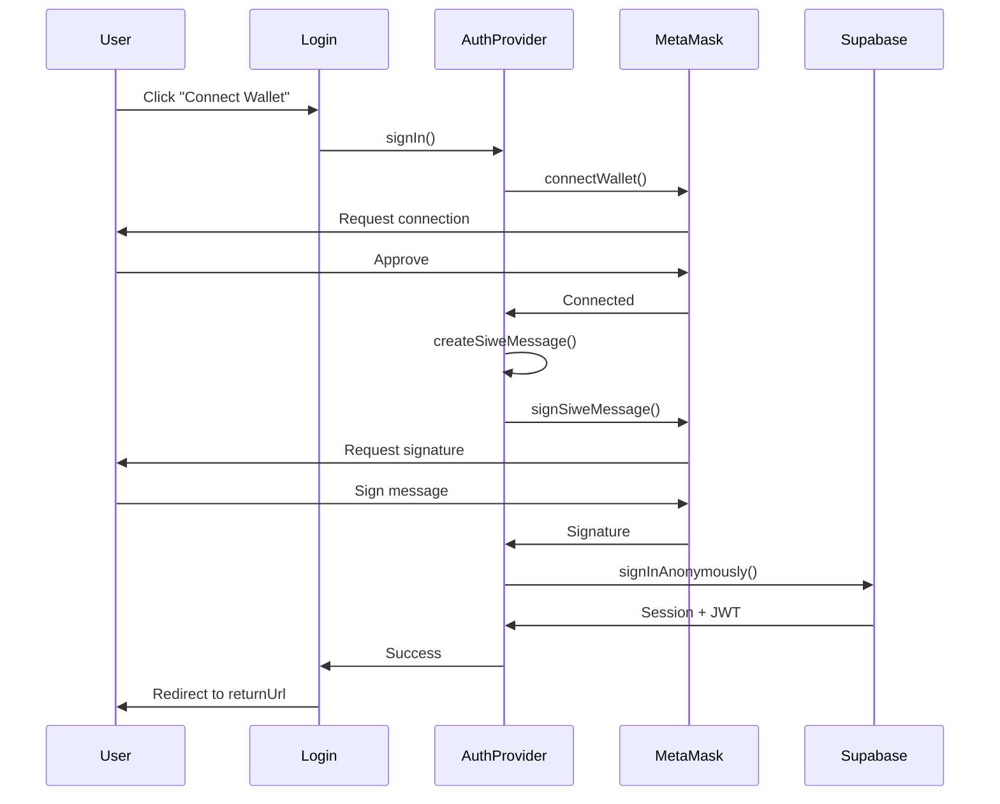

# Design: Login Page Implementation

## Context

The AI Bug Bounty Platform currently has a solid SIWE + Supabase authentication implementation in `/frontend/src/lib/auth.tsx`, but lacks a dedicated login page and comprehensive route protection. The ProtectedRoute component redirects to `/login`, which doesn't exist, creating a broken user flow.

## Goals

1. **Create dedicated login page** with Thunder Security branding
2. **Protect all application routes** (dashboard, protocols, scans, validations, payments)
3. **Configure Wagmi provider** for proper wallet interaction patterns
4. **Preserve user intent** with returnUrl redirect flow
5. **Maintain existing auth** - no changes to AuthProvider signIn/signOut logic

## Non-Goals

- Changes to SIWE authentication implementation
- New authentication methods (OAuth, email/password)
- Multi-factor authentication
- Session management changes
- Backend API changes

## Technical Decisions

### Decision 1: Wagmi Configuration Strategy

**Chosen Approach:** Configure WagmiProvider with Base Sepolia only, minimal connectors

**Rationale:**
- Project uses Base Sepolia (chain 84532) for USDC payments
- Need MetaMask (primary), WalletConnect, and Coinbase Wallet support
- Keep configuration simple and focused on actual deployment chain
- Avoid unnecessary multi-chain complexity

**Implementation:**
```typescript
// frontend/src/lib/wagmi.ts
import { http, createConfig } from 'wagmi';
import { baseSepolia } from 'wagmi/chains';
import { injected, walletConnect, coinbaseWallet } from 'wagmi/connectors';

export const config = createConfig({
  chains: [baseSepolia],
  connectors: [
    injected(), // MetaMask
    walletConnect({
      projectId: import.meta.env.VITE_WALLETCONNECT_PROJECT_ID || 'demo-project-id',
    }),
    coinbaseWallet({ appName: 'Thunder Security' }),
  ],
  transports: {
    [baseSepolia.id]: http(),
  },
});
```

**Provider Hierarchy:**
```
QueryClientProvider
└─ WagmiProvider (NEW - wagmi wallet UI)
   └─ BrowserRouter
      └─ AuthProvider (EXISTING - SIWE + Supabase)
         └─ App
```

**Alternatives Considered:**
- **Multi-chain support:** Rejected - only Base Sepolia is used in production
- **ConnectKit UI:** Rejected - custom UI already implemented in AuthProvider
- **Rainbowkit:** Rejected - overkill for simple wallet connection

### Decision 2: Login Page Design

**Chosen Approach:** Centered card with gradient background, minimal form

**Visual Specifications:**
- Background: `linear-gradient(135deg, #0A0E1A 0%, #0F1421 50%, #1a1f2e 100%)`
- Card: `max-w-md`, `bg-[#1a1f2e]`, `border border-gray-800`, `rounded-lg`, `p-12`
- Button: `from-blue-500 to-blue-600`, `hover:from-blue-600 to-blue-700`
- Typography: Thunder Security logo/text, subtitle "Connect your wallet to continue"
- Loading: Loader2 icon with `animate-spin` + "Connecting..." text
- Error: Red text with retry button

**User Flow:**
1. User lands on `/login` (or redirected from protected route)
2. See Thunder Security branding + "Connect Wallet" button
3. Click button → calls `signIn()` from AuthProvider
4. MetaMask opens → user approves connection
5. SIWE message signing → user approves signature
6. Success → redirect to `returnUrl` or `/` dashboard
7. Error → display error message + retry button

**Component Structure:**
```typescript
export default function Login() {
  const { user, loading: authLoading, signIn } = useAuth();
  const [connecting, setConnecting] = useState(false);
  const [error, setError] = useState<string | null>(null);
  const navigate = useNavigate();
  const location = useLocation();

  const searchParams = new URLSearchParams(location.search);
  const returnUrl = searchParams.get('returnUrl') || '/';

  // Auto-redirect if already authenticated
  useEffect(() => {
    if (user && !authLoading) {
      navigate(returnUrl, { replace: true });
    }
  }, [user, authLoading, navigate, returnUrl]);

  const handleConnect = async () => {
    try {
      setConnecting(true);
      setError(null);
      await signIn();
      toast.success('Successfully authenticated');
      navigate(returnUrl);
    } catch (err: any) {
      // Error handling by type
      if (err.message?.includes('User rejected')) {
        setError('Connection request was rejected. Please try again.');
      } else if (err.message?.includes('No Web3')) {
        setError('No Web3 wallet detected. Please install MetaMask.');
      } else {
        setError('Failed to connect. Please try again.');
      }
    } finally {
      setConnecting(false);
    }
  };

  // Render UI...
}
```

**Alternatives Considered:**
- **Email + password form:** Rejected - SIWE is the chosen auth method
- **Multi-step wizard:** Rejected - single-step connection is simpler
- **Embedded in sidebar:** Rejected - dedicated page is clearer UX

### Decision 3: Route Protection Strategy

**Chosen Approach:** Nested routes with single ProtectedRoute wrapper

**Route Structure:**
```typescript
<Routes>
  {/* PUBLIC ROUTE */}
  <Route path="/login" element={<Login />} />

  {/* PROTECTED ROUTES */}
  <Route
    element={
      <ProtectedRoute>
        <DashboardLayout>
          <Outlet />
        </DashboardLayout>
      </ProtectedRoute>
    }
  >
    <Route path="/" element={<Dashboard />} />
    <Route path="/protocols" element={<Protocols />} />
    <Route path="/protocols/register" element={<ProtocolRegistration />} />
    <Route path="/protocols/:id" element={<ProtocolDetail />} />
    <Route path="/scans" element={<Scans />} />
    <Route path="/scans/:id" element={<ScanDetail />} />
    <Route path="/validations" element={<Validations />} />
    <Route path="/protocols/:id/payments" element={<PaymentDashboard />} />
  </Route>

  {/* REDIRECTS */}
  <Route path="/payments" element={<Navigate to="/protocols" replace />} />
  <Route path="*" element={<Navigate to="/" replace />} />
</Routes>
```

**Benefits:**
- Single ProtectedRoute check for all authenticated routes
- DashboardLayout automatically applied to protected routes
- Login page isolated without sidebar
- Clean nested structure with `<Outlet />`

**Alternatives Considered:**
- **Individual ProtectedRoute per route:** Rejected - repetitive and error-prone
- **HOC wrapper:** Rejected - React Router v6 prefers element composition
- **AuthContext check in each page:** Rejected - not DRY, easy to forget

### Decision 4: ReturnUrl Implementation

**Chosen Approach:** Query parameter with URL encoding

**ProtectedRoute Enhancement:**
```typescript
if (!user) {
  const returnUrl = location.pathname + location.search;
  return <Navigate to={`/login?returnUrl=${encodeURIComponent(returnUrl)}`} replace />;
}
```

**Login Page Handling:**
```typescript
const searchParams = new URLSearchParams(location.search);
const returnUrl = searchParams.get('returnUrl') || '/';

// After successful auth
navigate(returnUrl);
```

**Security:**
- ReturnUrl must start with `/` (internal path only)
- Reject external URLs (no `http://`, `https://`, `//`)
- URL-encode to handle special characters

**Alternatives Considered:**
- **Local storage:** Rejected - query param is more transparent
- **Session storage:** Rejected - doesn't survive tab close
- **State prop:** Rejected - doesn't work with direct URL access

## Component Interactions

### Authentication Flow Diagram



### Provider Hierarchy

```
main.tsx
├─ ErrorBoundary
└─ QueryClientProvider
   └─ WagmiProvider [NEW]
      └─ BrowserRouter
         └─ AuthProvider [EXISTING]
            └─ App
               ├─ /login (public)
               └─ ProtectedRoute
                  └─ DashboardLayout
                     └─ <Outlet />
                        ├─ Dashboard
                        ├─ Protocols
                        ├─ Scans
                        ├─ Validations
                        └─ Payments
```

## Migration Plan

### Phase 1: Wagmi Configuration (No User Impact)
1. Create `/frontend/src/lib/wagmi.ts`
2. Add WagmiProvider to `/frontend/src/main.tsx`
3. Test payment components still work
4. Commit: "feat(frontend): add wagmi provider configuration"

### Phase 2: Login Page (New Route)
1. Create `/frontend/src/pages/Login.tsx`
2. Implement UI with Thunder Security branding
3. Test authentication flow
4. Commit: "feat(frontend): create dedicated login page"

### Phase 3: Route Protection (Breaking Change)
1. Update `/frontend/src/components/ProtectedRoute.tsx` with returnUrl
2. Restructure routes in `/frontend/src/App.tsx`
3. Test all routes require authentication
4. Commit: "feat(frontend): protect all routes and isolate login page"

### Phase 4: Documentation
1. Update `/frontend/README.md`
2. Update `/openspec/specs/frontend.md`
3. Commit: "docs(frontend): document login page and wagmi configuration"

### Phase 5: PR and Merge
1. Push feature branch
2. Create PR with comprehensive testing checklist
3. Manual testing (all scenarios)
4. Merge to main after approval
5. Archive OpenSpec change

## Risks and Trade-offs

### Risk 1: Breaking Existing Auth Flow
**Likelihood:** Low
**Impact:** High
**Mitigation:** No changes to AuthProvider signIn/signOut logic, only UI layer changes. Existing session handling remains unchanged.

### Risk 2: ReturnUrl Open Redirect Vulnerability
**Likelihood:** Medium
**Impact:** High
**Mitigation:** Validate returnUrl is internal path (starts with `/`), reject external URLs. Add input sanitization.

### Risk 3: Wagmi Provider Breaking Payment Components
**Likelihood:** Medium
**Impact:** Medium
**Mitigation:** Test payment components thoroughly before and after. Wagmi configuration matches existing Base Sepolia usage. Fallback to window.ethereum still works if needed.

### Risk 4: Session State Confusion
**Likelihood:** Low
**Impact:** Medium
**Mitigation:** AuthProvider remains single source of truth for authentication. Wagmi only handles wallet UI state, not session state.

### Trade-off 1: Single Login Method
**Decision:** Only support wallet-based SIWE authentication
**Rationale:** Consistent with Web3 platform identity. Email/password would require backend changes and separate session management.
**Consequence:** Users without MetaMask need to install it first.

### Trade-off 2: No Remember Me
**Decision:** Session expires when user disconnects wallet
**Rationale:** Security-first approach for financial platform. Users can stay connected in MetaMask.
**Consequence:** Users must reconnect after wallet disconnection.

## Testing Strategy

### Manual Testing Checklist

**Route Protection:**
- [ ] Visit `/` when not authenticated → redirect to `/login?returnUrl=/`
- [ ] Visit `/protocols` when not authenticated → redirect to `/login?returnUrl=/protocols`
- [ ] Visit `/scans` when not authenticated → redirect
- [ ] Visit `/validations` when not authenticated → redirect
- [ ] Visit `/protocols/:id/payments` when not authenticated → redirect

**Login Flow:**
- [ ] Login page renders with Thunder Security branding
- [ ] Click "Connect Wallet" → MetaMask opens
- [ ] Approve connection → SIWE message signing prompt
- [ ] Sign message → Authentication succeeds
- [ ] Redirect to returnUrl or dashboard
- [ ] Toast notification shows "Successfully authenticated"

**Error Handling:**
- [ ] No MetaMask installed → Error message with guidance
- [ ] Reject wallet connection → "Connection rejected" error with retry
- [ ] Reject signature → "Authentication cancelled" error with retry
- [ ] Retry button works correctly

**Edge Cases:**
- [ ] Already authenticated user visits `/login` → redirect to dashboard
- [ ] Change MetaMask account → auto logout → redirect to `/login`
- [ ] Disconnect wallet in MetaMask → auto logout → redirect to `/login`
- [ ] Special characters in returnUrl → properly encoded and decoded

**Payment Components (Regression):**
- [ ] Navigate to `/protocols/:id/payments` when authenticated
- [ ] BountyPoolStatus renders without errors
- [ ] USDCApprovalFlow wagmi hooks work
- [ ] EarningsLeaderboard displays correctly

**Browser Compatibility:**
- [ ] Chrome (latest)
- [ ] Firefox (latest)
- [ ] Safari (latest)

### Automated Testing (Future)

**Unit Tests:**
- Login component: rendering, error states, loading states
- ProtectedRoute: returnUrl encoding, redirect logic
- Wagmi config: chain configuration, connector setup

**Integration Tests:**
- Full authentication flow with mocked wallet
- Route protection with various user states
- ReturnUrl redirect after login

**E2E Tests (Cypress/Playwright):**
- Complete login flow with real MetaMask
- Protected route access
- Session persistence across navigation

## Open Questions

1. **WalletConnect Project ID:** Should we use a real project ID or keep the demo one?
   - **Resolution:** Use demo for development, add real ID before production deployment

2. **Session Timeout:** Should we add explicit session timeout handling?
   - **Resolution:** Defer to future iteration. Supabase handles token expiration.

3. **Mobile Wallet Support:** Should we add WalletConnect modal for mobile?
   - **Resolution:** WalletConnect connector supports mobile out of the box via QR code.

4. **Retry Limit:** Should we limit login retry attempts?
   - **Resolution:** Not needed - no server-side rate limiting issue with wallet connections.

## Success Metrics

**Security:**
- 100% of routes protected (except `/login`)
- Zero public access to dashboard features

**User Experience:**
- Login flow completion rate > 90%
- Average time to authenticate < 30 seconds
- Error recovery rate > 80%

**Technical Quality:**
- Zero TypeScript errors
- Zero console warnings in production
- Payment components work without provider errors
- Mobile responsive (320px - 1920px)

## References

- **AuthProvider:** `/frontend/src/lib/auth.tsx`
- **Current Routing:** `/frontend/src/App.tsx`
- **Protected Route:** `/frontend/src/components/ProtectedRoute.tsx`
- **Payment Components:** `/frontend/src/pages/PaymentDashboard.tsx`
- **Tailwind Config:** `/frontend/tailwind.config.js`
- **OpenSpec Examples:** `/openspec/changes/archive/`
