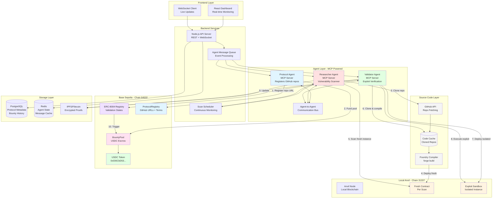
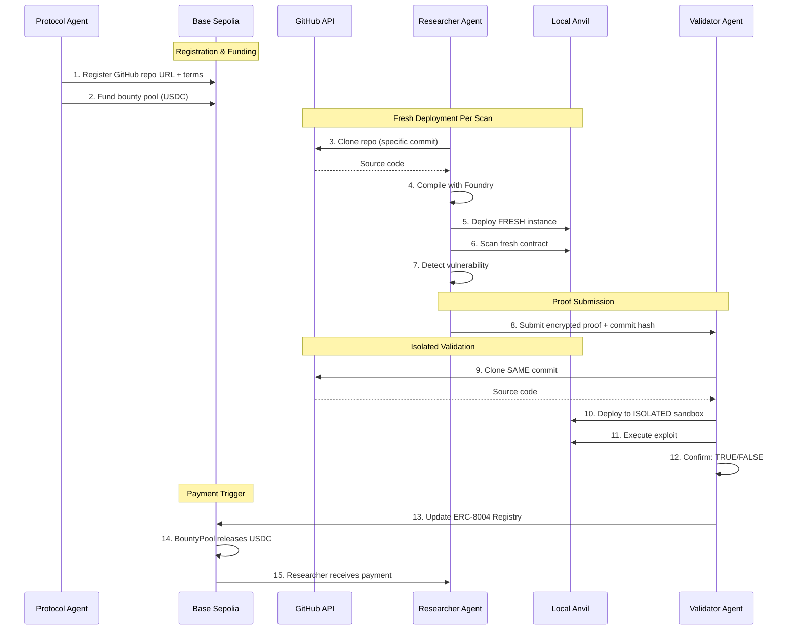

# Architecture: Autonomous Cybersecurity Bug Bounty Orchestrator

## Overview

A continuous security auditing platform where autonomous AI agents (powered by MCP) scan smart contracts for vulnerabilities, validate exploits in isolated sandboxes, and receive instant USDC bounty payments.

**Hybrid Deployment Model:**
- **Local Anvil (31337)**: Target contracts for scanning + sandbox for exploit validation
- **Base Sepolia (84532)**: x402 payment infrastructure (ERC-8004, BountyPool, USDC)

## System Architecture

**Key Design Decision**: Protocols register **GitHub repo URLs** (not deployed contract addresses). Each scan/validation deploys a **fresh contract instance** from source code, ensuring state isolation between agents.



## Component Details

### 1. Agent Layer (MCP-Powered)

#### Protocol Agent
- **Purpose**: Represents protocols/smart contracts seeking security audits
- **MCP Tools**: `register_protocol`, `set_bounty_terms`, `fund_pool`, `get_status`
- **Responsibilities**:
  - Register **GitHub repository URL** in the Bazaar (not deployed address)
  - Specify contract path within repo (e.g., `src/Vault.sol`)
  - Specify entry point contract name
  - Define bounty pricing per vulnerability severity
  - Fund the bounty pool with USDC
  - Receive vulnerability notifications

**Protocol Registration Data:**
```typescript
interface ProtocolRegistration {
  githubUrl: string;           // "https://github.com/org/protocol"
  branch: string;              // "main" or specific commit hash
  contractPath: string;        // "src/core/Vault.sol"
  contractName: string;        // "Vault"
  constructorArgs?: any[];     // Arguments for deployment
  dependencies?: string[];     // Other contracts to deploy first
  bountyTerms: BountyTerms;
}
```

#### Researcher Agent
- **Purpose**: Autonomous vulnerability scanner with fresh deployments
- **MCP Tools**: `clone_repo`, `compile_contracts`, `deploy_fresh`, `scan_contract`, `generate_proof`, `submit_finding`
- **Responsibilities**:
  - Query available protocols from Bazaar
  - **Clone GitHub repository** to local cache
  - **Compile contracts** using Foundry (forge build)
  - **Deploy fresh instance** to local Anvil for each scan
  - Perform static analysis (Slither, Mythril patterns)
  - Detect vulnerability patterns (reentrancy, overflow, access control)
  - Generate encrypted exploit proofs
  - Submit proofs to Validator Agent

**Why Fresh Deployment Per Scan?**
- **State Isolation**: No interference between concurrent agents
- **Reproducibility**: Same source → same bytecode → consistent results
- **Version Control**: Can scan specific commits/branches
- **No Exploited State**: Each scan starts with clean initial state

#### Validator Agent
- **Purpose**: Independent exploit verification with isolated deployment
- **MCP Tools**: `clone_repo`, `spawn_sandbox`, `deploy_isolated`, `execute_exploit`, `update_registry`
- **Responsibilities**:
  - Decrypt and parse exploit proofs
  - **Clone the same repo version** as Researcher Agent used
  - **Deploy fresh contract** to isolated sandbox
  - Execute exploit against clean instance
  - Capture and verify state changes
  - Update ERC-8004 registry with TRUE/FALSE on Base Sepolia

**Validation Isolation Guarantee:**
```
┌────────────────────────────────────────────────────────────┐
│  Each validation gets:                                      │
│  1. Fresh Anvil sandbox (new chain state)                  │
│  2. Fresh contract deployment (from same source)           │
│  3. No state pollution from other validations              │
│  4. Deterministic results (same exploit → same outcome)    │
└────────────────────────────────────────────────────────────┘
```

### 2. Infrastructure Layer

#### Agent-to-Agent Communication Bus
- Direct agent messaging protocol
- Event-driven architecture
- Message types: `SCAN_REQUEST`, `PROOF_SUBMISSION`, `VALIDATION_RESULT`
- Encryption: End-to-end for sensitive proofs

#### API Server (Node.js)
- REST endpoints for dashboard
- WebSocket for real-time updates
- Agent lifecycle management
- Authentication & authorization

#### Scan Scheduler
- Cron-based continuous scanning
- Protocol priority queue
- Rate limiting per protocol
- Retry logic for failed scans

### 3. Source Code & Compilation Layer

**Purpose**: Fetch, cache, and compile contracts from GitHub before deployment

```
┌─────────────────────────────────────────────────────────────────┐
│                    SOURCE CODE PIPELINE                          │
├─────────────────────────────────────────────────────────────────┤
│                                                                  │
│  ┌─────────────┐    ┌─────────────┐    ┌─────────────────────┐  │
│  │  GitHub     │───▶│  Code Cache │───▶│  Foundry Compiler   │  │
│  │  Clone/Pull │    │  (Local FS) │    │  (forge build)      │  │
│  └─────────────┘    └─────────────┘    └─────────────────────┘  │
│                                                │                 │
│                                                ▼                 │
│                           ┌─────────────────────────────────┐   │
│                           │  Compiled Artifacts             │   │
│                           │  - ABI                          │   │
│                           │  - Bytecode                     │   │
│                           │  - Source Maps                  │   │
│                           └─────────────────────────────────┘   │
│                                                                  │
└─────────────────────────────────────────────────────────────────┘
```

**Cache Structure:**
```
/cache/repos/
├── github.com/
│   └── org/
│       └── protocol/
│           ├── main/           # Latest main branch
│           ├── abc123/         # Specific commit
│           └── v1.0.0/         # Tagged version
```

### 4. Local Anvil Layer (Chain ID: 31337)

**Purpose**: Deploy fresh contract instances from source for scanning and validation

```
┌─────────────────────────────────────────────────────────────────┐
│                    LOCAL ANVIL ENVIRONMENT                       │
├─────────────────────────────────────────────────────────────────┤
│                                                                  │
│  SCANNING ANVIL (Port 8545)        VALIDATION ANVIL (Port 8546) │
│  ┌─────────────────────────┐       ┌─────────────────────────┐  │
│  │  Fresh Deploy Per Scan  │       │  Fresh Deploy Per Test  │  │
│  │                         │       │                         │  │
│  │  Agent A: Vault@0x111   │       │  Sandbox A: Vault@0xAAA │  │
│  │  Agent B: Vault@0x222   │       │  Sandbox B: Vault@0xBBB │  │
│  │  Agent C: Vault@0x333   │       │  Sandbox C: Vault@0xCCC │  │
│  │                         │       │                         │  │
│  │  (Each from same source,│       │  (Isolated per exploit  │  │
│  │   different addresses)  │       │   validation)           │  │
│  └─────────────────────────┘       └─────────────────────────┘  │
│                                                                  │
│  Benefits:                                                       │
│  ✓ No state pollution between agents                            │
│  ✓ Parallel scanning without conflicts                          │
│  ✓ Reproducible results (same source → same behavior)           │
│  ✓ Can test different versions/commits simultaneously           │
│                                                                  │
└─────────────────────────────────────────────────────────────────┘
```

### 4. Base Sepolia Layer (Chain ID: 84532)

**Purpose**: x402 payment infrastructure and ERC-8004 validation registry

#### Payment Contracts (Deployed on Base Sepolia)

```
┌─────────────────────────────────────────────────────────────────┐
│                   BASE SEPOLIA TESTNET                           │
├─────────────────────────────────────────────────────────────────┤
│                                                                  │
│  ┌─────────────────┐  ┌─────────────────┐  ┌─────────────────┐  │
│  │ProtocolRegistry │  │ValidationRegistry│  │   BountyPool    │  │
│  │                 │  │   (ERC-8004)     │  │                 │  │
│  │ - Register      │  │                 │  │ - Deposit USDC  │  │
│  │ - Set terms     │  │ - TRUE/FALSE    │  │ - Release bounty│  │
│  │ - Get metadata  │  │ - Trigger pay   │  │ - Withdraw      │  │
│  └────────┬────────┘  └────────┬────────┘  └────────┬────────┘  │
│           │                    │                    │            │
│           └────────────────────┼────────────────────┘            │
│                                │                                 │
│                                ▼                                 │
│                    ┌─────────────────────┐                       │
│                    │   USDC (Testnet)    │                       │
│                    │ 0x036CbD53842c5426  │                       │
│                    │ 634e7929541eC2318f  │                       │
│                    │ 3dCF7e              │                       │
│                    └─────────────────────┘                       │
└─────────────────────────────────────────────────────────────────┘
```

#### Bounty Pool Contract
```solidity
// Core functionality (on Base Sepolia)
- depositBounty(protocolId, amount)
- withdrawUnused(protocolId)
- releaseBounty(validationId, researcher)
- getBountyBalance(protocolId)
```

#### ERC-8004 Validation Registry
```solidity
// Validation states (on Base Sepolia)
- submitValidation(proofHash, result)
- getValidationStatus(proofHash)
- onValidationTrue → triggers x402 payment
```

### 5. Storage Layer

| Store | Purpose | Data |
|-------|---------|------|
| PostgreSQL | Persistent data | Protocols, bounties, history |
| Redis | Fast access | Agent state, message queue |
| IPFS | Immutable proofs | Encrypted exploit proofs |

## Security Considerations

1. **Sandbox Isolation**: Foundry forks run in isolated processes
2. **Proof Encryption**: Proofs encrypted until validation
3. **Agent Authentication**: MCP servers use signed messages
4. **Rate Limiting**: Prevent DoS on validation system
5. **Access Control**: Role-based permissions on contracts

## Network Configuration

### Hybrid Deployment Strategy

| Layer | Network | Chain ID | Purpose |
|-------|---------|----------|---------|
| **Target Contracts** | Local Anvil | 31337 | Contracts to be scanned for vulnerabilities |
| **Validation Sandbox** | Local Anvil | 31337 | Isolated fork for exploit execution |
| **Payment Infrastructure** | Base Sepolia | 84532 | x402 payments, ERC-8004, BountyPool |
| **Production (Future)** | Base Mainnet | 8453 | Final deployment |

### Development Stages

```
Stage 1: Local Development
├── Anvil running target contracts
├── Anvil sandbox for exploit validation
└── Payment contracts deployed to Base Sepolia

Stage 2: Testnet Validation
├── Target contracts on Base Sepolia (optional)
├── Full integration testing
└── Payment flow validation with testnet USDC

Stage 3: Mainnet Deployment
├── Target contracts on Base Mainnet
├── Payment infrastructure on Base Mainnet
└── Real USDC payments
```

### Contract Addresses

| Contract | Local Anvil | Base Sepolia | Base Mainnet |
|----------|-------------|--------------|--------------|
| ProtocolRegistry | Deployed locally | TBD | TBD |
| ValidationRegistry | - | TBD | TBD |
| BountyPool | - | TBD | TBD |
| USDC | Mock Token | 0x036CbD53842c5426634e7929541eC2318f3dCF7e | 0x833589fCD6eDb6E08f4c7C32D4f71b54bdA02913 |
| VulnerableVault (test) | Deployed locally | - | - |

## Data Flow Summary

### Cross-Chain Workflow (GitHub-Based)



### Step-by-Step Flow

1. **Protocol Agent** registers **GitHub repo URL** on **Base Sepolia** (ProtocolRegistry)
   - Includes: repo URL, branch/commit, contract path, constructor args
2. **Protocol Agent** funds bounty pool with USDC on **Base Sepolia**
3. **Researcher Agent** clones the repo from GitHub (caches locally)
4. **Researcher Agent** compiles contracts using Foundry (`forge build`)
5. **Researcher Agent** deploys **fresh instance** to Local Anvil
6. **Researcher Agent** scans the fresh contract (no prior state pollution)
7. On vulnerability discovery → encrypted proof created (includes commit hash)
8. **Validator Agent** receives proof with commit hash
9. **Validator Agent** clones the **same commit** from GitHub
10. **Validator Agent** deploys **isolated instance** to sandbox Anvil
11. Exploit executed against clean contract → result recorded
12. If TRUE → **Validator Agent** updates ERC-8004 on **Base Sepolia**
13. BountyPool on **Base Sepolia** triggers x402 USDC payment
14. USDC transferred to Researcher Agent wallet
15. Dashboard updates in real-time via WebSocket

### State Isolation Guarantee

```
┌─────────────────────────────────────────────────────────────────┐
│  Why GitHub URL instead of deployed address?                    │
├─────────────────────────────────────────────────────────────────┤
│                                                                  │
│  PROBLEM: If Agent A exploits a deployed contract:              │
│  ❌ Agent B scanning same contract sees corrupted state         │
│  ❌ Agent C validation fails because state already modified     │
│  ❌ Results are non-deterministic                               │
│                                                                  │
│  SOLUTION: Deploy fresh from source each time:                  │
│  ✓ Agent A deploys Vault@0x111 → exploits it                   │
│  ✓ Agent B deploys Vault@0x222 → scans clean state             │
│  ✓ Agent C deploys Vault@0x333 → validates independently       │
│  ✓ Same source code → same behavior → reproducible results     │
│                                                                  │
└─────────────────────────────────────────────────────────────────┘
```
