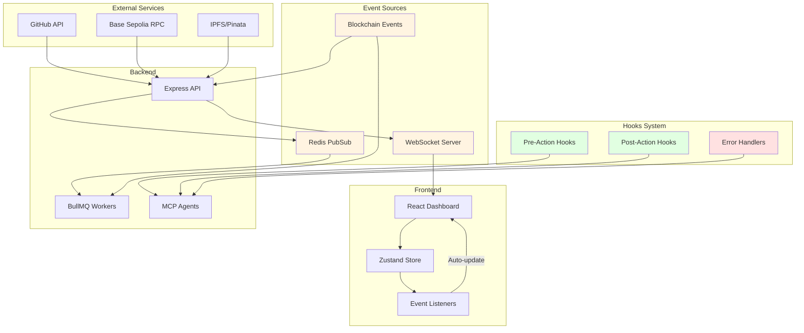
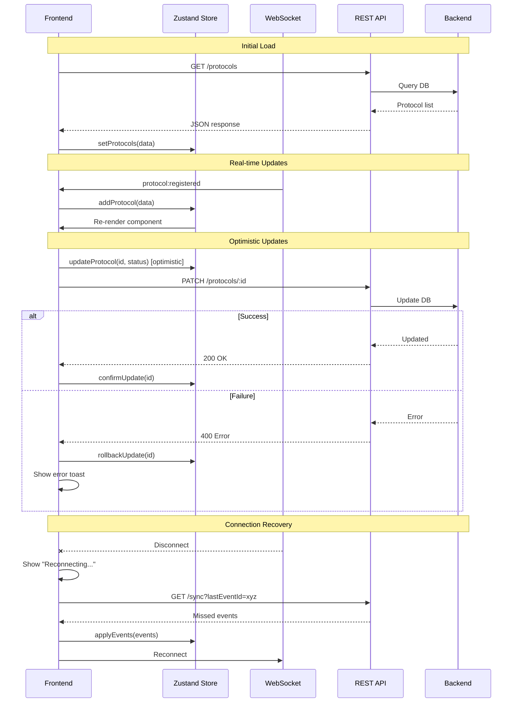

# Integration Specification: Autonomous Bug Bounty Orchestrator

## Overview

This document details all system integrations, event hooks, real-time synchronization, and automatic response mechanisms for the bug bounty platform.

## Integration Architecture



---

## 1. GitHub Integration

### Purpose
Fetch smart contract source code from GitHub repositories for scanning and validation.

### Integration Points

```typescript
interface GitHubIntegration {
  // Clone repository
  cloneRepo(url: string, ref: string): Promise<string>;  // Returns local path

  // Pull latest changes
  pullLatest(localPath: string): Promise<void>;

  // Get specific commit
  checkout(localPath: string, commitHash: string): Promise<void>;

  // Validate repository structure
  validateRepo(localPath: string, contractPath: string): Promise<boolean>;

  // Get commit metadata
  getCommitInfo(url: string, ref: string): Promise<CommitInfo>;
}

interface CommitInfo {
  hash: string;
  author: string;
  date: string;
  message: string;
}
```

### Events & Hooks

| Event | Trigger | Hook Actions |
|-------|---------|--------------|
| `repo:cloned` | After successful clone | Update cache, notify agents |
| `repo:updated` | After pull/checkout | Invalidate compiled artifacts |
| `repo:error` | Clone/pull failure | Retry with backoff, alert admin |
| `repo:invalid` | Structure validation fails | Notify protocol owner, pause scanning |

### Error Handling

```typescript
// Automatic retry with exponential backoff
const gitHubRetryPolicy = {
  maxRetries: 3,
  initialDelay: 1000,  // 1 second
  maxDelay: 30000,     // 30 seconds
  backoffFactor: 2,

  onRetry: (attempt: number, error: Error) => {
    emit('github:retry', { attempt, error: error.message });
  },

  onMaxRetries: (error: Error) => {
    emit('github:failed', { error: error.message });
    notifyAdmin('GitHub clone failed after max retries');
  }
};
```

---

## 2. Blockchain Integration (Base Sepolia)

### Purpose
Interact with payment infrastructure contracts on Base Sepolia testnet.

### Integration Points

```typescript
interface BlockchainIntegration {
  // Contract interactions
  protocolRegistry: {
    register(protocol: ProtocolData): Promise<TxReceipt>;
    getProtocol(id: bytes32): Promise<Protocol>;
    updateStatus(id: bytes32, status: Status): Promise<TxReceipt>;
  };

  validationRegistry: {
    submitValidation(data: ValidationData): Promise<TxReceipt>;
    recordResult(id: bytes32, result: boolean): Promise<TxReceipt>;
    getValidation(id: bytes32): Promise<Validation>;
  };

  bountyPool: {
    deposit(protocolId: bytes32, amount: bigint): Promise<TxReceipt>;
    getPoolInfo(protocolId: bytes32): Promise<PoolInfo>;
  };

  // Event listeners
  subscribeToEvents(contract: string, eventName: string): EventSubscription;
}
```

### Event Subscriptions

```typescript
// Subscribe to blockchain events
const eventSubscriptions = {
  // Protocol Registry events
  'ProtocolRegistered': {
    contract: 'ProtocolRegistry',
    handler: async (event) => {
      await db.protocols.upsert(event.args);
      emit('ws:protocol_registered', event.args);
      triggerHook('post:protocol_registered', event.args);
    }
  },

  // Validation Registry events
  'ValidationCompleted': {
    contract: 'ValidationRegistry',
    handler: async (event) => {
      await db.validations.update(event.args);
      emit('ws:validation_complete', event.args);

      if (event.args.result === true) {
        triggerHook('post:validation_true', event.args);
        // Payment automatically triggered by smart contract
      }
    }
  },

  // Bounty Pool events
  'BountyDeposited': {
    contract: 'BountyPool',
    handler: async (event) => {
      await db.bounties.update(event.args);
      emit('ws:pool_funded', event.args);
      triggerHook('post:pool_funded', event.args);
    }
  },

  'BountyReleased': {
    contract: 'BountyPool',
    handler: async (event) => {
      await db.payments.create(event.args);
      emit('ws:payment_released', event.args);
      triggerHook('post:payment_released', event.args);
      notifyResearcher(event.args.researcher, event.args.amount);
    }
  }
};
```

### Transaction Monitoring

```typescript
// Monitor pending transactions
interface TxMonitor {
  // Track transaction until confirmed
  watchTx(hash: string): Promise<TxReceipt>;

  // Handle transaction states
  onPending: (hash: string) => void;
  onConfirmed: (receipt: TxReceipt) => void;
  onFailed: (hash: string, reason: string) => void;
  onDropped: (hash: string) => void;

  // Auto-retry failed transactions
  retryPolicy: {
    maxRetries: 3;
    bumpGasPercent: 10;  // Increase gas by 10% each retry
  };
}
```

---

## 3. WebSocket Integration (Real-time Updates)

### Purpose
Push real-time updates from backend to frontend dashboard.

### Event Categories

```typescript
// WebSocket event types
type WSEventType =
  // Protocol events
  | 'protocol:registered'
  | 'protocol:updated'
  | 'protocol:paused'

  // Scan events
  | 'scan:started'
  | 'scan:progress'
  | 'scan:completed'
  | 'scan:failed'

  // Vulnerability events
  | 'vuln:discovered'
  | 'vuln:validation_started'
  | 'vuln:confirmed'
  | 'vuln:rejected'

  // Payment events
  | 'payment:pending'
  | 'payment:released'
  | 'payment:failed'

  // Agent events
  | 'agent:online'
  | 'agent:offline'
  | 'agent:busy'
  | 'agent:error'

  // System events
  | 'system:health'
  | 'system:alert'
  | 'system:maintenance';
```

### Room-Based Broadcasting

```typescript
// Server-side room management
const wsRooms = {
  // Global rooms
  'protocols': 'All protocol updates',
  'scans': 'All scan activity',
  'vulnerabilities': 'All vulnerability events',
  'payments': 'All payment events',
  'agents': 'Agent status updates',
  'system': 'System health and alerts',

  // Entity-specific rooms
  'protocol:{id}': 'Updates for specific protocol',
  'scan:{id}': 'Progress for specific scan',
  'agent:{id}': 'Status for specific agent',
};

// Client subscription
socket.emit('subscribe', {
  rooms: ['protocols', 'vulnerabilities', 'payments']
});
```

### Frontend Event Handlers

```typescript
// React hook for WebSocket events
function useWebSocketEvents() {
  const { addProtocol, updateScan, showAlert } = useStore();

  useEffect(() => {
    const socket = io(WS_URL);

    // Protocol events → Update protocol list
    socket.on('protocol:registered', (data) => {
      addProtocol(data);
      toast.success(`New protocol: ${data.name}`);
    });

    // Scan events → Update scan progress
    socket.on('scan:progress', (data) => {
      updateScan(data.scanId, { progress: data.progress });
    });

    // Vulnerability events → Show alert + update list
    socket.on('vuln:discovered', (data) => {
      showAlert({
        type: 'warning',
        title: 'Vulnerability Found!',
        message: `${data.severity}: ${data.title}`,
        protocolId: data.protocolId
      });
    });

    socket.on('vuln:confirmed', (data) => {
      showAlert({
        type: 'success',
        title: 'Vulnerability Confirmed!',
        message: `Payment of ${data.bountyAmount} USDC pending`
      });
    });

    // Payment events → Update balances
    socket.on('payment:released', (data) => {
      toast.success(`Payment released: ${data.amount} USDC`);
      refetchBalances();
    });

    // Agent events → Update status cards
    socket.on('agent:error', (data) => {
      showAlert({
        type: 'error',
        title: `Agent Error: ${data.agentName}`,
        message: data.error
      });
    });

    return () => socket.disconnect();
  }, []);
}
```

---

## 4. Hooks System

### Purpose
Execute custom logic before/after key actions for validation, logging, and error handling.

### Hook Types

```typescript
// Hook registration
interface HooksRegistry {
  // Pre-action hooks (can abort action)
  pre: {
    'scan:start': PreHook[];
    'validation:start': PreHook[];
    'payment:release': PreHook[];
    'protocol:register': PreHook[];
  };

  // Post-action hooks (for side effects)
  post: {
    'scan:complete': PostHook[];
    'validation:complete': PostHook[];
    'payment:complete': PostHook[];
    'protocol:registered': PostHook[];
    'vuln:discovered': PostHook[];
  };

  // Error hooks (for recovery)
  error: {
    'scan:failed': ErrorHook[];
    'validation:failed': ErrorHook[];
    'payment:failed': ErrorHook[];
    'agent:crashed': ErrorHook[];
    'blockchain:error': ErrorHook[];
  };
}

type PreHook = (context: HookContext) => Promise<{ proceed: boolean; reason?: string }>;
type PostHook = (context: HookContext, result: any) => Promise<void>;
type ErrorHook = (context: HookContext, error: Error) => Promise<{ retry: boolean; delay?: number }>;
```

### Hook Definitions

```typescript
// Pre-hooks: Validate before action
const preHooks = {
  'scan:start': [
    // Check protocol is active
    async (ctx) => {
      const protocol = await db.protocols.get(ctx.protocolId);
      if (protocol.status !== 'ACTIVE') {
        return { proceed: false, reason: 'Protocol not active' };
      }
      return { proceed: true };
    },

    // Check agent availability
    async (ctx) => {
      const agent = await getAvailableResearcherAgent();
      if (!agent) {
        return { proceed: false, reason: 'No agents available' };
      }
      ctx.assignedAgent = agent;
      return { proceed: true };
    },

    // Check GitHub repo accessible
    async (ctx) => {
      const accessible = await checkGitHubAccess(ctx.protocol.githubUrl);
      if (!accessible) {
        return { proceed: false, reason: 'GitHub repo inaccessible' };
      }
      return { proceed: true };
    }
  ],

  'payment:release': [
    // Verify validation is TRUE
    async (ctx) => {
      const validation = await db.validations.get(ctx.validationId);
      if (validation.result !== 'TRUE') {
        return { proceed: false, reason: 'Validation not confirmed' };
      }
      return { proceed: true };
    },

    // Check bounty pool has funds
    async (ctx) => {
      const pool = await getBountyPoolBalance(ctx.protocolId);
      if (pool < ctx.amount) {
        return { proceed: false, reason: 'Insufficient funds' };
      }
      return { proceed: true };
    }
  ]
};

// Post-hooks: Side effects after action
const postHooks = {
  'vuln:discovered': [
    // Send WebSocket notification
    async (ctx, result) => {
      emit('ws:vuln:discovered', {
        protocolId: ctx.protocolId,
        severity: result.severity,
        title: result.title
      });
    },

    // Log to audit trail
    async (ctx, result) => {
      await db.auditLog.create({
        action: 'VULNERABILITY_DISCOVERED',
        entityId: result.id,
        metadata: result
      });
    },

    // Notify protocol owner
    async (ctx, result) => {
      const protocol = await db.protocols.get(ctx.protocolId);
      await notificationService.send(protocol.ownerAddress, {
        type: 'VULN_DISCOVERED',
        data: result
      });
    }
  ],

  'payment:complete': [
    // Update dashboard stats
    async (ctx, result) => {
      await updateDashboardStats();
      emit('ws:stats:updated');
    },

    // Update researcher leaderboard
    async (ctx, result) => {
      await updateResearcherStats(ctx.researcherAddress);
      emit('ws:leaderboard:updated');
    },

    // Archive vulnerability
    async (ctx, result) => {
      await db.vulnerabilities.update(ctx.vulnId, {
        status: 'PAID',
        paymentTxHash: result.txHash
      });
    }
  ]
};

// Error hooks: Recovery and alerts
const errorHooks = {
  'scan:failed': [
    // Log error
    async (ctx, error) => {
      await db.agentLogs.create({
        agentId: ctx.agentId,
        level: 'ERROR',
        message: error.message,
        metadata: { scanId: ctx.scanId }
      });
    },

    // Retry logic
    async (ctx, error) => {
      if (ctx.retryCount < 3 && isTransientError(error)) {
        return { retry: true, delay: Math.pow(2, ctx.retryCount) * 1000 };
      }
      return { retry: false };
    },

    // Alert admin for persistent failures
    async (ctx, error) => {
      if (ctx.retryCount >= 3) {
        await alertAdmin({
          type: 'SCAN_FAILED',
          scanId: ctx.scanId,
          error: error.message
        });
      }
    }
  ],

  'agent:crashed': [
    // Restart agent
    async (ctx, error) => {
      await restartAgent(ctx.agentId);
      emit('ws:agent:restarted', { agentId: ctx.agentId });
      return { retry: true, delay: 5000 };
    },

    // Reassign pending tasks
    async (ctx, error) => {
      const tasks = await getAgentTasks(ctx.agentId);
      for (const task of tasks) {
        await reassignTask(task.id);
      }
    }
  ],

  'blockchain:error': [
    // Handle RPC errors
    async (ctx, error) => {
      if (error.code === 'NETWORK_ERROR') {
        await switchToBackupRPC();
        return { retry: true, delay: 2000 };
      }
      return { retry: false };
    },

    // Handle nonce issues
    async (ctx, error) => {
      if (error.message.includes('nonce')) {
        await resetNonce(ctx.signer);
        return { retry: true, delay: 1000 };
      }
      return { retry: false };
    }
  ]
};
```

---

## 5. Frontend-Backend Synchronization

### Purpose
Keep frontend state synchronized with backend in real-time, with automatic recovery.

### State Sync Architecture



### Zustand Store with Sync

```typescript
interface AppStore {
  // State
  protocols: Protocol[];
  scans: Map<string, Scan>;
  agents: Agent[];
  connectionStatus: 'connected' | 'disconnected' | 'reconnecting';
  lastEventId: string;

  // Actions
  setProtocols: (protocols: Protocol[]) => void;
  addProtocol: (protocol: Protocol) => void;
  updateProtocol: (id: string, updates: Partial<Protocol>) => void;

  // Sync actions
  handleWSEvent: (event: WSEvent) => void;
  syncMissedEvents: (fromEventId: string) => Promise<void>;
  setConnectionStatus: (status: string) => void;
}

const useAppStore = create<AppStore>((set, get) => ({
  protocols: [],
  scans: new Map(),
  agents: [],
  connectionStatus: 'disconnected',
  lastEventId: '',

  // Handle incoming WebSocket events
  handleWSEvent: (event) => {
    set({ lastEventId: event.id });

    switch (event.type) {
      case 'protocol:registered':
        set((state) => ({
          protocols: [...state.protocols, event.data]
        }));
        break;

      case 'scan:progress':
        set((state) => {
          const scans = new Map(state.scans);
          scans.set(event.data.scanId, {
            ...scans.get(event.data.scanId),
            progress: event.data.progress
          });
          return { scans };
        });
        break;

      case 'agent:status':
        set((state) => ({
          agents: state.agents.map(a =>
            a.id === event.data.agentId
              ? { ...a, status: event.data.status }
              : a
          )
        }));
        break;
    }
  },

  // Recover missed events after reconnection
  syncMissedEvents: async (fromEventId) => {
    try {
      const response = await api.get(`/sync?after=${fromEventId}`);
      for (const event of response.data.events) {
        get().handleWSEvent(event);
      }
    } catch (error) {
      console.error('Failed to sync missed events:', error);
    }
  }
}));
```

### Auto-Recovery Mechanisms

```typescript
// WebSocket connection manager with auto-recovery
class WSConnectionManager {
  private socket: Socket;
  private reconnectAttempts = 0;
  private maxReconnectAttempts = 10;
  private reconnectDelay = 1000;

  connect() {
    this.socket = io(WS_URL, {
      transports: ['websocket'],
      reconnection: true,
      reconnectionAttempts: this.maxReconnectAttempts,
      reconnectionDelay: this.reconnectDelay,
      reconnectionDelayMax: 30000
    });

    this.socket.on('connect', () => {
      console.log('WebSocket connected');
      useAppStore.getState().setConnectionStatus('connected');
      this.reconnectAttempts = 0;

      // Sync any missed events
      const lastEventId = useAppStore.getState().lastEventId;
      if (lastEventId) {
        useAppStore.getState().syncMissedEvents(lastEventId);
      }
    });

    this.socket.on('disconnect', (reason) => {
      console.log('WebSocket disconnected:', reason);
      useAppStore.getState().setConnectionStatus('disconnected');

      if (reason === 'io server disconnect') {
        // Server disconnected, try to reconnect
        this.socket.connect();
      }
    });

    this.socket.on('reconnect_attempt', (attempt) => {
      this.reconnectAttempts = attempt;
      useAppStore.getState().setConnectionStatus('reconnecting');
    });

    this.socket.on('reconnect_failed', () => {
      console.error('WebSocket reconnection failed');
      // Show persistent error banner
      showErrorBanner('Connection lost. Please refresh the page.');
    });

    // Handle all events
    this.socket.onAny((eventType, data) => {
      useAppStore.getState().handleWSEvent({
        type: eventType,
        data,
        id: data.eventId || Date.now().toString()
      });
    });
  }
}
```

---

## 6. Agent Integration

### Purpose
Coordinate MCP agents with the backend and handle agent lifecycle.

### Agent Lifecycle Hooks

```typescript
interface AgentLifecycle {
  // Startup
  onAgentStart: (agentId: string) => Promise<void>;
  onAgentReady: (agentId: string) => Promise<void>;

  // Runtime
  onTaskAssigned: (agentId: string, task: Task) => Promise<void>;
  onTaskProgress: (agentId: string, progress: number) => Promise<void>;
  onTaskComplete: (agentId: string, result: any) => Promise<void>;

  // Errors
  onAgentError: (agentId: string, error: Error) => Promise<void>;
  onAgentCrash: (agentId: string, error: Error) => Promise<void>;

  // Shutdown
  onAgentStop: (agentId: string, reason: string) => Promise<void>;
}

const agentLifecycleHooks: AgentLifecycle = {
  onAgentStart: async (agentId) => {
    await db.agents.update(agentId, { status: 'STARTING' });
    emit('ws:agent:starting', { agentId });
  },

  onAgentReady: async (agentId) => {
    await db.agents.update(agentId, {
      status: 'ONLINE',
      lastHeartbeat: new Date()
    });
    emit('ws:agent:online', { agentId });

    // Check for pending tasks
    const pendingTasks = await db.tasks.getPending(agentId);
    if (pendingTasks.length > 0) {
      await assignTask(agentId, pendingTasks[0]);
    }
  },

  onTaskComplete: async (agentId, result) => {
    await db.agents.update(agentId, { status: 'ONLINE', currentTask: null });
    emit('ws:agent:task_complete', { agentId, result });

    // Auto-assign next task
    const nextTask = await db.tasks.getNextPending();
    if (nextTask) {
      await assignTask(agentId, nextTask);
    }
  },

  onAgentCrash: async (agentId, error) => {
    await db.agents.update(agentId, { status: 'ERROR' });
    emit('ws:agent:crashed', { agentId, error: error.message });

    // Trigger error hooks
    await triggerHook('error:agent_crashed', { agentId, error });

    // Auto-restart after delay
    setTimeout(async () => {
      await restartAgent(agentId);
    }, 5000);
  }
};
```

### Agent Health Monitoring

```typescript
// Heartbeat system
class AgentHealthMonitor {
  private heartbeatInterval = 30000;  // 30 seconds
  private timeoutThreshold = 90000;   // 90 seconds

  start() {
    setInterval(async () => {
      const agents = await db.agents.getAll();

      for (const agent of agents) {
        const timeSinceHeartbeat = Date.now() - agent.lastHeartbeat.getTime();

        if (timeSinceHeartbeat > this.timeoutThreshold) {
          // Agent is unresponsive
          if (agent.status !== 'OFFLINE') {
            await db.agents.update(agent.id, { status: 'OFFLINE' });
            emit('ws:agent:offline', { agentId: agent.id });
            await triggerHook('error:agent_timeout', { agentId: agent.id });
          }
        }
      }
    }, this.heartbeatInterval);
  }

  recordHeartbeat(agentId: string) {
    db.agents.update(agentId, { lastHeartbeat: new Date() });
  }
}
```

---

## 7. Error Detection & Auto-Fix

### Purpose
Detect errors in real-time and automatically fix or escalate them.

### Error Categories & Responses

```typescript
const errorResponses = {
  // Transient errors - auto-retry
  'NETWORK_ERROR': {
    action: 'RETRY',
    maxRetries: 3,
    backoff: 'exponential',
    notify: false
  },

  'RPC_TIMEOUT': {
    action: 'SWITCH_RPC',
    fallbackRPC: process.env.BACKUP_RPC_URL,
    notify: false
  },

  'GAS_TOO_LOW': {
    action: 'BUMP_GAS',
    bumpPercent: 20,
    maxBumps: 3,
    notify: false
  },

  // Recoverable errors - auto-fix + notify
  'AGENT_CRASHED': {
    action: 'RESTART_AGENT',
    delay: 5000,
    notify: true,
    severity: 'warning'
  },

  'NONCE_TOO_LOW': {
    action: 'RESET_NONCE',
    notify: true,
    severity: 'info'
  },

  'INSUFFICIENT_FUNDS': {
    action: 'QUEUE_PAYMENT',
    notify: true,
    severity: 'warning',
    alertOwner: true
  },

  // Critical errors - escalate
  'CONTRACT_REVERTED': {
    action: 'INVESTIGATE',
    notify: true,
    severity: 'error',
    escalate: true
  },

  'VALIDATION_MISMATCH': {
    action: 'HALT_AND_ALERT',
    notify: true,
    severity: 'critical',
    escalate: true,
    pauseSystem: true
  }
};
```

### Auto-Fix Implementation

```typescript
class AutoFixService {
  async handleError(error: Error, context: ErrorContext) {
    const errorType = classifyError(error);
    const response = errorResponses[errorType];

    if (!response) {
      // Unknown error - log and escalate
      await this.escalate(error, context);
      return;
    }

    switch (response.action) {
      case 'RETRY':
        return this.retryWithBackoff(context, response);

      case 'SWITCH_RPC':
        await this.switchRPC(response.fallbackRPC);
        return this.retryWithBackoff(context, { ...response, maxRetries: 1 });

      case 'BUMP_GAS':
        return this.bumpGasAndRetry(context, response);

      case 'RESTART_AGENT':
        await this.restartAgent(context.agentId, response.delay);
        break;

      case 'RESET_NONCE':
        await this.resetNonce(context.signer);
        return this.retryWithBackoff(context, { ...response, maxRetries: 1 });

      case 'QUEUE_PAYMENT':
        await this.queuePayment(context);
        if (response.alertOwner) {
          await this.alertProtocolOwner(context.protocolId, 'Insufficient bounty funds');
        }
        break;

      case 'INVESTIGATE':
        await this.logForInvestigation(error, context);
        break;

      case 'HALT_AND_ALERT':
        if (response.pauseSystem) {
          await this.pauseSystem();
        }
        await this.alertAdmin({
          type: 'CRITICAL',
          error: error.message,
          context
        });
        break;
    }

    if (response.notify) {
      emit('ws:system:error', {
        severity: response.severity,
        message: error.message,
        context
      });
    }
  }

  private async retryWithBackoff(context: ErrorContext, options: RetryOptions) {
    for (let i = 0; i < options.maxRetries; i++) {
      const delay = options.backoff === 'exponential'
        ? Math.pow(2, i) * 1000
        : 1000;

      await sleep(delay);

      try {
        return await context.retry();
      } catch (e) {
        if (i === options.maxRetries - 1) throw e;
      }
    }
  }
}
```

---

## 8. Dashboard Real-time Updates

### Frontend Hook Implementations

```typescript
// Hook: Auto-refresh on events
function useAutoRefresh(queryKey: string[], eventTypes: string[]) {
  const queryClient = useQueryClient();

  useEffect(() => {
    const handleEvent = (event: WSEvent) => {
      if (eventTypes.includes(event.type)) {
        queryClient.invalidateQueries({ queryKey });
      }
    };

    wsManager.onAny(handleEvent);
    return () => wsManager.offAny(handleEvent);
  }, [queryKey, eventTypes]);
}

// Usage
function ProtocolList() {
  const { data: protocols } = useQuery({
    queryKey: ['protocols'],
    queryFn: fetchProtocols
  });

  // Auto-refresh when protocols change
  useAutoRefresh(['protocols'], [
    'protocol:registered',
    'protocol:updated',
    'protocol:paused'
  ]);

  return <ProtocolTable data={protocols} />;
}
```

### Real-time Component Updates

```typescript
// Scan progress with live updates
function ScanProgress({ scanId }: { scanId: string }) {
  const [progress, setProgress] = useState(0);
  const [status, setStatus] = useState<ScanStatus>('RUNNING');

  useWSEvent(`scan:${scanId}:progress`, (data) => {
    setProgress(data.progress);
  });

  useWSEvent(`scan:${scanId}:complete`, (data) => {
    setStatus('COMPLETED');
    setProgress(100);
  });

  useWSEvent(`scan:${scanId}:failed`, (data) => {
    setStatus('FAILED');
    toast.error(`Scan failed: ${data.error}`);
  });

  return (
    <div>
      <ProgressBar value={progress} status={status} />
      <StatusBadge status={status} />
    </div>
  );
}

// Agent status cards with live updates
function AgentStatusCards() {
  const { agents, updateAgent } = useAppStore();

  useWSEvent('agent:status', (data) => {
    updateAgent(data.agentId, { status: data.status });
  });

  useWSEvent('agent:heartbeat', (data) => {
    updateAgent(data.agentId, { lastHeartbeat: data.timestamp });
  });

  return (
    <div className="grid grid-cols-3 gap-4">
      {agents.map(agent => (
        <AgentCard
          key={agent.id}
          agent={agent}
          showPulse={agent.status === 'BUSY'}
        />
      ))}
    </div>
  );
}
```

---

## 9. Integration Testing

### Test Hooks

```typescript
// Integration test utilities
describe('Integration: Scan → Validation → Payment', () => {
  it('completes full flow with events', async () => {
    const events: WSEvent[] = [];
    wsManager.onAny((event) => events.push(event));

    // 1. Register protocol
    const protocol = await api.post('/protocols', mockProtocol);
    expect(events).toContainEvent('protocol:registered');

    // 2. Start scan
    const scan = await api.post('/scans', { protocolId: protocol.id });
    expect(events).toContainEvent('scan:started');

    // 3. Wait for vulnerability discovery
    await waitForEvent('vuln:discovered', 60000);

    // 4. Wait for validation
    await waitForEvent('vuln:confirmed', 30000);

    // 5. Verify payment
    await waitForEvent('payment:released', 10000);

    // 6. Verify final state
    const updatedProtocol = await api.get(`/protocols/${protocol.id}`);
    expect(updatedProtocol.stats.vulnerabilitiesFound).toBeGreaterThan(0);
  });
});
```

---

## Integration Checklist

| Integration | Status | Events | Hooks | Auto-Fix |
|-------------|--------|--------|-------|----------|
| GitHub API | Required | ✓ | ✓ | ✓ |
| Base Sepolia RPC | Required | ✓ | ✓ | ✓ |
| WebSocket Server | Required | ✓ | - | ✓ |
| Redis PubSub | Required | ✓ | - | ✓ |
| IPFS/Pinata | Required | ✓ | ✓ | ✓ |
| Agent Lifecycle | Required | ✓ | ✓ | ✓ |
| Error Recovery | Required | ✓ | ✓ | ✓ |
| Dashboard Sync | Required | ✓ | - | ✓ |
