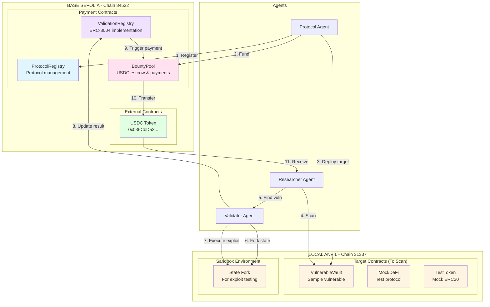
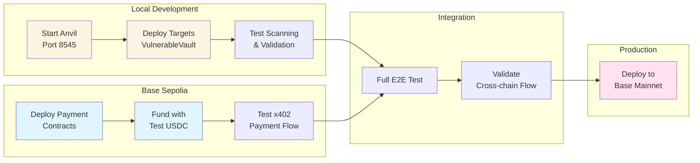

# Smart Contract Interfaces: Autonomous Bug Bounty Orchestrator

## Overview

**Hybrid Deployment Architecture:**
- **Local Anvil (31337)**: Target contracts for vulnerability scanning + sandbox for exploit validation
- **Base Sepolia (84532)**: x402 payment infrastructure (ERC-8004, BountyPool, USDC)

This separation allows:
1. Fast local iteration on target contracts
2. Real testnet validation of payment flows
3. Clear path to mainnet deployment

## Contract Architecture



---

## Contract Addresses

### Local Anvil (Chain ID: 31337)
| Contract | Address | Purpose |
|----------|---------|---------|
| VulnerableVault | Deployed on startup | Sample contract with reentrancy bug |
| MockDeFiProtocol | Deployed on startup | Test DeFi protocol |
| TestToken | Deployed on startup | Mock ERC20 for testing |

### Base Sepolia Testnet (Chain ID: 84532)
| Contract | Address | Purpose |
|----------|---------|---------|
| ProtocolRegistry | TBD (deploy first) | Protocol metadata & bounty terms |
| ValidationRegistry | TBD (deploy second) | ERC-8004 validation states |
| BountyPool | TBD (deploy third) | USDC escrow & x402 payments |
| USDC | 0x036CbD53842c5426634e7929541eC2318f3dCF7e | Testnet USDC |

### Base Mainnet (Chain ID: 8453) - Future
| Contract | Address | Purpose |
|----------|---------|---------|
| ProtocolRegistry | TBD | Production protocol registry |
| ValidationRegistry | TBD | Production ERC-8004 |
| BountyPool | TBD | Production payments |
| USDC | 0x833589fCD6eDb6E08f4c7C32D4f71b54bdA02913 | Real USDC |

---

## ProtocolRegistry.sol

### Interface

```solidity
// SPDX-License-Identifier: MIT
pragma solidity ^0.8.24;

import {IERC165} from "@openzeppelin/contracts/utils/introspection/IERC165.sol";

/**
 * @title IProtocolRegistry
 * @notice Registry for protocols participating in the bug bounty program
 */
interface IProtocolRegistry is IERC165 {
    // ============================================
    // STRUCTS
    // ============================================

    struct BountyTerms {
        uint256 baseReward;          // Base reward in USDC (6 decimals)
        uint256 criticalMultiplier;  // Multiplier for critical (100 = 1x, 1000 = 10x)
        uint256 highMultiplier;      // Multiplier for high severity
        uint256 mediumMultiplier;    // Multiplier for medium severity
        uint256 lowMultiplier;       // Multiplier for low severity
        uint256 maxPayout;           // Maximum single payout
    }

    struct Protocol {
        address contractAddress;     // Target contract address
        address owner;               // Protocol owner (can update)
        string name;                 // Protocol name
        string metadataURI;          // IPFS URI for additional metadata
        BountyTerms bountyTerms;     // Bounty configuration
        ProtocolStatus status;       // Current status
        uint256 registeredAt;        // Registration timestamp
    }

    enum ProtocolStatus {
        Pending,
        Active,
        Paused,
        Deprecated
    }

    // ============================================
    // EVENTS
    // ============================================

    event ProtocolRegistered(
        bytes32 indexed protocolId,
        address indexed contractAddress,
        address indexed owner,
        string name
    );

    event ProtocolUpdated(
        bytes32 indexed protocolId,
        ProtocolStatus status
    );

    event BountyTermsUpdated(
        bytes32 indexed protocolId,
        uint256 baseReward,
        uint256 maxPayout
    );

    // ============================================
    // FUNCTIONS
    // ============================================

    /**
     * @notice Register a new protocol for bug bounty
     * @param contractAddress The smart contract address to audit
     * @param name Human-readable protocol name
     * @param metadataURI IPFS URI with additional metadata
     * @param bountyTerms Bounty reward configuration
     * @return protocolId Unique identifier for the protocol
     */
    function registerProtocol(
        address contractAddress,
        string calldata name,
        string calldata metadataURI,
        BountyTerms calldata bountyTerms
    ) external returns (bytes32 protocolId);

    /**
     * @notice Update protocol status
     * @param protocolId Protocol identifier
     * @param status New status
     */
    function updateStatus(
        bytes32 protocolId,
        ProtocolStatus status
    ) external;

    /**
     * @notice Update bounty terms
     * @param protocolId Protocol identifier
     * @param bountyTerms New bounty configuration
     */
    function updateBountyTerms(
        bytes32 protocolId,
        BountyTerms calldata bountyTerms
    ) external;

    /**
     * @notice Get protocol details
     * @param protocolId Protocol identifier
     * @return Protocol struct with all details
     */
    function getProtocol(bytes32 protocolId)
        external
        view
        returns (Protocol memory);

    /**
     * @notice Check if a protocol is active
     * @param protocolId Protocol identifier
     * @return True if protocol status is Active
     */
    function isActive(bytes32 protocolId)
        external
        view
        returns (bool);

    /**
     * @notice Get protocol ID from contract address
     * @param contractAddress The contract address
     * @return protocolId The protocol identifier
     */
    function getProtocolId(address contractAddress)
        external
        view
        returns (bytes32 protocolId);

    /**
     * @notice Calculate bounty amount for a severity level
     * @param protocolId Protocol identifier
     * @param severity Severity level (0=Critical, 1=High, 2=Medium, 3=Low)
     * @return amount Bounty amount in USDC
     */
    function calculateBounty(
        bytes32 protocolId,
        uint8 severity
    ) external view returns (uint256 amount);
}
```

### Implementation Skeleton

```solidity
// SPDX-License-Identifier: MIT
pragma solidity ^0.8.24;

import {AccessControl} from "@openzeppelin/contracts/access/AccessControl.sol";
import {ERC165} from "@openzeppelin/contracts/utils/introspection/ERC165.sol";
import {IProtocolRegistry} from "./interfaces/IProtocolRegistry.sol";

contract ProtocolRegistry is IProtocolRegistry, AccessControl, ERC165 {
    bytes32 public constant REGISTRAR_ROLE = keccak256("REGISTRAR_ROLE");

    mapping(bytes32 => Protocol) private _protocols;
    mapping(address => bytes32) private _addressToId;

    uint256 public protocolCount;

    constructor() {
        _grantRole(DEFAULT_ADMIN_ROLE, msg.sender);
        _grantRole(REGISTRAR_ROLE, msg.sender);
    }

    function registerProtocol(
        address contractAddress,
        string calldata name,
        string calldata metadataURI,
        BountyTerms calldata bountyTerms
    ) external returns (bytes32 protocolId) {
        require(contractAddress != address(0), "Invalid address");
        require(_addressToId[contractAddress] == bytes32(0), "Already registered");
        require(bountyTerms.baseReward > 0, "Base reward required");

        protocolId = keccak256(abi.encodePacked(
            contractAddress,
            block.chainid,
            protocolCount++
        ));

        _protocols[protocolId] = Protocol({
            contractAddress: contractAddress,
            owner: msg.sender,
            name: name,
            metadataURI: metadataURI,
            bountyTerms: bountyTerms,
            status: ProtocolStatus.Pending,
            registeredAt: block.timestamp
        });

        _addressToId[contractAddress] = protocolId;

        emit ProtocolRegistered(protocolId, contractAddress, msg.sender, name);
    }

    function updateStatus(
        bytes32 protocolId,
        ProtocolStatus status
    ) external {
        Protocol storage protocol = _protocols[protocolId];
        require(
            protocol.owner == msg.sender || hasRole(DEFAULT_ADMIN_ROLE, msg.sender),
            "Not authorized"
        );

        protocol.status = status;
        emit ProtocolUpdated(protocolId, status);
    }

    function calculateBounty(
        bytes32 protocolId,
        uint8 severity
    ) external view returns (uint256) {
        BountyTerms memory terms = _protocols[protocolId].bountyTerms;
        uint256 multiplier;

        if (severity == 0) multiplier = terms.criticalMultiplier;
        else if (severity == 1) multiplier = terms.highMultiplier;
        else if (severity == 2) multiplier = terms.mediumMultiplier;
        else multiplier = terms.lowMultiplier;

        uint256 amount = (terms.baseReward * multiplier) / 100;
        return amount > terms.maxPayout ? terms.maxPayout : amount;
    }

    // ... additional implementations
}
```

---

## ValidationRegistry.sol (ERC-8004)

### Interface

```solidity
// SPDX-License-Identifier: MIT
pragma solidity ^0.8.24;

/**
 * @title IValidationRegistry
 * @notice ERC-8004 compliant validation registry for vulnerability proofs
 * @dev Stores validation results and triggers payment on TRUE results
 */
interface IValidationRegistry {
    // ============================================
    // STRUCTS
    // ============================================

    struct Validation {
        bytes32 protocolId;          // Associated protocol
        bytes32 proofHash;           // Keccak256 of encrypted proof
        address researcher;          // Researcher wallet address
        uint8 severity;              // 0=Critical, 1=High, 2=Medium, 3=Low
        ValidationResult result;     // Validation outcome
        string ipfsCid;              // IPFS CID for proof storage
        uint256 submittedAt;         // Submission timestamp
        uint256 validatedAt;         // Validation timestamp
    }

    enum ValidationResult {
        Pending,
        True,
        False,
        Duplicate,
        Error
    }

    // ============================================
    // EVENTS
    // ============================================

    event ValidationSubmitted(
        bytes32 indexed validationId,
        bytes32 indexed protocolId,
        bytes32 indexed proofHash,
        address researcher,
        uint8 severity
    );

    event ValidationCompleted(
        bytes32 indexed validationId,
        bytes32 indexed proofHash,
        ValidationResult result
    );

    event ValidationTrue(
        bytes32 indexed validationId,
        bytes32 indexed protocolId,
        address indexed researcher,
        uint8 severity
    );

    // ============================================
    // FUNCTIONS
    // ============================================

    /**
     * @notice Submit a vulnerability for validation
     * @param protocolId The protocol identifier
     * @param proofHash Hash of the encrypted proof
     * @param researcher Address to receive bounty if validated
     * @param severity Vulnerability severity level
     * @param ipfsCid IPFS content identifier for proof
     * @return validationId Unique validation identifier
     */
    function submitValidation(
        bytes32 protocolId,
        bytes32 proofHash,
        address researcher,
        uint8 severity,
        string calldata ipfsCid
    ) external returns (bytes32 validationId);

    /**
     * @notice Record validation result (Validator Agent only)
     * @param validationId The validation identifier
     * @param result TRUE or FALSE result
     */
    function recordResult(
        bytes32 validationId,
        ValidationResult result
    ) external;

    /**
     * @notice Get validation details
     * @param validationId The validation identifier
     * @return Validation struct
     */
    function getValidation(bytes32 validationId)
        external
        view
        returns (Validation memory);

    /**
     * @notice Check if a proof has been validated
     * @param proofHash The proof hash
     * @return True if already validated
     */
    function isProofValidated(bytes32 proofHash)
        external
        view
        returns (bool);

    /**
     * @notice Get validation result by proof hash
     * @param proofHash The proof hash
     * @return The validation result
     */
    function getResultByProof(bytes32 proofHash)
        external
        view
        returns (ValidationResult);
}
```

### Implementation Skeleton

```solidity
// SPDX-License-Identifier: MIT
pragma solidity ^0.8.24;

import {AccessControl} from "@openzeppelin/contracts/access/AccessControl.sol";
import {IValidationRegistry} from "./interfaces/IValidationRegistry.sol";
import {IBountyPool} from "./interfaces/IBountyPool.sol";
import {IProtocolRegistry} from "./interfaces/IProtocolRegistry.sol";

contract ValidationRegistry is IValidationRegistry, AccessControl {
    bytes32 public constant VALIDATOR_ROLE = keccak256("VALIDATOR_ROLE");

    IProtocolRegistry public protocolRegistry;
    IBountyPool public bountyPool;

    mapping(bytes32 => Validation) private _validations;
    mapping(bytes32 => bytes32) private _proofToValidation;
    mapping(bytes32 => bool) private _usedProofs;

    uint256 public validationCount;

    constructor(address _protocolRegistry, address _bountyPool) {
        protocolRegistry = IProtocolRegistry(_protocolRegistry);
        bountyPool = IBountyPool(_bountyPool);
        _grantRole(DEFAULT_ADMIN_ROLE, msg.sender);
    }

    function submitValidation(
        bytes32 protocolId,
        bytes32 proofHash,
        address researcher,
        uint8 severity,
        string calldata ipfsCid
    ) external returns (bytes32 validationId) {
        require(protocolRegistry.isActive(protocolId), "Protocol not active");
        require(!_usedProofs[proofHash], "Proof already submitted");
        require(researcher != address(0), "Invalid researcher");
        require(severity <= 3, "Invalid severity");

        validationId = keccak256(abi.encodePacked(
            proofHash,
            block.timestamp,
            validationCount++
        ));

        _validations[validationId] = Validation({
            protocolId: protocolId,
            proofHash: proofHash,
            researcher: researcher,
            severity: severity,
            result: ValidationResult.Pending,
            ipfsCid: ipfsCid,
            submittedAt: block.timestamp,
            validatedAt: 0
        });

        _proofToValidation[proofHash] = validationId;
        _usedProofs[proofHash] = true;

        emit ValidationSubmitted(
            validationId,
            protocolId,
            proofHash,
            researcher,
            severity
        );
    }

    function recordResult(
        bytes32 validationId,
        ValidationResult result
    ) external onlyRole(VALIDATOR_ROLE) {
        Validation storage validation = _validations[validationId];
        require(validation.result == ValidationResult.Pending, "Already validated");
        require(
            result == ValidationResult.True || 
            result == ValidationResult.False ||
            result == ValidationResult.Duplicate,
            "Invalid result"
        );

        validation.result = result;
        validation.validatedAt = block.timestamp;

        emit ValidationCompleted(validationId, validation.proofHash, result);

        if (result == ValidationResult.True) {
            emit ValidationTrue(
                validationId,
                validation.protocolId,
                validation.researcher,
                validation.severity
            );

            // Trigger payment
            bountyPool.releaseBounty(
                validation.protocolId,
                validation.researcher,
                validation.severity,
                validationId
            );
        }
    }

    // ... additional implementations
}
```

---

## BountyPool.sol

### Interface

```solidity
// SPDX-License-Identifier: MIT
pragma solidity ^0.8.24;

import {IERC20} from "@openzeppelin/contracts/token/ERC20/IERC20.sol";

/**
 * @title IBountyPool
 * @notice USDC escrow and bounty payment distribution
 */
interface IBountyPool {
    // ============================================
    // STRUCTS
    // ============================================

    struct PoolInfo {
        uint256 totalDeposited;      // Total USDC deposited
        uint256 availableBalance;    // Currently available
        uint256 totalPaidOut;        // Total paid to researchers
        uint256 reservedAmount;      // Reserved for pending validations
    }

    // ============================================
    // EVENTS
    // ============================================

    event BountyDeposited(
        bytes32 indexed protocolId,
        address indexed depositor,
        uint256 amount
    );

    event BountyReleased(
        bytes32 indexed protocolId,
        address indexed researcher,
        uint256 amount,
        bytes32 indexed validationId
    );

    event BountyWithdrawn(
        bytes32 indexed protocolId,
        address indexed owner,
        uint256 amount
    );

    event EmergencyWithdraw(
        address indexed admin,
        uint256 amount
    );

    // ============================================
    // FUNCTIONS
    // ============================================

    /**
     * @notice Deposit USDC to protocol's bounty pool
     * @param protocolId Protocol identifier
     * @param amount Amount of USDC to deposit (6 decimals)
     */
    function depositBounty(
        bytes32 protocolId,
        uint256 amount
    ) external;

    /**
     * @notice Release bounty to researcher (called by ValidationRegistry)
     * @param protocolId Protocol identifier
     * @param researcher Researcher wallet address
     * @param severity Vulnerability severity for calculation
     * @param validationId Reference to the validation
     */
    function releaseBounty(
        bytes32 protocolId,
        address researcher,
        uint8 severity,
        bytes32 validationId
    ) external;

    /**
     * @notice Withdraw unused bounty funds (protocol owner only)
     * @param protocolId Protocol identifier
     * @param amount Amount to withdraw
     */
    function withdrawBounty(
        bytes32 protocolId,
        uint256 amount
    ) external;

    /**
     * @notice Get pool information for a protocol
     * @param protocolId Protocol identifier
     * @return PoolInfo struct
     */
    function getPoolInfo(bytes32 protocolId)
        external
        view
        returns (PoolInfo memory);

    /**
     * @notice Check if pool has sufficient balance for severity
     * @param protocolId Protocol identifier
     * @param severity Vulnerability severity
     * @return True if sufficient funds
     */
    function hasSufficientFunds(
        bytes32 protocolId,
        uint8 severity
    ) external view returns (bool);
}
```

### Implementation Skeleton

```solidity
// SPDX-License-Identifier: MIT
pragma solidity ^0.8.24;

import {AccessControl} from "@openzeppelin/contracts/access/AccessControl.sol";
import {IERC20} from "@openzeppelin/contracts/token/ERC20/IERC20.sol";
import {SafeERC20} from "@openzeppelin/contracts/token/ERC20/utils/SafeERC20.sol";
import {ReentrancyGuard} from "@openzeppelin/contracts/utils/ReentrancyGuard.sol";
import {IBountyPool} from "./interfaces/IBountyPool.sol";
import {IProtocolRegistry} from "./interfaces/IProtocolRegistry.sol";

contract BountyPool is IBountyPool, AccessControl, ReentrancyGuard {
    using SafeERC20 for IERC20;

    bytes32 public constant PAYOUT_ROLE = keccak256("PAYOUT_ROLE");

    IERC20 public immutable usdc;
    IProtocolRegistry public protocolRegistry;

    mapping(bytes32 => PoolInfo) private _pools;
    mapping(bytes32 => bool) private _paidValidations;

    // USDC addresses per network (passed in constructor)
    // Base Sepolia: 0x036CbD53842c5426634e7929541eC2318f3dCF7e
    // Base Mainnet: 0x833589fCD6eDb6E08f4c7C32D4f71b54bdA02913

    constructor(address _protocolRegistry, address _usdc) {
        require(_usdc != address(0), "Invalid USDC address");
        usdc = IERC20(_usdc);
        protocolRegistry = IProtocolRegistry(_protocolRegistry);
        _grantRole(DEFAULT_ADMIN_ROLE, msg.sender);
    }

    function depositBounty(
        bytes32 protocolId,
        uint256 amount
    ) external nonReentrant {
        require(amount > 0, "Amount must be > 0");

        IProtocolRegistry.Protocol memory protocol =
            protocolRegistry.getProtocol(protocolId);
        require(protocol.contractAddress != address(0), "Protocol not found");

        usdc.safeTransferFrom(msg.sender, address(this), amount);

        _pools[protocolId].totalDeposited += amount;
        _pools[protocolId].availableBalance += amount;

        emit BountyDeposited(protocolId, msg.sender, amount);
    }

    function releaseBounty(
        bytes32 protocolId,
        address researcher,
        uint8 severity,
        bytes32 validationId
    ) external onlyRole(PAYOUT_ROLE) nonReentrant {
        require(!_paidValidations[validationId], "Already paid");
        require(researcher != address(0), "Invalid researcher");

        uint256 amount = protocolRegistry.calculateBounty(protocolId, severity);
        PoolInfo storage pool = _pools[protocolId];

        require(pool.availableBalance >= amount, "Insufficient funds");

        _paidValidations[validationId] = true;
        pool.availableBalance -= amount;
        pool.totalPaidOut += amount;

        usdc.safeTransfer(researcher, amount);

        emit BountyReleased(protocolId, researcher, amount, validationId);
    }

    function withdrawBounty(
        bytes32 protocolId,
        uint256 amount
    ) external nonReentrant {
        IProtocolRegistry.Protocol memory protocol =
            protocolRegistry.getProtocol(protocolId);
        require(protocol.owner == msg.sender, "Not owner");

        PoolInfo storage pool = _pools[protocolId];
        require(pool.availableBalance >= amount, "Insufficient balance");

        pool.availableBalance -= amount;
        pool.totalDeposited -= amount;

        usdc.safeTransfer(msg.sender, amount);

        emit BountyWithdrawn(protocolId, msg.sender, amount);
    }

    function hasSufficientFunds(
        bytes32 protocolId,
        uint8 severity
    ) external view returns (bool) {
        uint256 required = protocolRegistry.calculateBounty(protocolId, severity);
        return _pools[protocolId].availableBalance >= required;
    }

    function getPoolInfo(bytes32 protocolId)
        external
        view
        returns (PoolInfo memory)
    {
        return _pools[protocolId];
    }

    // Emergency functions for admin
    function emergencyWithdraw() external onlyRole(DEFAULT_ADMIN_ROLE) {
        uint256 balance = usdc.balanceOf(address(this));
        usdc.safeTransfer(msg.sender, balance);
        emit EmergencyWithdraw(msg.sender, balance);
    }
}
```

---

## OpsTreasury.sol

### Overview

The OpsTreasury contract manages operational gas funds for Validator Agents. Protocol owners deposit ETH alongside their USDC bounty pool to ensure agents can execute validation transactions without running out of gas.

### Interface

```solidity
// SPDX-License-Identifier: MIT
pragma solidity ^0.8.24;

/**
 * @title IOpsTreasury
 * @notice Manages operational ETH buffer for agent gas costs
 * @dev Protocol owners deposit ETH; Validator Agents get refunded after validation tx
 */
interface IOpsTreasury {
    // ============================================
    // STRUCTS
    // ============================================

    struct OpsBuffer {
        uint256 totalDeposited;      // Total ETH deposited by protocol owner
        uint256 availableBalance;    // Currently available for refunds
        uint256 totalRefunded;       // Total refunded to agents
        uint256 minBuffer;           // Minimum buffer before alerts
    }

    // ============================================
    // EVENTS
    // ============================================

    event BufferDeposited(
        bytes32 indexed protocolId,
        address indexed depositor,
        uint256 amount
    );

    event AgentRefunded(
        bytes32 indexed protocolId,
        address indexed agent,
        uint256 gasUsed,
        uint256 refundAmount
    );

    event BufferWithdrawn(
        bytes32 indexed protocolId,
        address indexed owner,
        uint256 amount
    );

    event LowBufferAlert(
        bytes32 indexed protocolId,
        uint256 remainingBalance,
        uint256 minBuffer
    );

    // ============================================
    // FUNCTIONS
    // ============================================

    /**
     * @notice Deposit ETH to protocol's operational buffer
     * @param protocolId Protocol identifier
     */
    function depositBuffer(bytes32 protocolId) external payable;

    /**
     * @notice Refund gas costs to Validator Agent after validation tx
     * @param protocolId Protocol identifier
     * @param agent Address of the agent to refund
     * @param gasUsed Gas consumed by the validation transaction
     * @dev Only callable by ValidationRegistry after recordResult()
     */
    function refundAgent(
        bytes32 protocolId,
        address agent,
        uint256 gasUsed
    ) external;

    /**
     * @notice Withdraw unused buffer (protocol owner only)
     * @param protocolId Protocol identifier
     * @param amount Amount to withdraw
     */
    function withdrawBuffer(
        bytes32 protocolId,
        uint256 amount
    ) external;

    /**
     * @notice Set minimum buffer threshold for alerts
     * @param protocolId Protocol identifier
     * @param minBuffer Minimum ETH balance before alert
     */
    function setMinBuffer(
        bytes32 protocolId,
        uint256 minBuffer
    ) external;

    /**
     * @notice Get buffer information for a protocol
     * @param protocolId Protocol identifier
     * @return OpsBuffer struct
     */
    function getBufferInfo(bytes32 protocolId)
        external
        view
        returns (OpsBuffer memory);

    /**
     * @notice Check if buffer has sufficient funds for a validation
     * @param protocolId Protocol identifier
     * @param estimatedGas Estimated gas for validation tx
     * @return True if sufficient funds
     */
    function hasSufficientBuffer(
        bytes32 protocolId,
        uint256 estimatedGas
    ) external view returns (bool);
}
```

### Implementation Skeleton

```solidity
// SPDX-License-Identifier: MIT
pragma solidity ^0.8.24;

import {AccessControl} from "@openzeppelin/contracts/access/AccessControl.sol";
import {ReentrancyGuard} from "@openzeppelin/contracts/utils/ReentrancyGuard.sol";
import {IOpsTreasury} from "./interfaces/IOpsTreasury.sol";
import {IProtocolRegistry} from "./interfaces/IProtocolRegistry.sol";

contract OpsTreasury is IOpsTreasury, AccessControl, ReentrancyGuard {
    bytes32 public constant REFUNDER_ROLE = keccak256("REFUNDER_ROLE");

    IProtocolRegistry public protocolRegistry;

    mapping(bytes32 => OpsBuffer) private _buffers;

    // Gas price premium (10% buffer for gas price fluctuations)
    uint256 public constant GAS_PREMIUM_BPS = 1100; // 110% of gas cost

    constructor(address _protocolRegistry) {
        protocolRegistry = IProtocolRegistry(_protocolRegistry);
        _grantRole(DEFAULT_ADMIN_ROLE, msg.sender);
    }

    function depositBuffer(bytes32 protocolId) external payable nonReentrant {
        require(msg.value > 0, "Amount must be > 0");

        IProtocolRegistry.Protocol memory protocol =
            protocolRegistry.getProtocol(protocolId);
        require(protocol.contractAddress != address(0), "Protocol not found");

        _buffers[protocolId].totalDeposited += msg.value;
        _buffers[protocolId].availableBalance += msg.value;

        emit BufferDeposited(protocolId, msg.sender, msg.value);
    }

    function refundAgent(
        bytes32 protocolId,
        address agent,
        uint256 gasUsed
    ) external onlyRole(REFUNDER_ROLE) nonReentrant {
        require(agent != address(0), "Invalid agent");

        // Calculate refund with premium
        uint256 refundAmount = (gasUsed * tx.gasprice * GAS_PREMIUM_BPS) / 10000;

        OpsBuffer storage buffer = _buffers[protocolId];
        require(buffer.availableBalance >= refundAmount, "Insufficient buffer");

        buffer.availableBalance -= refundAmount;
        buffer.totalRefunded += refundAmount;

        // Transfer ETH to agent
        (bool success, ) = agent.call{value: refundAmount}("");
        require(success, "Refund transfer failed");

        emit AgentRefunded(protocolId, agent, gasUsed, refundAmount);

        // Check for low buffer alert
        if (buffer.availableBalance < buffer.minBuffer) {
            emit LowBufferAlert(protocolId, buffer.availableBalance, buffer.minBuffer);
        }
    }

    function withdrawBuffer(
        bytes32 protocolId,
        uint256 amount
    ) external nonReentrant {
        IProtocolRegistry.Protocol memory protocol =
            protocolRegistry.getProtocol(protocolId);
        require(protocol.owner == msg.sender, "Not owner");

        OpsBuffer storage buffer = _buffers[protocolId];
        require(buffer.availableBalance >= amount, "Insufficient balance");

        buffer.availableBalance -= amount;
        buffer.totalDeposited -= amount;

        (bool success, ) = msg.sender.call{value: amount}("");
        require(success, "Withdraw transfer failed");

        emit BufferWithdrawn(protocolId, msg.sender, amount);
    }

    function setMinBuffer(
        bytes32 protocolId,
        uint256 minBuffer
    ) external {
        IProtocolRegistry.Protocol memory protocol =
            protocolRegistry.getProtocol(protocolId);
        require(protocol.owner == msg.sender, "Not owner");

        _buffers[protocolId].minBuffer = minBuffer;
    }

    function hasSufficientBuffer(
        bytes32 protocolId,
        uint256 estimatedGas
    ) external view returns (bool) {
        uint256 estimatedCost = (estimatedGas * tx.gasprice * GAS_PREMIUM_BPS) / 10000;
        return _buffers[protocolId].availableBalance >= estimatedCost;
    }

    function getBufferInfo(bytes32 protocolId)
        external
        view
        returns (OpsBuffer memory)
    {
        return _buffers[protocolId];
    }

    // Allow contract to receive ETH
    receive() external payable {}
}
```

### Integration with ValidationRegistry

When `recordResult()` is called, the ValidationRegistry triggers a refund:

```solidity
// In ValidationRegistry.sol - recordResult function
function recordResult(
    bytes32 validationId,
    ValidationResult result
) external onlyRole(VALIDATOR_ROLE) {
    // ... existing validation logic ...

    // Refund gas to Validator Agent
    uint256 gasUsed = gasleft(); // Capture at start, calculate diff
    opsTreasury.refundAgent(
        validation.protocolId,
        msg.sender,  // Validator Agent address
        startGas - gasleft() + 21000  // Include base tx cost
    );
}
```

---

## Sample Target Contracts (Local Anvil)

These contracts are deployed locally for vulnerability scanning and exploit validation.

### VulnerableVault.sol

```solidity
// SPDX-License-Identifier: MIT
pragma solidity ^0.8.24;

import {IERC20} from "@openzeppelin/contracts/token/ERC20/IERC20.sol";

/**
 * @title VulnerableVault
 * @notice INTENTIONALLY VULNERABLE - For testing only
 * @dev Contains reentrancy vulnerability for Researcher Agent to detect
 */
contract VulnerableVault {
    IERC20 public token;
    mapping(address => uint256) public balances;

    constructor(address _token) {
        token = IERC20(_token);
    }

    function deposit(uint256 amount) external {
        token.transferFrom(msg.sender, address(this), amount);
        balances[msg.sender] += amount;
    }

    // VULNERABLE: State update after external call
    function withdraw(uint256 amount) external {
        require(balances[msg.sender] >= amount, "Insufficient balance");

        // BUG: External call before state update (reentrancy)
        (bool success, ) = msg.sender.call{value: 0}("");
        require(success, "Transfer failed");

        token.transfer(msg.sender, amount);

        // State update happens AFTER external call - vulnerable!
        balances[msg.sender] -= amount;
    }

    function getBalance(address user) external view returns (uint256) {
        return balances[user];
    }
}
```

### MockDeFiProtocol.sol

```solidity
// SPDX-License-Identifier: MIT
pragma solidity ^0.8.24;

/**
 * @title MockDeFiProtocol
 * @notice Sample DeFi protocol for testing
 * @dev Contains multiple vulnerability patterns
 */
contract MockDeFiProtocol {
    address public owner;
    mapping(address => uint256) public stakes;

    // VULNERABLE: Missing access control
    function setOwner(address _newOwner) external {
        // BUG: No onlyOwner modifier
        owner = _newOwner;
    }

    function stake() external payable {
        stakes[msg.sender] += msg.value;
    }

    // VULNERABLE: Unchecked return value
    function unstake(uint256 amount) external {
        require(stakes[msg.sender] >= amount, "Insufficient stake");
        stakes[msg.sender] -= amount;

        // BUG: Not checking return value
        payable(msg.sender).send(amount);
    }
}
```

---

## Foundry Test Examples

### Payment Contract Tests (Base Sepolia Fork)

```solidity
// test/payment/BountyPool.t.sol
// SPDX-License-Identifier: MIT
pragma solidity ^0.8.24;

import {Test, console} from "forge-std/Test.sol";
import {BountyPool} from "../../src/payment/BountyPool.sol";
import {ProtocolRegistry} from "../../src/payment/ProtocolRegistry.sol";
import {ValidationRegistry} from "../../src/payment/ValidationRegistry.sol";
import {IERC20} from "@openzeppelin/contracts/token/ERC20/IERC20.sol";

contract BountyPoolTest is Test {
    BountyPool public bountyPool;
    ProtocolRegistry public protocolRegistry;
    ValidationRegistry public validationRegistry;

    // Base Sepolia USDC
    address public constant USDC_SEPOLIA = 0x036CbD53842c5426634e7929541eC2318f3dCF7e;

    address public protocolOwner = makeAddr("protocolOwner");
    address public researcher = makeAddr("researcher");
    address public validator = makeAddr("validator");

    bytes32 public protocolId;

    function setUp() public {
        // Fork Base Sepolia for payment tests
        vm.createSelectFork(vm.envString("BASE_SEPOLIA_RPC_URL"));

        // Deploy payment contracts to forked Sepolia
        protocolRegistry = new ProtocolRegistry();
        bountyPool = new BountyPool(
            address(protocolRegistry),
            USDC_SEPOLIA  // Use Sepolia USDC
        );
        validationRegistry = new ValidationRegistry(
            address(protocolRegistry),
            address(bountyPool)
        );

        // Setup roles
        bountyPool.grantRole(
            bountyPool.PAYOUT_ROLE(),
            address(validationRegistry)
        );
        validationRegistry.grantRole(
            validationRegistry.VALIDATOR_ROLE(),
            validator
        );

        // Register a protocol (metadata only, target is on Anvil)
        vm.startPrank(protocolOwner);

        IProtocolRegistry.BountyTerms memory terms = IProtocolRegistry.BountyTerms({
            baseReward: 100e6,           // 100 USDC
            criticalMultiplier: 1000,    // 10x
            highMultiplier: 500,         // 5x
            mediumMultiplier: 200,       // 2x
            lowMultiplier: 100,          // 1x
            maxPayout: 10000e6           // 10,000 USDC
        });

        // Target contract is on Anvil, but we register its address here
        protocolId = protocolRegistry.registerProtocol(
            address(0x1234),  // Anvil contract address
            "VulnerableVault",
            "ipfs://metadata",
            terms
        );

        protocolRegistry.updateStatus(
            protocolId,
            IProtocolRegistry.ProtocolStatus.Active
        );

        vm.stopPrank();
    }

    function test_DepositBounty() public {
        // Deal USDC to protocol owner (testnet)
        deal(USDC_SEPOLIA, protocolOwner, 10000e6);
        uint256 amount = 10000e6;

        vm.startPrank(protocolOwner);
        IERC20(USDC_SEPOLIA).approve(address(bountyPool), amount);
        bountyPool.depositBounty(protocolId, amount);
        vm.stopPrank();

        IBountyPool.PoolInfo memory info = bountyPool.getPoolInfo(protocolId);
        assertEq(info.totalDeposited, amount);
        assertEq(info.availableBalance, amount);
    }

    function test_FullPaymentFlow() public {
        // 1. Fund the bounty pool
        deal(USDC_SEPOLIA, protocolOwner, 10000e6);
        vm.startPrank(protocolOwner);
        IERC20(USDC_SEPOLIA).approve(address(bountyPool), 10000e6);
        bountyPool.depositBounty(protocolId, 10000e6);
        vm.stopPrank();

        // 2. Submit validation (after exploit confirmed on Anvil)
        bytes32 proofHash = keccak256("exploit_proof_from_anvil");
        bytes32 validationId = validationRegistry.submitValidation(
            protocolId,
            proofHash,
            researcher,
            0,  // Critical severity
            "ipfs://proof"
        );

        // 3. Validator confirms (after running exploit on Anvil sandbox)
        vm.prank(validator);
        validationRegistry.recordResult(
            validationId,
            IValidationRegistry.ValidationResult.True
        );

        // 4. Check researcher received USDC payment
        uint256 expectedPayout = 100e6 * 10;  // 1000 USDC (critical)
        assertEq(IERC20(USDC_SEPOLIA).balanceOf(researcher), expectedPayout);
    }
}
```

### Target Contract Tests (Local Anvil)

```solidity
// test/targets/VulnerableVault.t.sol
// SPDX-License-Identifier: MIT
pragma solidity ^0.8.24;

import {Test, console} from "forge-std/Test.sol";
import {VulnerableVault} from "../../src/targets/VulnerableVault.sol";
import {MockERC20} from "../mocks/MockERC20.sol";

contract VulnerableVaultTest is Test {
    VulnerableVault public vault;
    MockERC20 public token;

    address public attacker = makeAddr("attacker");
    address public victim = makeAddr("victim");

    function setUp() public {
        // Deploy on local Anvil (no fork needed)
        token = new MockERC20("Test Token", "TEST");
        vault = new VulnerableVault(address(token));

        // Setup initial state
        token.mint(victim, 1000e18);
        vm.prank(victim);
        token.approve(address(vault), 1000e18);
        vm.prank(victim);
        vault.deposit(1000e18);
    }

    function test_ExploitReentrancy() public {
        // This test demonstrates the vulnerability
        // The Researcher Agent should detect this pattern

        // Deploy attacker contract
        ReentrancyAttacker attackerContract = new ReentrancyAttacker(vault, token);

        // Fund attacker
        token.mint(address(attackerContract), 100e18);

        // Execute attack
        vm.prank(attacker);
        attackerContract.attack(100e18);

        // Attacker should have drained funds
        // (In real scenario, this proves the vulnerability)
        console.log("Vault balance after attack:", vault.getBalance(address(attackerContract)));
    }
}

// Helper contract for reentrancy attack
contract ReentrancyAttacker {
    VulnerableVault public vault;
    IERC20 public token;
    uint256 public attackCount;

    constructor(VulnerableVault _vault, IERC20 _token) {
        vault = _vault;
        token = _token;
    }

    function attack(uint256 amount) external {
        token.approve(address(vault), amount);
        vault.deposit(amount);
        vault.withdraw(amount);
    }

    fallback() external {
        if (attackCount < 5) {
            attackCount++;
            vault.withdraw(100e18);
        }
    }
}
```

---

## Deployment Scripts

### 1. Deploy Target Contracts to Local Anvil

```solidity
// script/DeployTargets.s.sol
// SPDX-License-Identifier: MIT
pragma solidity ^0.8.24;

import {Script, console} from "forge-std/Script.sol";
import {VulnerableVault} from "../src/targets/VulnerableVault.sol";
import {MockDeFiProtocol} from "../src/targets/MockDeFiProtocol.sol";
import {MockERC20} from "../src/targets/MockERC20.sol";

/**
 * @title DeployTargets
 * @notice Deploy sample vulnerable contracts to LOCAL ANVIL for scanning
 */
contract DeployTargetsScript is Script {
    function run() public {
        // Use Anvil's default private key
        uint256 deployerKey = vm.envUint("ANVIL_PRIVATE_KEY");

        vm.startBroadcast(deployerKey);

        // 1. Deploy mock token
        MockERC20 testToken = new MockERC20("Test Token", "TEST");
        console.log("TestToken:", address(testToken));

        // 2. Deploy VulnerableVault (has reentrancy bug)
        VulnerableVault vault = new VulnerableVault(address(testToken));
        console.log("VulnerableVault:", address(vault));

        // 3. Deploy MockDeFiProtocol (has access control bug)
        MockDeFiProtocol defi = new MockDeFiProtocol();
        console.log("MockDeFiProtocol:", address(defi));

        // 4. Seed with initial funds for testing
        testToken.mint(address(vault), 100000e18);

        vm.stopBroadcast();

        console.log("\n=== LOCAL ANVIL DEPLOYMENT COMPLETE ===");
        console.log("Chain ID: 31337");
        console.log("These contracts are ready for vulnerability scanning");
    }
}
```

### 2. Deploy Payment Infrastructure to Base Sepolia

```solidity
// script/DeployPayment.s.sol
// SPDX-License-Identifier: MIT
pragma solidity ^0.8.24;

import {Script, console} from "forge-std/Script.sol";
import {ProtocolRegistry} from "../src/payment/ProtocolRegistry.sol";
import {ValidationRegistry} from "../src/payment/ValidationRegistry.sol";
import {BountyPool} from "../src/payment/BountyPool.sol";

/**
 * @title DeployPayment
 * @notice Deploy x402 payment infrastructure to BASE SEPOLIA
 */
contract DeployPaymentScript is Script {
    // Base Sepolia USDC
    address constant USDC_SEPOLIA = 0x036CbD53842c5426634e7929541eC2318f3dCF7e;

    function run() public {
        uint256 deployerPrivateKey = vm.envUint("PRIVATE_KEY");
        address validatorAgent = vm.envAddress("VALIDATOR_AGENT");

        console.log("Deploying to Base Sepolia (Chain ID: 84532)");
        console.log("Using USDC:", USDC_SEPOLIA);

        vm.startBroadcast(deployerPrivateKey);

        // 1. Deploy ProtocolRegistry
        ProtocolRegistry protocolRegistry = new ProtocolRegistry();
        console.log("ProtocolRegistry:", address(protocolRegistry));

        // 2. Deploy BountyPool with Sepolia USDC
        BountyPool bountyPool = new BountyPool(
            address(protocolRegistry),
            USDC_SEPOLIA
        );
        console.log("BountyPool:", address(bountyPool));

        // 3. Deploy ValidationRegistry (ERC-8004)
        ValidationRegistry validationRegistry = new ValidationRegistry(
            address(protocolRegistry),
            address(bountyPool)
        );
        console.log("ValidationRegistry:", address(validationRegistry));

        // 4. Setup roles
        bountyPool.grantRole(
            bountyPool.PAYOUT_ROLE(),
            address(validationRegistry)
        );

        validationRegistry.grantRole(
            validationRegistry.VALIDATOR_ROLE(),
            validatorAgent
        );

        vm.stopBroadcast();

        console.log("\n=== BASE SEPOLIA DEPLOYMENT COMPLETE ===");
        console.log("Chain ID: 84532");
        console.log("Update .env with these addresses:");
        console.log("PROTOCOL_REGISTRY_ADDRESS=", address(protocolRegistry));
        console.log("VALIDATION_REGISTRY_ADDRESS=", address(validationRegistry));
        console.log("BOUNTY_POOL_ADDRESS=", address(bountyPool));
    }
}
```

### 3. Deploy to Base Mainnet (Production)

```solidity
// script/DeployMainnet.s.sol
// SPDX-License-Identifier: MIT
pragma solidity ^0.8.24;

import {Script, console} from "forge-std/Script.sol";
import {ProtocolRegistry} from "../src/payment/ProtocolRegistry.sol";
import {ValidationRegistry} from "../src/payment/ValidationRegistry.sol";
import {BountyPool} from "../src/payment/BountyPool.sol";

/**
 * @title DeployMainnet
 * @notice Deploy payment infrastructure to BASE MAINNET (production)
 */
contract DeployMainnetScript is Script {
    // Base Mainnet USDC
    address constant USDC_MAINNET = 0x833589fCD6eDb6E08f4c7C32D4f71b54bdA02913;

    function run() public {
        uint256 deployerPrivateKey = vm.envUint("PRIVATE_KEY");
        address validatorAgent = vm.envAddress("VALIDATOR_AGENT");

        console.log("!!! DEPLOYING TO BASE MAINNET !!!");
        console.log("Chain ID: 8453");
        console.log("Using USDC:", USDC_MAINNET);

        vm.startBroadcast(deployerPrivateKey);

        ProtocolRegistry protocolRegistry = new ProtocolRegistry();
        BountyPool bountyPool = new BountyPool(
            address(protocolRegistry),
            USDC_MAINNET
        );
        ValidationRegistry validationRegistry = new ValidationRegistry(
            address(protocolRegistry),
            address(bountyPool)
        );

        bountyPool.grantRole(bountyPool.PAYOUT_ROLE(), address(validationRegistry));
        validationRegistry.grantRole(validationRegistry.VALIDATOR_ROLE(), validatorAgent);

        vm.stopBroadcast();

        console.log("\n=== BASE MAINNET DEPLOYMENT COMPLETE ===");
        console.log("ProtocolRegistry:", address(protocolRegistry));
        console.log("BountyPool:", address(bountyPool));
        console.log("ValidationRegistry:", address(validationRegistry));
    }
}
```

---

## Deploy Commands

### Step 1: Start Local Anvil

```bash
# Terminal 1 - Target contracts node
anvil --chain-id 31337 --port 8545

# Terminal 2 - Sandbox node (for exploit validation)
anvil --chain-id 31338 --port 8546
```

### Step 2: Deploy Target Contracts to Local Anvil

```bash
forge script script/DeployTargets.s.sol \
  --rpc-url http://localhost:8545 \
  --broadcast
```

### Step 3: Deploy Payment Infrastructure to Base Sepolia

```bash
# Make sure you have Sepolia ETH for gas
forge script script/DeployPayment.s.sol \
  --rpc-url $BASE_SEPOLIA_RPC_URL \
  --broadcast \
  --verify \
  --etherscan-api-key $BASESCAN_API_KEY
```

### Step 4 (Future): Deploy to Base Mainnet

```bash
# Only after thorough testing on Sepolia!
forge script script/DeployMainnet.s.sol \
  --rpc-url $BASE_RPC_URL \
  --broadcast \
  --verify \
  --etherscan-api-key $BASESCAN_API_KEY
```

---

## Deployment Workflow Summary


