# Workflows: Autonomous Bug Bounty Orchestrator

## Table of Contents
1. [System Initialization](#1-system-initialization)
2. [Protocol Registration Flow](#2-protocol-registration-flow)
3. [Vulnerability Scanning Flow](#3-vulnerability-scanning-flow)
4. [Exploit Validation Flow](#4-exploit-validation-flow)
5. [Bounty Payment Flow](#5-bounty-payment-flow)
6. [Agent-to-Agent Communication](#6-agent-to-agent-communication)
7. [Dashboard Real-time Updates](#7-dashboard-real-time-updates)
8. [Error Handling & Recovery](#8-error-handling--recovery)

---

## 1. System Initialization

**Hybrid Setup:** Local Anvil (targets + sandbox) + Base Sepolia (payments)

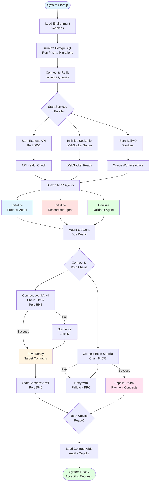

---

## 2. Protocol Registration Flow

**GitHub-Based Registration:** Protocols submit GitHub repo URLs, not deployed contract addresses.

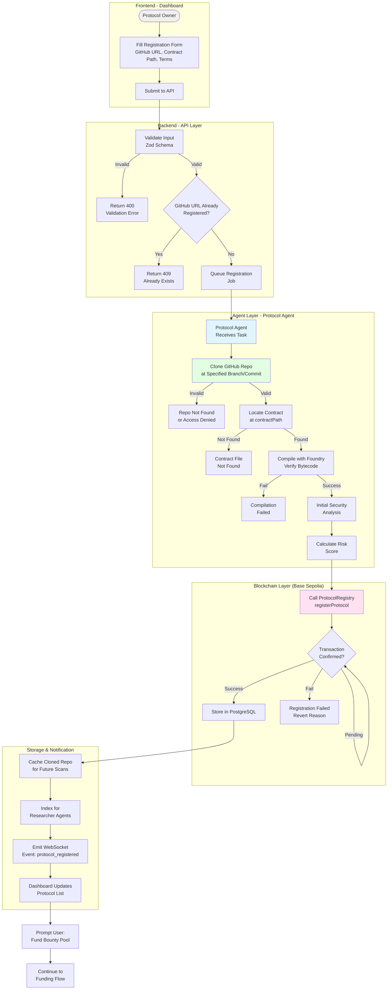

### Protocol Registration Sequence

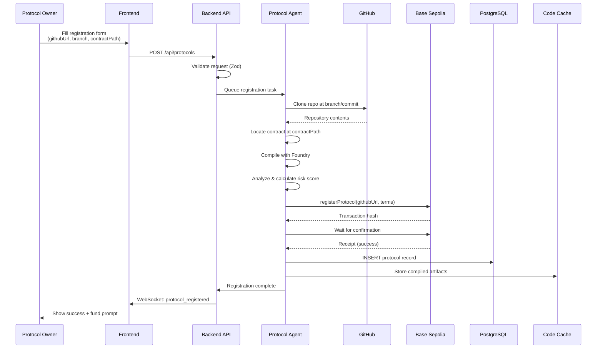

---

## 3. Vulnerability Scanning Flow

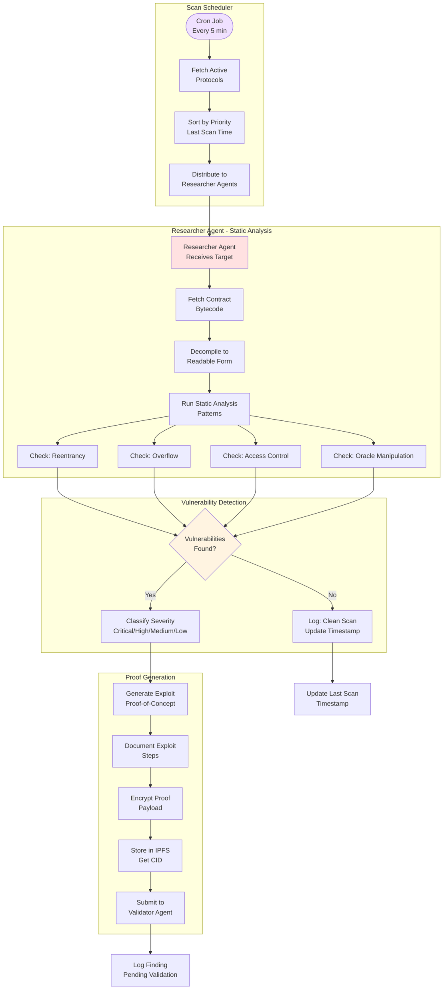

### Vulnerability Detection Patterns

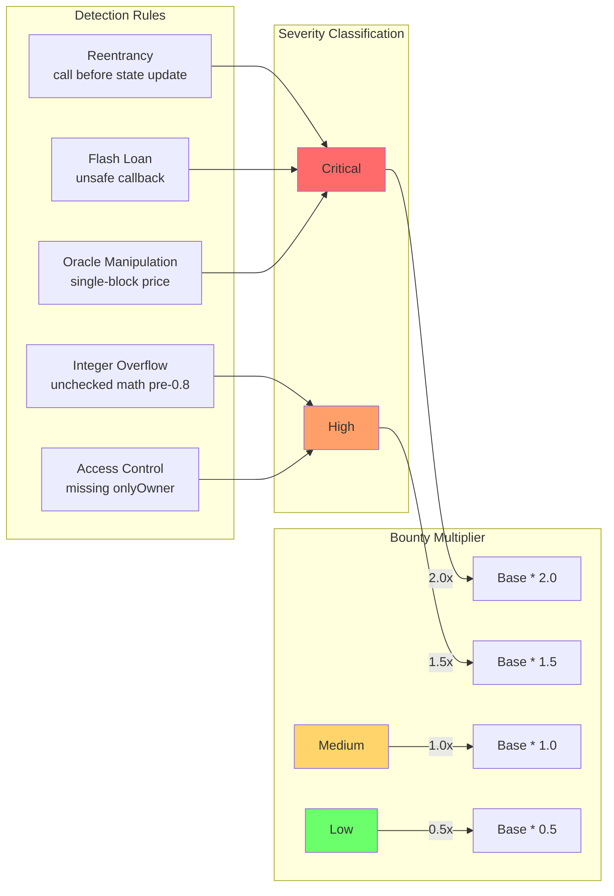

---

## 4. Exploit Validation Flow

**Cross-Chain Validation:** Execute on Local Anvil → Record on Base Sepolia

```mermaid
flowchart TD
    subgraph "Validator Agent Receives Proof"
        Receive([Receive Encrypted<br/>Proof from RA]) --> Decrypt[Decrypt Proof<br/>Payload]
        Decrypt --> Parse[Parse Exploit<br/>Instructions]
        Parse --> Validate{Valid Proof<br/>Format?}
        Validate -->|No| Reject1[Reject: Invalid Format<br/>Notify RA]
        Validate -->|Yes| PrepSandbox[Prepare Sandbox<br/>Environment]
    end

    subgraph "LOCAL ANVIL - Sandbox (Port 8546)"
        PrepSandbox --> SpawnAnvil[Spawn Sandbox Anvil<br/>Fork from Port 8545]
        SpawnAnvil --> CopyState[Copy Target Contract<br/>State from Main Anvil]
        CopyState --> SetupState[Setup Required<br/>State Variables]
        SetupState --> DeployExploit[Deploy Exploit<br/>Contract]
    end

    subgraph "LOCAL ANVIL - Exploit Execution"
        DeployExploit --> ExecuteExploit[Execute Exploit<br/>Transaction]
        ExecuteExploit --> CaptureState[Capture State<br/>Changes]
        CaptureState --> AnalyzeResult{Exploit<br/>Successful?}

        AnalyzeResult -->|No| RecordFail[Record: FALSE<br/>Exploit Failed]
        AnalyzeResult -->|Yes| RecordSuccess[Record: TRUE<br/>Vulnerability Confirmed]
    end

    subgraph "BASE SEPOLIA - Registry Update"
        RecordFail --> UpdateReg1[Update ERC-8004<br/>on Sepolia<br/>Status = FALSE]
        RecordSuccess --> UpdateReg2[Update ERC-8004<br/>on Sepolia<br/>Status = TRUE]

        UpdateReg1 --> NotifyRA1[Notify RA:<br/>Validation Failed]
        UpdateReg2 --> TriggerPayment[Trigger x402 Payment<br/>on Base Sepolia]
    end

    subgraph "Cleanup"
        NotifyRA1 --> Cleanup[Destroy Sandbox<br/>Clean Resources]
        TriggerPayment --> Cleanup
        Cleanup --> Ready([Ready for Next<br/>Validation])
    end

    style Receive fill:#e1ffe1
    style SpawnAnvil fill:#fff4e1
    style CopyState fill:#fff4e1
    style ExecuteExploit fill:#fff4e1
    style AnalyzeResult fill:#fff4e1
    style UpdateReg1 fill:#ffe1f0
    style UpdateReg2 fill:#ffe1f0
    style TriggerPayment fill:#ffe1f0
```

### Sandbox Isolation (Local Anvil)

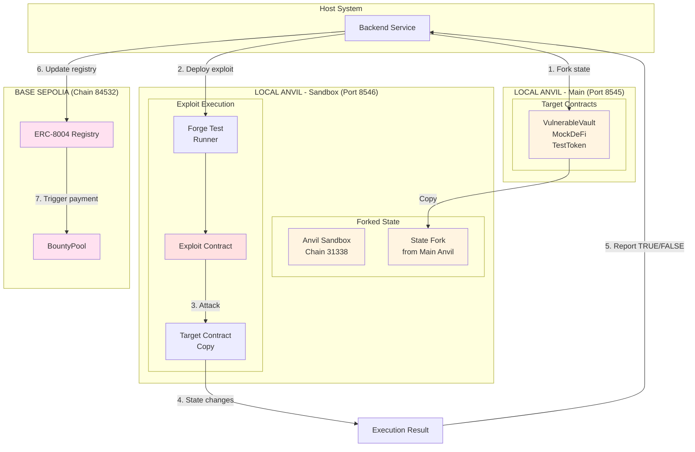

---

## 5. Bounty Payment Flow

**All payments occur on Base Sepolia (Chain 84532) using testnet USDC**

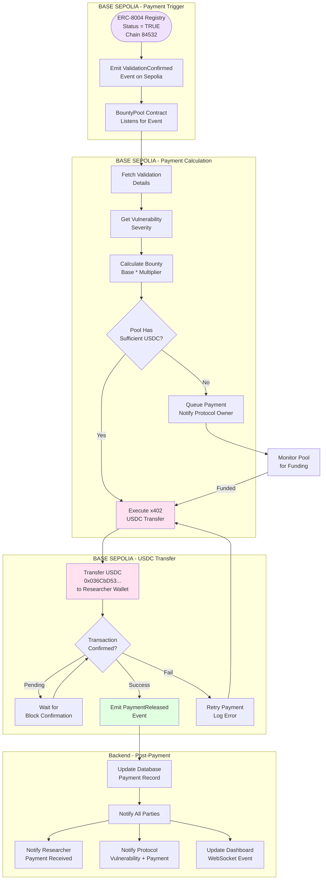

### Payment Sequence Diagram (Base Sepolia)

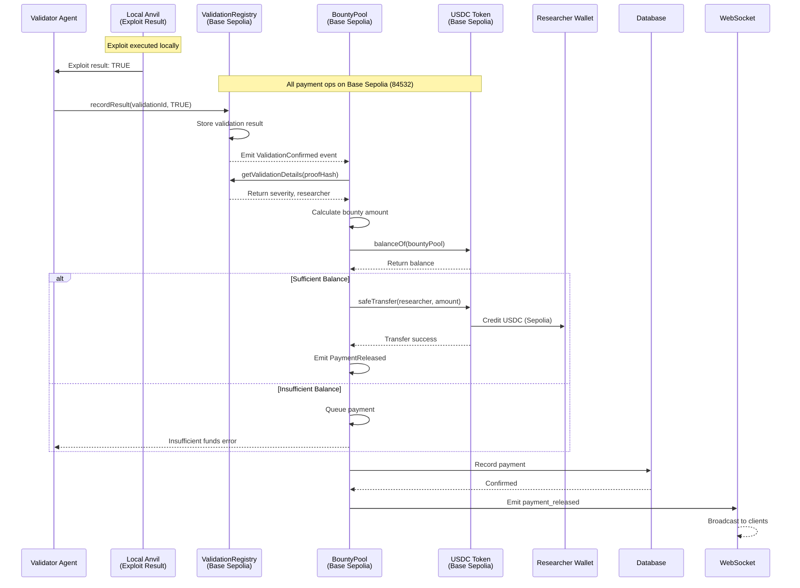

---

## 6. Agent-to-Agent Communication

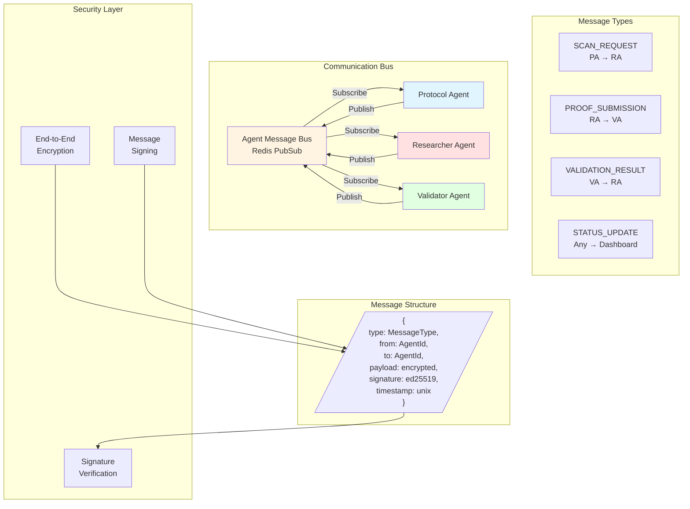

### A2A Message Flow

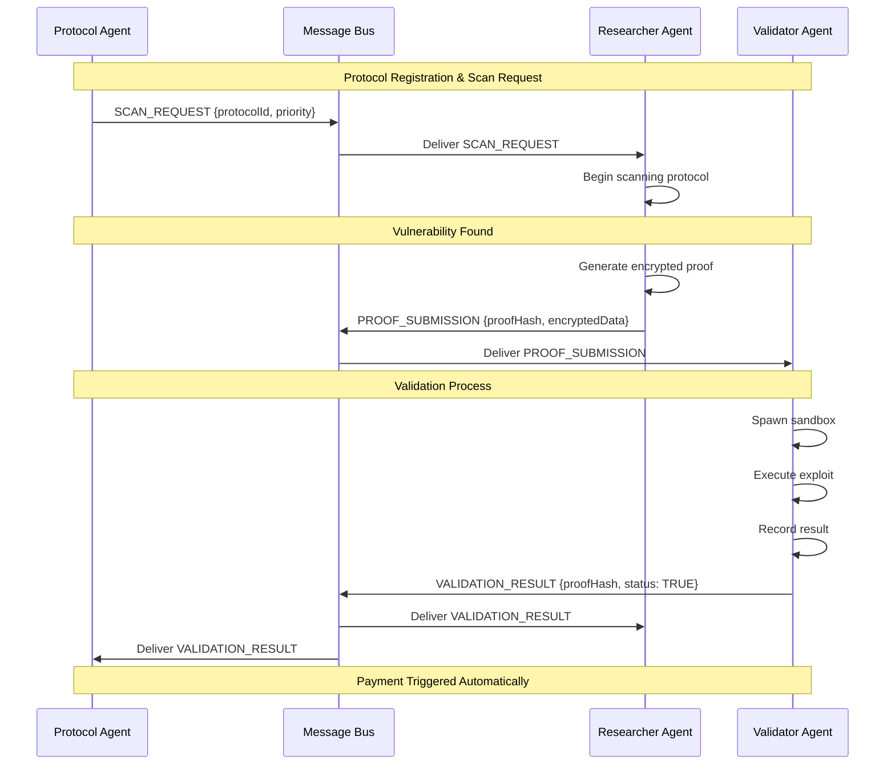

---

## 7. Dashboard Real-time Updates

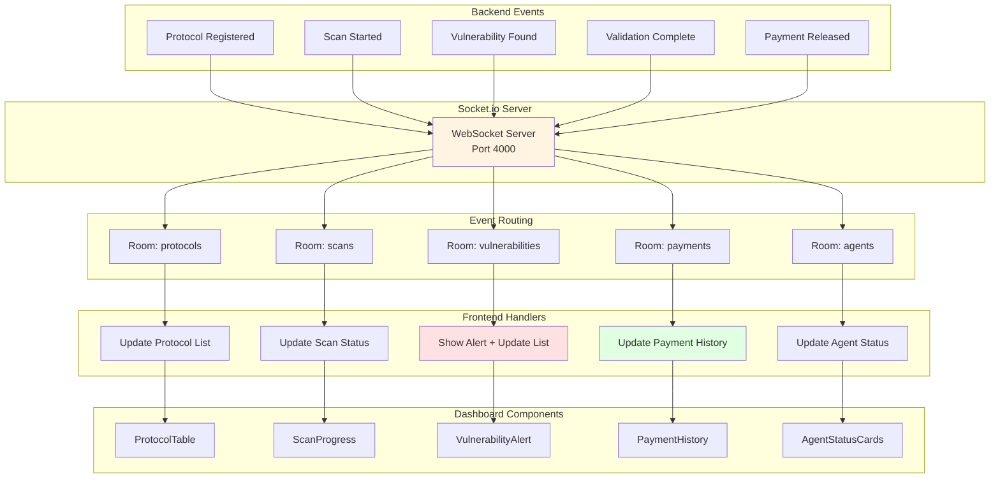

### WebSocket Event Types

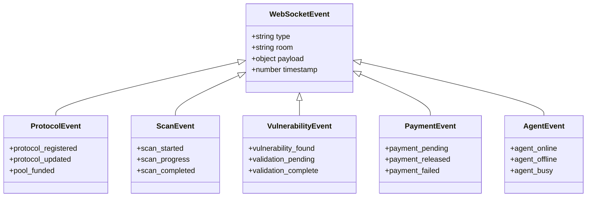

---

## 8. Error Handling & Recovery

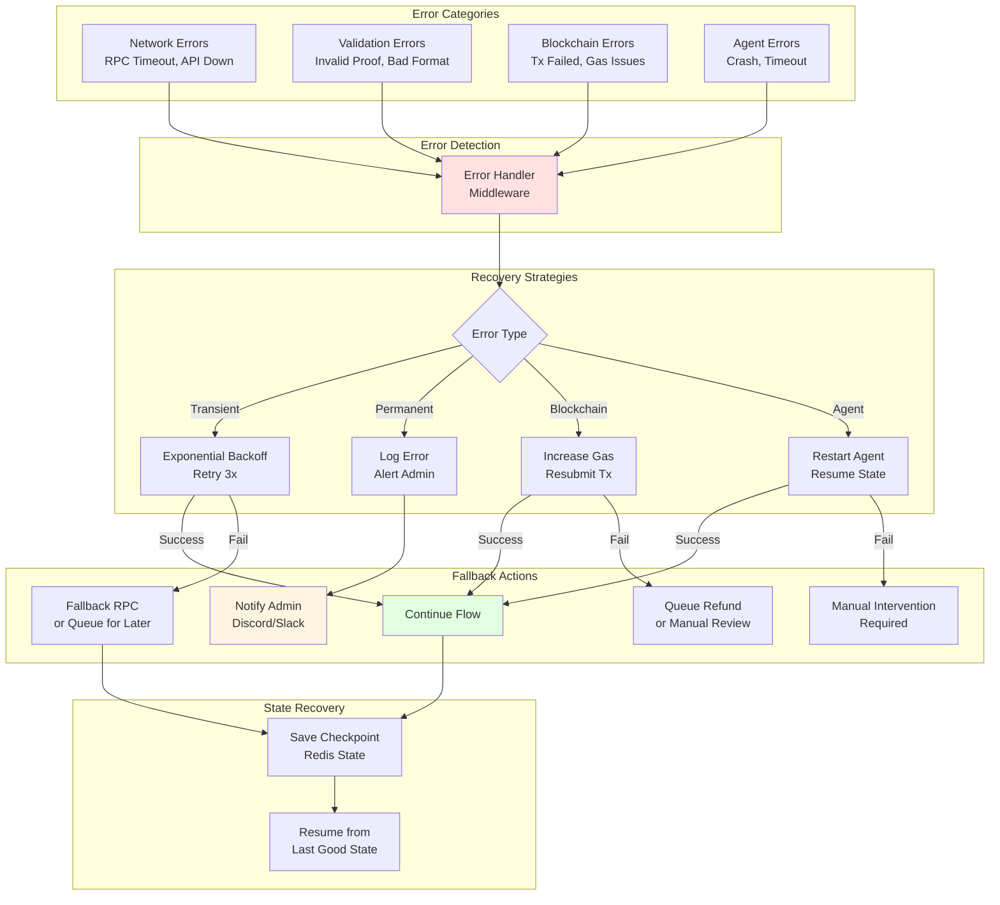

### Retry Configuration

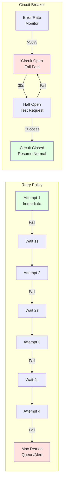

---

## Complete System Flow Summary

**Hybrid Architecture: Local Anvil (31337) + Base Sepolia (84532)**

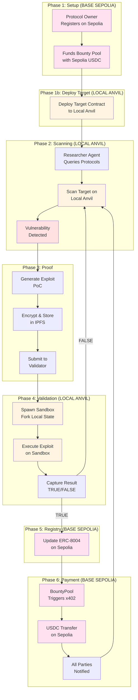

### Chain Separation Summary

| Phase | Chain | Purpose |
|-------|-------|---------|
| Protocol Registration | Base Sepolia (84532) | Metadata + bounty terms |
| Bounty Funding | Base Sepolia (84532) | USDC deposit |
| Target Deployment | Local Anvil (31337) | Contracts to scan |
| Vulnerability Scanning | Local Anvil (31337) | Fast local analysis |
| Exploit Validation | Local Anvil Sandbox (31338) | Isolated exploit execution |
| Registry Update | Base Sepolia (84532) | ERC-8004 state change |
| Payment Release | Base Sepolia (84532) | x402 USDC transfer |

### Why This Architecture?

1. **Fast Iteration**: Target contracts on local Anvil = instant feedback
2. **Real Payment Testing**: USDC on Sepolia = realistic payment flow
3. **Isolation**: Sandbox on separate Anvil = no state pollution
4. **Clear Upgrade Path**: Sepolia → Mainnet is straightforward
